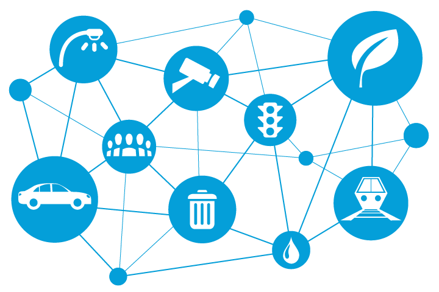

## Vorwort

Vor ein paar Tagen hat mich jemand gefragt:

Warum benutzt du nicht einfach fertige Cloud-Dienste oder mobile Apps und baust stattdessen deine eigene NAS und private Dienste? Ich stoße oft auf Beiträge wie "Ich habe eine Website ähnlich wie Tencent Video erstellt" oder "Ich habe meine eigene NetEase Cloud Music erstellt"...

Kannst du keine App auf deinem Handy installieren? Kannst du keine Software auf deinem Computer herunterladen?

Warum?

Heute werde ich kein Tutorial schreiben. Ich möchte diese Frage beantworten und auch die Zweifel anderer Freunde ansprechen.

## Warum

### Kostenwirksamkeit

Zunächst einmal wollen wir über die Kosten sprechen. Im Vergleich zum Kauf von Cloud-Diensten ist der Aufbau eigener Dienste auf lange Sicht `kostengünstiger`.

Zuerst gibt es `Speicherplatz`: Fotos, Lieblingsfilme, Arbeits- und Lebensdokumente, Lernmaterialien usw.

Kann ich das alles in der Cloud speichern? Natürlich, aber es wäre eine `große Ausgabe`.

Hier sind einige Beispiele für häufig verwendete Dienste:

| Dienst (pro Jahr) | Preis         |
| ----------------- | ------------- |
| iCloud 200GB      | ￥252 (21*12) |
| Baidu Cloud 5TB   | ￥188         |
| Alibaba Cloud 8TB | ￥158         |

Eine 4TB-Festplatte kostet etwa 300 Yuan, was in etwa den Kosten dieser Mitgliedschaften entspricht. Es gibt auch zahlreiche Mitgliedschaften für Video-Streaming-Seiten, Mitgliedschaften für verschiedene Musik-Apps und 10 US-Dollar pro Monat für Notion.

Es gibt viele kostenpflichtige Apps, und einige erweiterte Funktionen erfordern eine Zahlung, um sie freizuschalten. Andererseits können viele selbstgebaute Dienste kostenlos genutzt werden.

### Selbstkontrolle

Hast du von Xunlei KuaiPan, Sina Weipan, UC Weipan, Huawei Weipan, Weiyun, 360 Yun gehört?

Dies sind alles `gescheiterte Cloud-Speicherdienste`. Wie viele Benutzer haben ihre Daten verloren, weil das Geschäft dieser Unternehmen nicht erfolgreich war?

"NetEase Youqian" ist eine persönliche Finanz-App, die ich benutze. Als ich mich wieder eingeloggt habe, war sie leer. Es stellte sich heraus, dass es eine Ankündigung gab, in der die Benutzer darüber informiert wurden, dass der Dienst eingestellt wird und sie ihre Daten rechtzeitig übertragen sollen...

Ich weiß nicht, wie viele Leute in den Kommentaren ihre Daten verloren haben, weil sie diese öffentlichen Dienste genutzt haben.

Das ist ein Hauptgrund für den Aufwand. Ich möchte selbst entscheiden, wann ich aufhöre, diese Dienste zu nutzen, nicht diese Unternehmen.

### Mehrere Geräte und Teilen

Die Verwendung mehrerer Geräte ist ebenfalls ein wichtiger Grund, warum ich NAS und selbstgebaute Dienste verwende.

Ich habe einen Mac, einen Windows-PC und Linux. Ich habe auch Android- und iOS-Geräte. Aber es gibt viele Anwendungen, für die `nicht so viele Clients für diese Plattformen entwickelt wurden`.

Auf der anderen Seite werden selbstgebaute Dienste meistens über das Web erstellt, was bedeutet, dass du sie von überall aus zugreifen kannst, solange du einen `Webbrowser` hast.

Fotos, Filme und Musik, die zu Hause gespeichert sind, `sind nicht von externen Cloud-Diensten abhängig` und können problemlos auf mehreren Geräten verwendet werden, sogar von mehreren Familienmitgliedern.

### Datensicherheit und Privatsphäre

Besonders bei sensiblen Daten, Finanzdaten und privaten Daten vertraue ich mehr auf Selbsthosting als auf Dienste von Drittanbietern.

Ich möchte nicht sehen, wie eine Sicherheitslücke in einem Cloud-Speicherdienst meine privaten Fotos öffentlich zugänglich macht.

Ich möchte auch nicht, dass andere wissen, wie viel Geld auf meinem Bankkonto ist.

Und ich möchte auf keinen Fall, dass diese Unternehmen meine und die Daten meiner Familie verwenden, um ihre Modelle zu "trainieren"...

### Geschwindigkeit und Effizienz

Selbstgehostete Dienste sind oft schlanker. Herunterladen bedeutet einfach herunterladen, Speichern bedeutet einfach speichern, Musik hören bedeutet einfach Musik hören, im Gegensatz zu vielen Anwendungen heutzutage, die Installationspakete von mehreren Gigabyte haben.

Sie wollen jeden Aspekt des Lebens in einer App unterbringen.

Mit selbstgehosteten Diensten kann ich schnell und direkt auf das zugreifen, was ich brauche, ohne komplexe Anmeldungen und Klicks durch verschiedene Prozesse, um das zu finden, was ich will.

Außerdem wissen diejenigen, die ein bisschen Ahnung haben, dass die Geschwindigkeit einer kabelgebundenen Verbindung viel schneller ist als Wi-Fi und Mobilfunknetze. Ich kann zu Hause problemlos echtes 4K genießen.

### Hobbys und Herausforderungen

Das ist auch ein sehr wichtiger Punkt: Ich mag es.

Geld kann nicht kaufen, was ich mag.

Ich genieße das Vergnügen, jeden Dienst aufzubauen. Jedes Mal, wenn ich einen neuen Dienst erfolgreich starte, fühle ich ein großes Gefühl der Erfüllung. Das Aufbauen und Warten von selbstgehosteten Servern ist eine Herausforderung, aber auch eine Gelegenheit zum Lernen und Wachsen.

Im Prozess der Konfiguration und Optimierung habe ich ein tieferes Verständnis und eine bessere Beherrschung dieser Technologien erlangt.

## Nachteile

In dieser Welt ist "nichts absolut gut oder schlecht".

> Ist es gut, eine Erkältung und Fieber zu haben?
>
> Nein, es ist unangenehm. Ich habe keine Lust, irgendetwas zu tun und habe kein Interesse an irgendetwas.
>
> Ja, es ist dein Körper, der dir sagt, dass du deinen Lebensstil ändern musst. Es sind deine weißen Blutkörperchen, die aktiv gegen Bakterien kämpfen.

NAS und selbstgehostete Dienste sind keine Ausnahme.

### Lernkosten

Du musst viele Dinge lernen, die du nicht kennst, um die Sicherheit deiner Dienste und Daten zu gewährleisten.

### Zeitkosten

Du benötigst viel Zeit, um Probleme zu debuggen und zu lösen, mit denen du zuvor noch nie konfrontiert warst.

Du benötigst auch etwas Zeit, um meinen Blog zu lesen, hahaha.

## Fazit

Ob es um die Kontrolle von Daten, die Wirtschaftlichkeit oder die Leidenschaft für Technologie geht, ich wähle letztendlich NAS und Selbsthosting.

Wenn dir dieser Artikel gefällt, denke bitte daran, [Nasdaddy's Digital Garden (nasdaddy)] zu liken, zu bookmarken und zu folgen. Wir werden weiterhin praktische Anleitungen zur Selbsthosting-Anwendung bringen. Gemeinsam nehmen wir unsere Daten in die Hand und erschaffen unsere eigene digitale Welt!

Wenn du während des Einrichtungsprozesses auf Probleme stößt oder Vorschläge hast, hinterlasse bitte einen Kommentar unten. Lass uns gemeinsam erkunden und lernen.