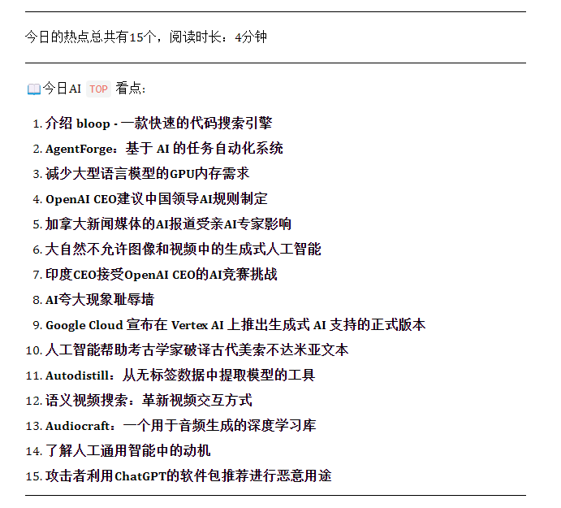
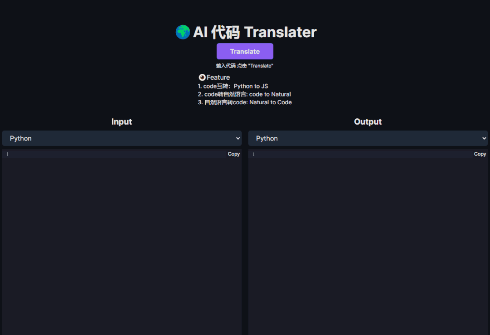
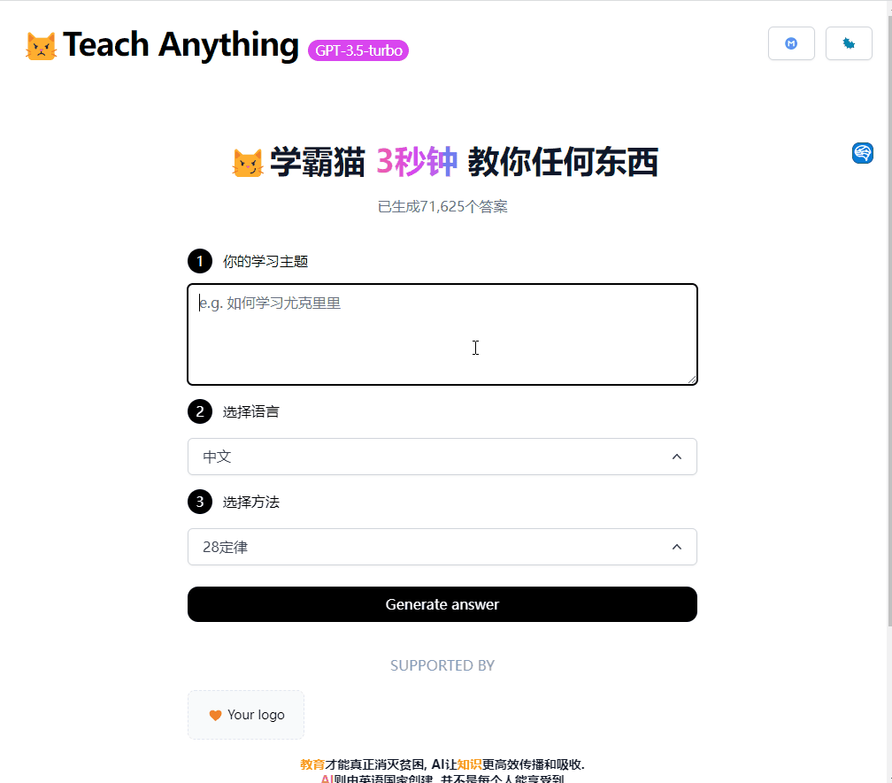
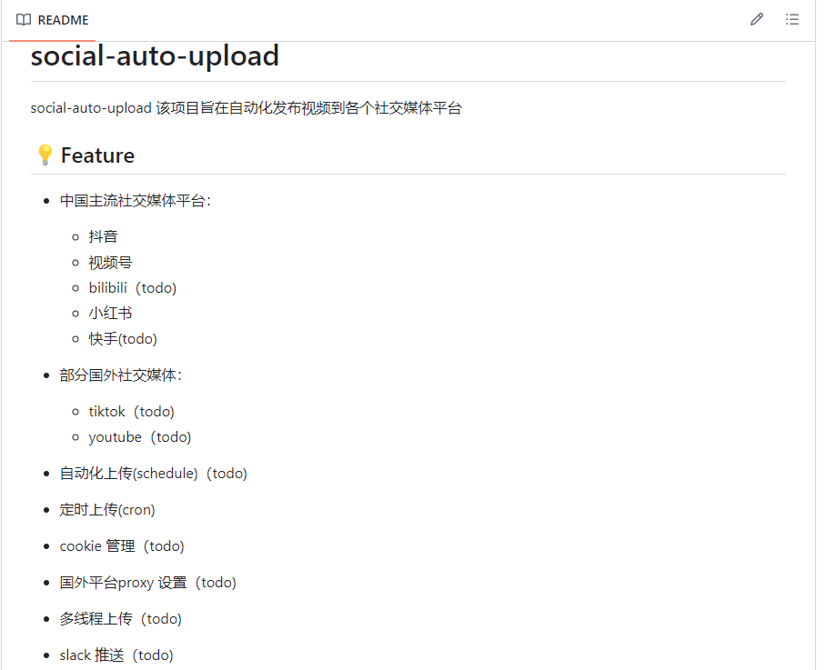
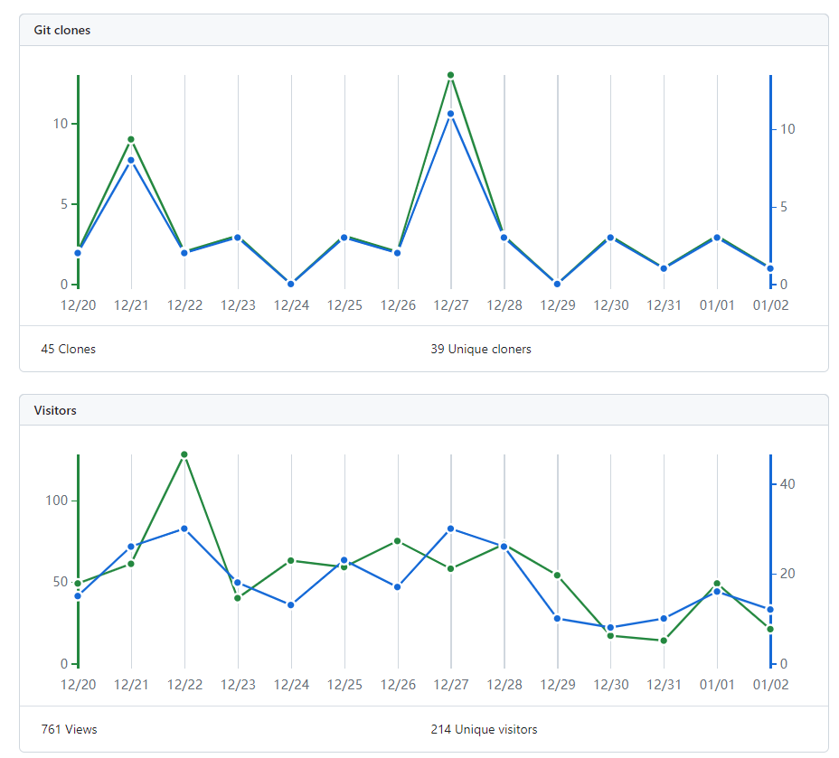
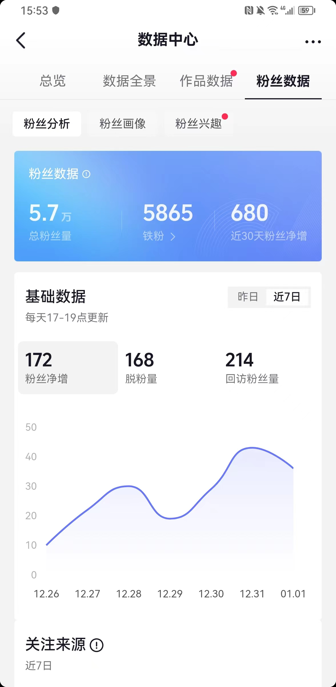

# Preface

On the second day of 2024, I want to take a look back at my 2023.

The subtitle of this review is: **A Year in the Life of Creature X on Earth**

I am this creature X, an unknown, clumsy being that suddenly gained self-awareness.

And this is a documentation of one year in the short lifespan of this creature, spanning 70 to 80 years.

The reason I call myself a creature? It is to remind myself: **to be humble**.

Whether I am humble or arrogant, I can never escape the pitiful fate of being a creature: **born to die**.

No matter how luxurious my meals are or how noble my position is, I still cannot escape the most basic biological characteristic: the need to excrete, to defecate.

...

Below is the review of this little creature X's year.

This review covers: career, health, education, family, friendships, entertainment, emotions...

# Career

> Constantly striving, never stopping

## All about AI

### 1. AI News Channel RainAI (Abandoned)

At the end of 2022, when I witnessed the great charm of AI and saw its immense potential, I was lost. I pondered day and night on how to utilize this AI revolution.

In fact, I contemplated and observed for a long time. I tried and planned products like AI games, AI girlfriends, ChatPDF, but in the end, I **couldn't determine a direction**.

I chose to **keep moving forward in times of confusion instead of standing still and wandering.** I started managing an AI news channel with two goals:

1. To share the knowledge and information I learned while studying and absorbing them, and help others.
2. To accumulate some traffic for future use.
3. To make friends with like-minded individuals.

#### Achievements

Articles published on the public account: 25, with 363 subscribers.

Independent blog: 14 subscribers, total visits of 92,000.

> This project was abandoned in June and put on hold.

#### Reflection and Conclusion

1. The AI storm was too intense. Keeping up with AI progress consumed a lot of my time and energy.
2. To delve deeper, it requires a significant amount of time for experimentation and exploration, which I didn't have.
3. Attempting to automate the extraction of key points using AI had **low quality** and felt meaningless.

### 2. Chinese Prompt Community (Abandoned)

When AI was just emerging, prompts were a very trendy and valuable thing, and it remains so today.

The core of prompts is asking questions, which is a problem that most people, including myself, have: if you can't ask a good question, you naturally won't get good results.

Life and career are like this, **a good question determines the quality of the answer**.

For example, I often ask myself this question to examine the motivation behind my actions:

> If I wouldn't brag about what I'm currently doing to others, would I still do it?

The common point here is that a lot of prompt tutorials and **high-quality prompts are in English**, and **most large language models are based on English corpora**.

So, in order to have **better answers**, we need **better prompts**, and the best prompts are **in English**.

Therefore, I created a Chinese prompt community to automatically fetch high-quality prompts.

#### Achievements

Number of users: 1.11k, with over 4k posts.

#### Reflection and Summary

- Status: **Abandoned**
- Long story: The changes in the AI field are too fast, with new things every day. Prompt is just a small subfield in the AI domain. Later on, I found more interesting and important things, so I gradually abandoned it (because automation doesn't really require my involvement...).
- In a nutshell: **Some things are just desserts, not main courses**.

Reflection and Summary:

What went well:

1. **Automation** reduced the pressure of running the website.
2. Learned about Flarum website building and various plugins.
3. Practiced **running multiple projects and cross-promotion** (bbs, blog, tools).

Areas for improvement:

1. **Failed to deeply consider** the next steps.
2. **Failed to retain traffic**.

### 3. AI Tool - AI-code (Obsolete)

Project content: Translates any code into corresponding code.

#### Reflection and Summary

Status: **Abandoned**

Long story: The AI tool was used for traffic diversion, but since other AI projects were abandoned, this project died along with them.

In a nutshell: **When one dies, they all die**.

Reflection and Summary:

What went well:

1. Used **multidimensional tools and products for traffic diversion**.
2. **Gained 440 users**.

Areas for improvement:

1. **Did not do extensive marketing** and promotion.
2. The product's audience is skewed towards STEM fields.
3. Failed to consider what kind of users to attract.

### 4. AI Tool - AI-learn (Obsolete)

Project content: Combines various mainstream and efficient learning methods, such as Pareto's law (80/20 rule) and the Feynman technique.

#### Reflection and Summary

Status: **Abandoned**

Long story: Smart Cat was a project that I personally believed in and thought it would be useful for others, which is why I created it. Unfortunately, the technology I used to implement it was unofficial and caused extreme instability later on, so I had to abandon it.

In a nutshell: **One failure led to the abandonment of other good projects**.

Reflection and Summary:

What went well:

1. Used **other tools and products for traffic diversion**.
2. **Gained a large number of users**.

NAS

This year, I hope to start a new project to document my experience with NAS and self-hosting. The purpose is as follows:

1. 建立了一个自动化制作视频的项目，可以自动上传、制作视频，并管理多个账号。
2. 取得了一些账号的成绩，但还有一些账号的表现不理想。
3. 项目的优先级较低，维护频率也较低，可能在日后逐步减少对该项目的关注。

做得不好的地方

1. 对项目的商业价值尚未确定。
2. 爱好无法让你走得更远，需要建立系统来支持。
3. 有些爱好可能需要更多的人参与和探讨，而不仅仅是自己一个人在玩。

总结：爱好需要建立系统来支持，而不仅仅依靠兴致。自动化项目可以带来一些成果，但商业价值尚未确定。

1. The video production started off rough and pieced together, but now it has become a streamlined process, during which many technical and architectural problems have been solved.
2. Play to one's strengths and **automate to improve efficiency**.
3. Establish a comprehensive system called the **10-30-100 strategy** (applicable to anything):
   - 10 days of unconditional execution without keeping track of results, then reconsider whether to continue.
   - 30 days of progress-seeking without seeking results.
   - 100 days of bold action to seek breakthroughs.
4. Share: Open source part of the upload to the community.

Areas for improvement:

1. Taking action is good, but often accompanied by a **lack of sufficient planning and thinking**.
2. **Focus on priorities**: Bugs are never-ending, prioritize tasks that can produce results.
3. **Lack of diverse collisions**: Information is relatively closed off.

### social-auto-upload

Automatically upload videos to social media platforms: Douyin, Xiaohongshu, Shipin Hao, TikTok, YouTube, Bilibili.

#### Achievements:

1. GitHub stars: 101, forks: 15.
2. Community group: 60 members.

#### Reflection and Summary

Status: **Low-frequency maintenance**.

In-depth: I hope to share the process of automating myself and the pitfalls I have encountered, to give back and help others. The birth of this project was because I needed a lot of testing work for uploading in an automated video production project. Finally, when I couldn't bear such low-efficiency labor, I developed a tool for automatically uploading videos.

In short: **Being smart is not enough, you also need to be lazy, because that way, you will find ways to improve efficiency and be lazy yourself**.

Reflection and Summary:

What was done well:

1. Help others as much as possible.
2. Connect with like-minded people, perhaps new ideas can be generated through collisions.

## Self-media

In 2023, my self-media channel experienced a **long period of hiatus**...

The main purpose of this channel is to help people with:

- Psychological barriers, such as anxiety and lack of confidence.
- Share some life philosophy.
- Learning experiences.
- Educational concepts, etc.

But this year, there hasn't been much new content. The only regret in 2023 is that I **disappointed those who follow and appreciate me**. There are a lot of messages in the background that I don't have time to read.

#### Achievements

As of now, the number of followers on mainstream platforms in China is 90,000+, with Douyin platform having the most.

My own courses have made some profit (despite issues with the store).

#### Reflection and Summary

- Status: **On hiatus**.

- In-depth: I hope to help those who seek breakthroughs and changes in life, career, health, finance, and business, and those who want to live their own lives. This has always been my goal.

- In short: **Helping others helps oneself**. While helping others, I have also gained great satisfaction and improvement.

Reflection and Summary:

What was done well:

1. Subjectively **eager to continue updating** (contradictory).
2. Also **implemented various measures** to ensure the orderly progress of this matter.

Areas for improvement:

1. **Paused for a few months**
2. Many people's comments were replied to weeks or even months later.
3. **Issues with the store** indirectly made me develop a negative attitude towards continuing updates.

---

**Summary of Career Section:**

Returning to the main title of this article: A Complex yet Simple Year

This year seems to have involved many complex and diverse things, but fundamentally, it has been an **extremely simple** year: because from the beginning of the year until now, only one or two things have been **left behind**.

Many projects were started but eventually abandoned, whether due to my own reasons or external factors. Do all these things have meaning?

They do have meaning, perhaps as an observer, you cannot experience it. Many things are interconnected.

If I hadn't started my own media business in the early years, I wouldn't have considered automated video production.

If I hadn't studied and researched AI, there wouldn't have been a large output of projects (chatgpt has provided me with tremendous help in these projects).

If I hadn't studied psychology, perhaps I would just be a middle-aged man worn down by life and defeated by society.

If it weren't for past experiences, you wouldn't be reading this here.

In the new year of 2024, I will continue to explore new things, face new challenges, hahaha.

**Do the thing, and you shall have the power. Life is about exploring and trying new things.**

The later section will continue to be updated, reflecting on health, learning, family, education, and other aspects of 2023.