# 前言

2024年的第2天，想要在这一天回顾一下自己的2023年

这篇回顾的副标题叫：**记X生物存在于地球一年**

我就是这个X生物，一个未知、笨拙、突然有了自我意识的生物

而这一篇是这个生物在其短短的70、80年的寿命中，絮絮叨叨自己其中一年的证明

之所以称自己为生物？是想要告诫我自己：**要谦虚**

无论我是卑微，还是自大，你都始终无法摆脱：作为一个生物的可悲宿命 -> **出生即走向死亡**

无论我吃的如此豪华，站的位置多么高贵，依旧无法摆脱：我需要排泄，需要拉屎，这个最基础的生物特性

...

以下，是这个X小生物，这一年的回顾

这份回顾，涵盖：事业、健康、学习、家庭、教育、友谊、娱乐、情绪....

# 事业

> 折腾不断，折腾不止

## All about AI

### 1. AI资讯号 RainAI（废弃）

22年底，当我见证了AI的巨大魅力，看到其巨大的潜力之后，我迷茫了，每日苦思冥想，如何利用这次Ai的变革

事实上，我思考和观察了许久，曾经尝试、规划过AI游戏、AI女友、ChatPDF这样的产品，最终都**无法笃定一个方向**

我选择：**在迷茫的时期，与其停止脚步去彷徨，不如去做，在做的过程中寻找机会**

于是我开始经营这么一个AI资讯号，目的有2：

1. 自己在学习和吸收这些资讯和知识的时候，顺便将其输出出来，帮助其他人

2. 积攒一些流量、日后使用
3. 结交一些同好的朋友

#### 成果

公众号发文：25篇、用户数363

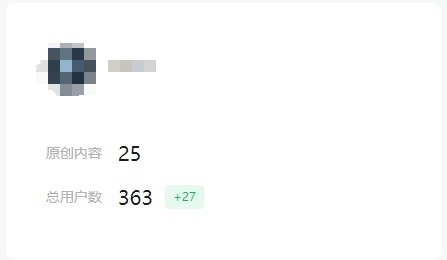

独立站blog：订阅用户14，访问总数9.2w

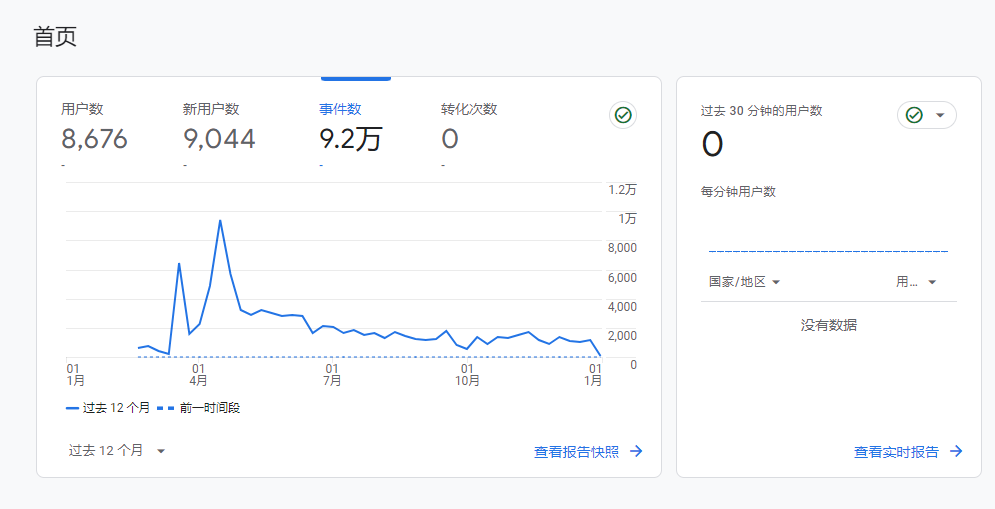

> 该项目于6月放弃，搁浅

#### 思考与总结

1. AI风暴太强烈，AI的进步是以日来迭代的，每日摄取资讯**耗费了我大量的时间和精力**
2. 想深入，就需要大量的时间，去尝试和挖掘，**时间上并不允许**
3. 后期尝试自动化用**AI提炼要点**，**质量较低**，感觉无意义

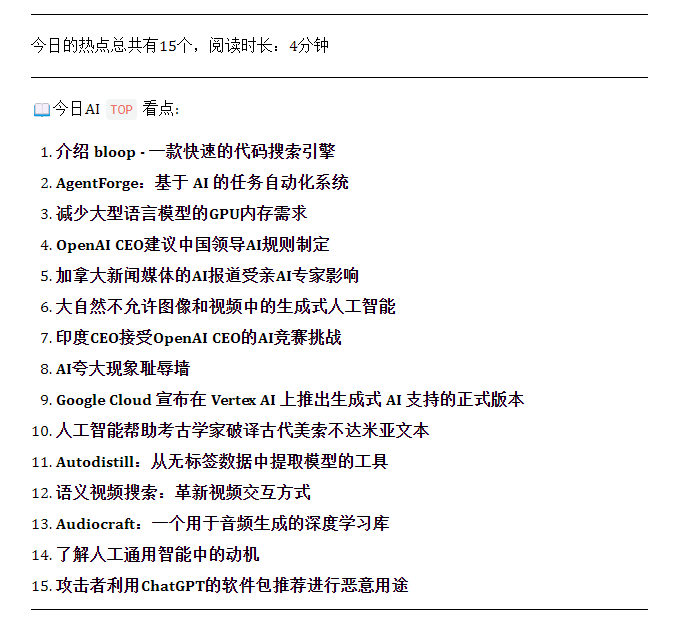

### 2. 中文Prompt社区（废弃）

AI刚刚兴起的时候，Prompt是一项非常新潮并且有价值的事情，放在当前也是如此

**Prompt核心就是提问**，这也是大多数人包括我在内，都存在的问题：如果你无法提出一个很好的问题，自然就不会有好的结果

生活、事业都是如此，**一个好的问题决定了答案的好坏**

比如我常常会问自己这个问题，借此来检查做事情的动机：

> 如果我不会因为，当前在做的这件事情而向他人炫耀，那么我还会去做吗？

这里的通点在于：大量的prompt教程，和**优质的prompt都是英文**的，而且**大语言模型也都是基于英文语料**

所以想要有**更好的回答**，需要**更好的prompt**，想要**更好的prompt**，**英文prompt**是最佳

于是我创立了一个prompt中文社区，自动化抓取优质的prompt

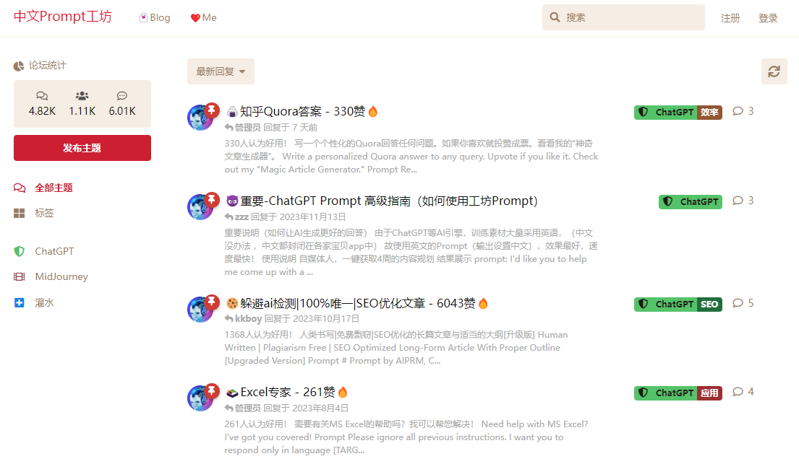

#### 成果

用户数：1.11k，帖子拥有4k+

#### 思考与总结

- 状态：**放弃**

- 长话：AI领域的变革太快太快，每天都有新的东西，prompt只是ai领域中一个很小的细分领域，后期我有了更好玩，更重要的事情，于是逐步放弃了（因为自动化实在也不需要我做啥呀...）

- 一句话：**某些东西只是甜品而不是主菜

反思与总结：

做的好的地方

1. **自动化**减轻了我运营网站的压力
2. **学习**到了flarum建站和诸多插件
3. 实践了**多项目运作，互相引流**（bbs，blog，tools)

有待提升的地方

1. 一直**未能深入思考**后续的事情
2. **未能将流量沉淀下来**

### 3. AI工具- AI-code（废弃）

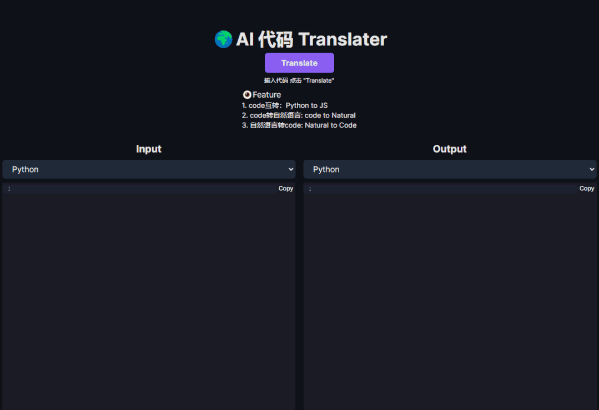

项目内容：将任意代码转化为对应的代码

#### 思考与总结

状态：**放弃**

长话：ai工具引流，因其他AI项目放弃了，连带这个项目也死翘翘

一句话：**一死死一窝**

反思与总结：

做的好的地方

1. 使用**多维度工具和产品引流**
2. **收获了440个用户**

有待提升的地方

1. **未做大量营销**推广
2. 产品**受众偏理工科**
3. 未能思考想要吸引什么样的用户

### 4. AI工具- AI-learn（废弃）

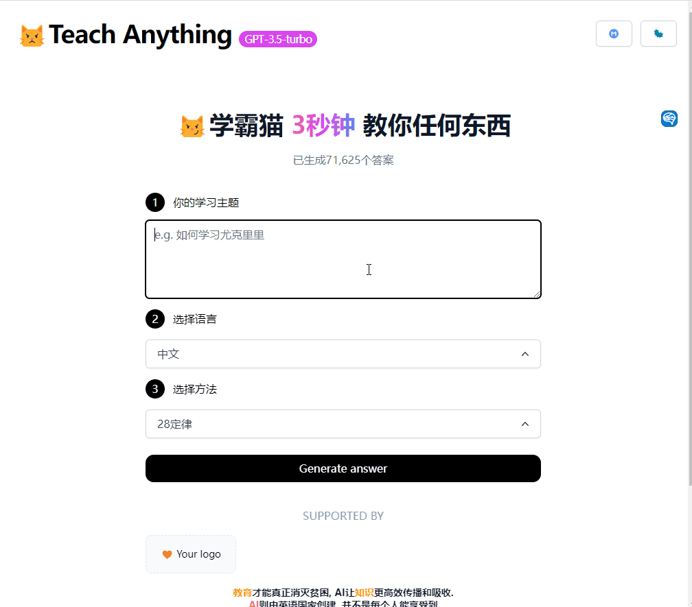

项目内容：结合多种主流高效学习方法，pareto（28定律），feynman法则等等

#### 思考与总结

状态：**放弃**

长话：学霸猫截止目前也是我自己非常看好的项目，觉得对其他人有用所以才做的，无奈背后技术我采用的是一种非官方手段来实现的，后期导致及其不稳定，于是放弃了

一句话：**一个失利而放弃了其他好的项目

反思与总结：

做的好的地方

1. **使用其他工具和产品引流**
2. **收获了大量的用户**

##  NAS

今年我希望开个新坑，来把自己折腾nas，self-hosted的经历写下来

目的如下：

1. **爱好**，nas许多时候都是我自己在玩，周围嘛很少有人探讨，而我希望把这个爱好散播出去
2. **帮助他人**，有许多人并不懂得技术，也不懂得该怎么玩，玩什么，而我将折腾的这些过程写下来，也许能帮助到某些人
3. **折腾无止境**，生命也在于折腾

开坑有3：

1. **公众号**

22篇原创，829用户数，还有些打赏（这些有趣的人类...）

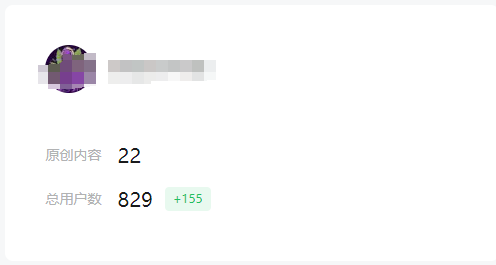

2. **什么值得买**

粉丝：629

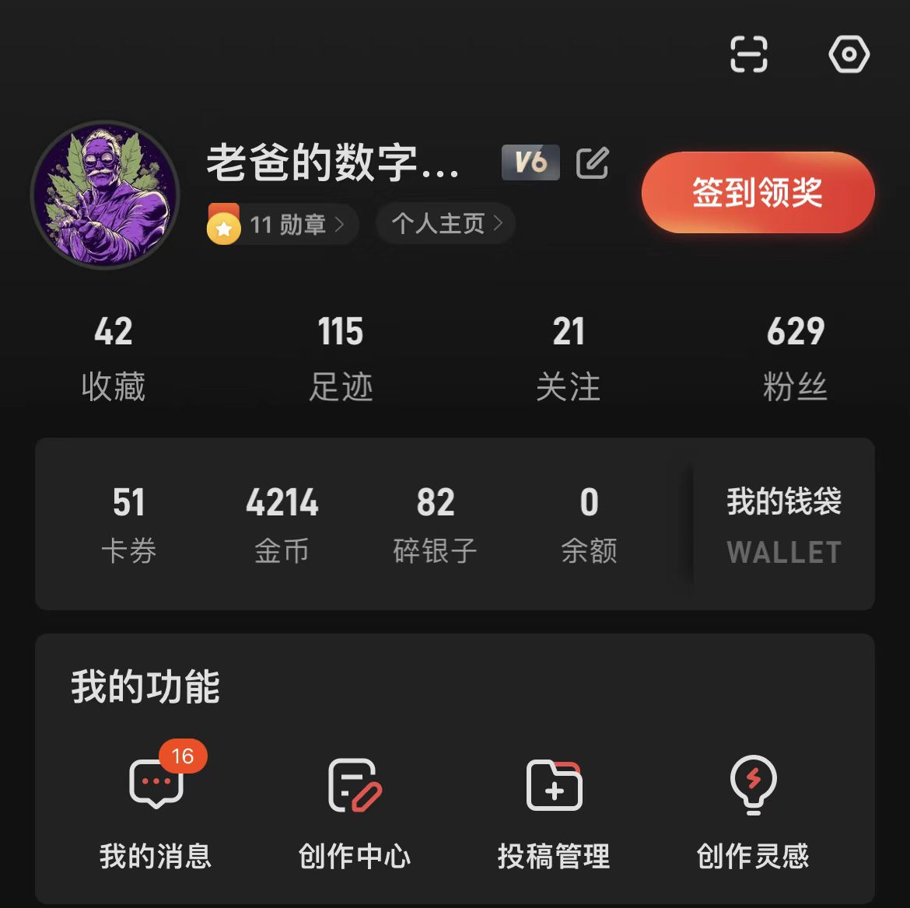

3. 独立站 **NasDaddy**

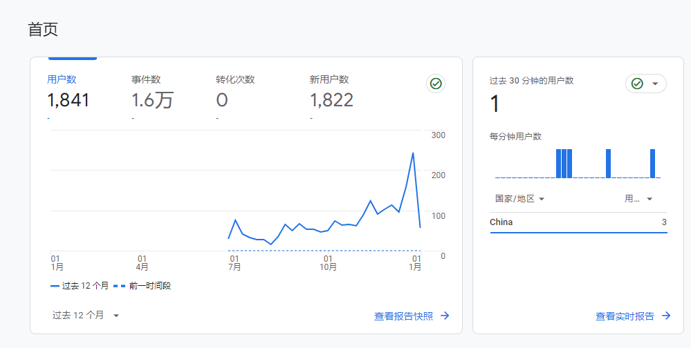

#### 思考与总结

状态：保持**最低月更新**

长话：一个长期的爱好，不求任何回报的做这件事，但是也经历了近2个月没更新，**即便是爱好，也不能单纯的靠兴致来驱动，而是要建立系统**

一句话：**爱好无法让你走的更远**，爱好+系统也许可以

反思与总结：

做的好的地方

1. 建立系统**每周batch**（10分钟）获取相关资讯
2. 多语言独立站，我看到后台许多来自美国和德国的用户访问，于是我特意为这部分用户增加了多语言的支持

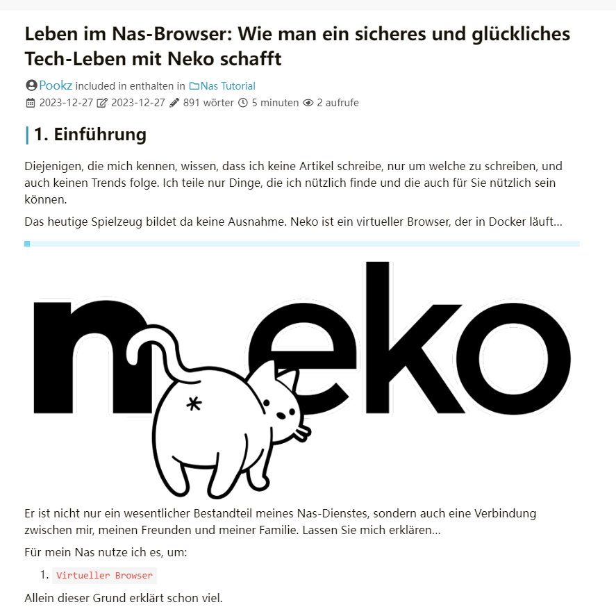

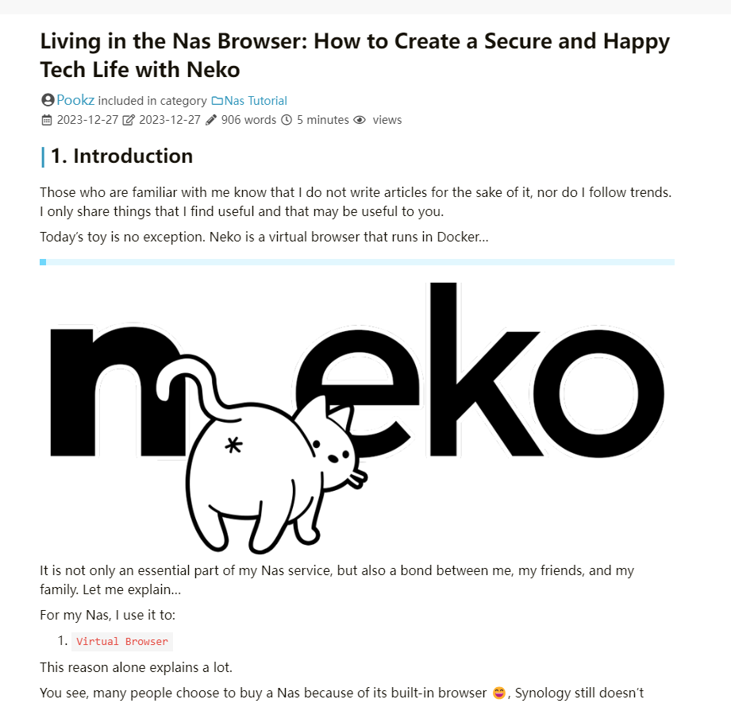

## 自动化制作视频RVM

### 主项目

一句话：**自动化制作视频**（国外到国内），中文语音，中文字幕，自动化封面，自动化上传...

这个项目耗费了我大概4个月的时间去完善它，现在基本上自动上传，自动制作，不需要怎么管理

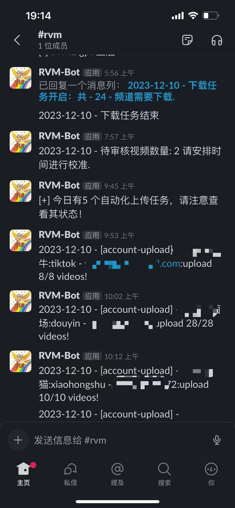

#### 成果：

1. 目前我管理着**38个账号**，涉及youtube、tiktok 抖音快手，视频号，小红书，b站等平台
2. 部分账号内容取得成绩还可以，部分则不是那么理想（未作细致的统计）

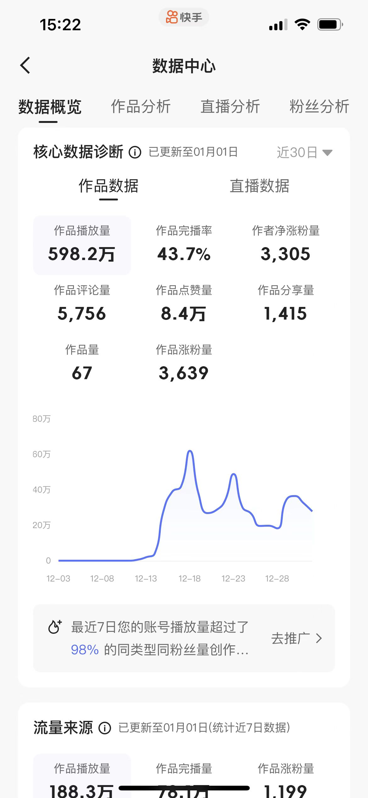

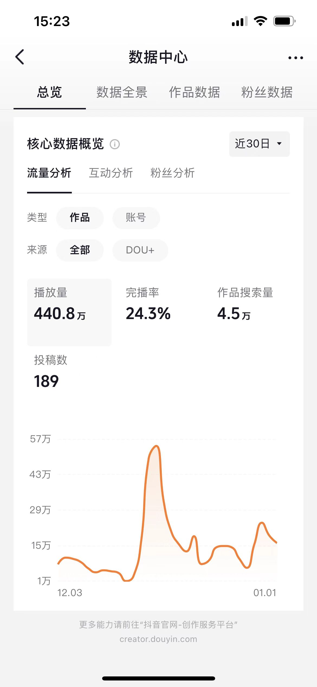

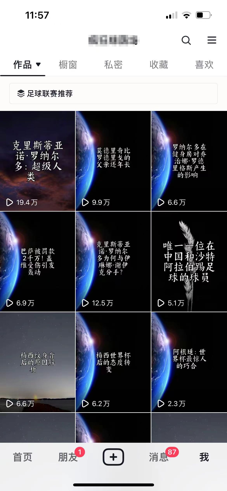

#### 思考与总结

状态：**优先级低、低频率维护中**

长话：一个完善的自动化项目，**商业价值尚且未知**

一句话：好玩的项目、日后逐步减少对该项目的关注

反思与总结：

做的好的地方

1. 从一开始很粗糙的制作视频，拼凑视频到现在流水线，这期间解决了许多技术上和架构上的问题
2. 发挥自我的优势，**自动化提高效率**
3. 建立一套完善的系统**10-30-100策略**（适用于任何事情）
   - 10天，不记结果的无条件执行，10天之后再来思考是否要继续
   - 30天，不求结果，目的在于寻求进展
   - 100天，大胆的行动，寻求巨大突破
4. 共享：将上传部分开源给社区

做的不好的地方

1. 行动多是好事，但是常常也伴随着，**缺乏足够的规划和思考**
2. **抓重点**，bug是永远解决不完的，优先做那些能产生结果的事情
3. **缺少多元碰撞**，信息较为闭塞

### social-auto-upload

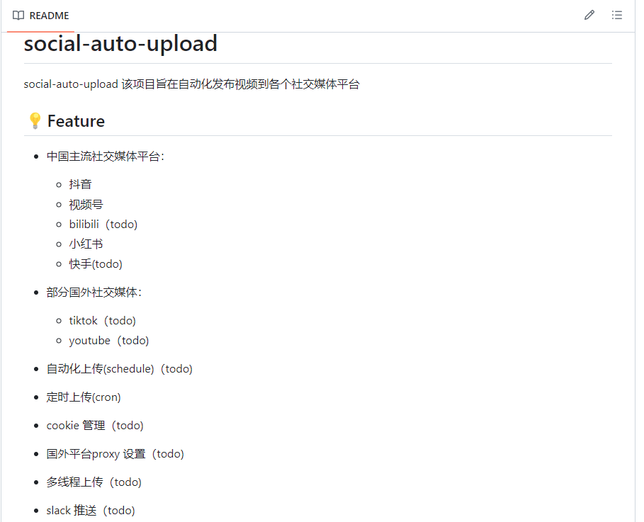

自动化上传视频到社交媒体：抖音、小红书、视频号、tiktok、youtube、bilibili

#### 成果：

1. github star 101 fork 15 
2. 社区群：60人

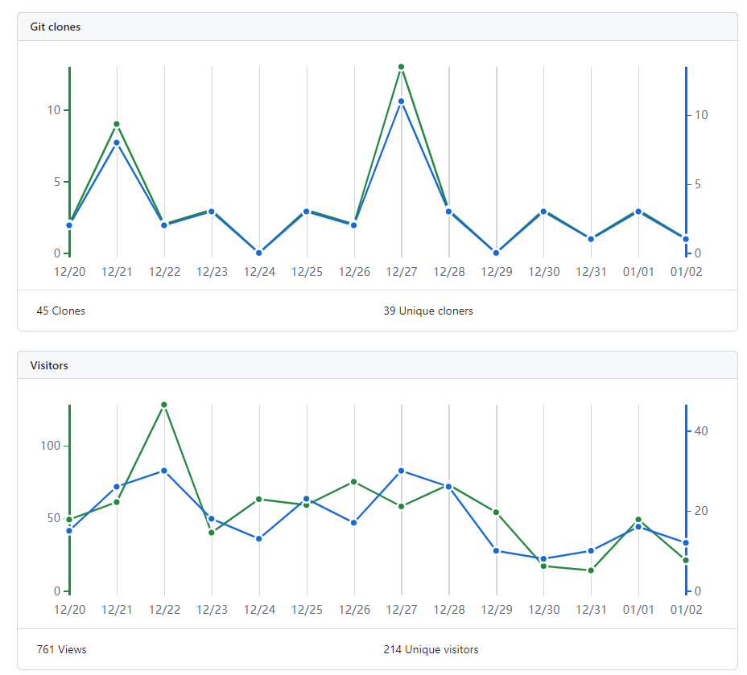

#### 思考与总结

状态：**低频维护中**

长话：我希望将自己自动化的过程，一些踩过的坑分享出来，回馈和帮助其他人。这个项目的诞生是因为我在自动化制作视频的项目中，需要大量上传的测试工作，终于在自己忍受不了如此低效劳动力的时候，开发出了自动上传视频平台的工具

一句话：**人不仅要聪明，还要懒，因为这样，你才会想办法去提升效率，让自己偷懒**

反思与总结：

做的好的地方

1. 尽可能的帮助他人
2. 广结同好之人，也许能碰撞出新的想法

## 自媒体

2023年我的自媒体频道，进入了一个**长时间的断更**....

这个频道的目的主要是帮助人们：

- 心理障碍，诸如焦虑，不自信
- 分享一些人生哲学
- 学习心得
- 教育理念等

而今年一年未能更新太多内容，2023年唯一遗憾的是，**让关注认可我的人失望了**，后台有大量的留言，我都没时间去看

#### 成果

截止目前，中国主流平台的粉丝量9w+，其中最多的当属抖音平台

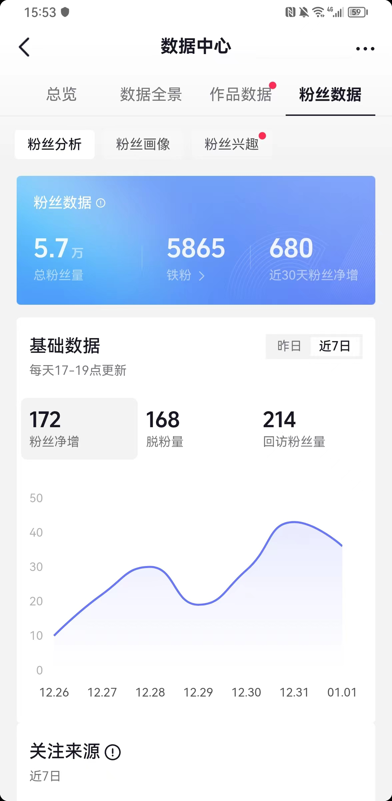

我自己的课程尚有部分盈利（在店铺有问题的情况下）

#### 思考与总结

- 状态：**停更中**

- 长话：我希望帮助那些想要在生活、职场、健康、财务、事业上，寻求突破和改变的人，想要活出自我的人，这是我一直以来的目标

- 一句话：**渡人渡己**，在帮助别人的同时，我自己也得到了巨大的满足和提升

反思与总结：

做的好的地方

1. 主观意识上**非常希望继续更新**（打脸）
2. 也**设置了诸多举措**来确保这件事情有序的推进

做的不好的地方

1. **停更几个月**
2. 许多人的留言，几周甚至几个月后才回复
3. **店铺问题**，间接也让我对继续更新这件事情产生了消极的做法

---

**事业篇总结：**

回归当这篇文章的主标题：复杂又简单的一年

这一年看似做了许多复杂，种类繁多的事情，其实从本质上来说，又是**极其简单**的一年：因为从一年的开始到现在一年的结束，**留下来的只有那一两件**事情

许多项目做着做着就没了，就搁浅了，无论是自己的原因还是外部的原因。这么多事情有意义吗？

有意义，也许作为旁观者，你无法体会到，许多东西是环环相扣的

如果没有我早年做自媒体，我不会去考虑自动化制作视频

如果没有AI的学习和研究，也不会有大量项目的产出（chatgpt在这些项目中都给与了我巨大的帮助）

如果没有我研习心理学，也许现在我只是一个被生活磨平棱角、被社会打败的中年大叔

如果没有过去的经历，你也不会在这里看到我

在新的2024，我会不断的折腾，折腾新的事情，迎接新的挑战，哈哈哈哈

**Do the thing, and you shall have the power. 生命在于折腾**

后篇会继续更新、关于2023年健康、学习、家庭、教育等反思

