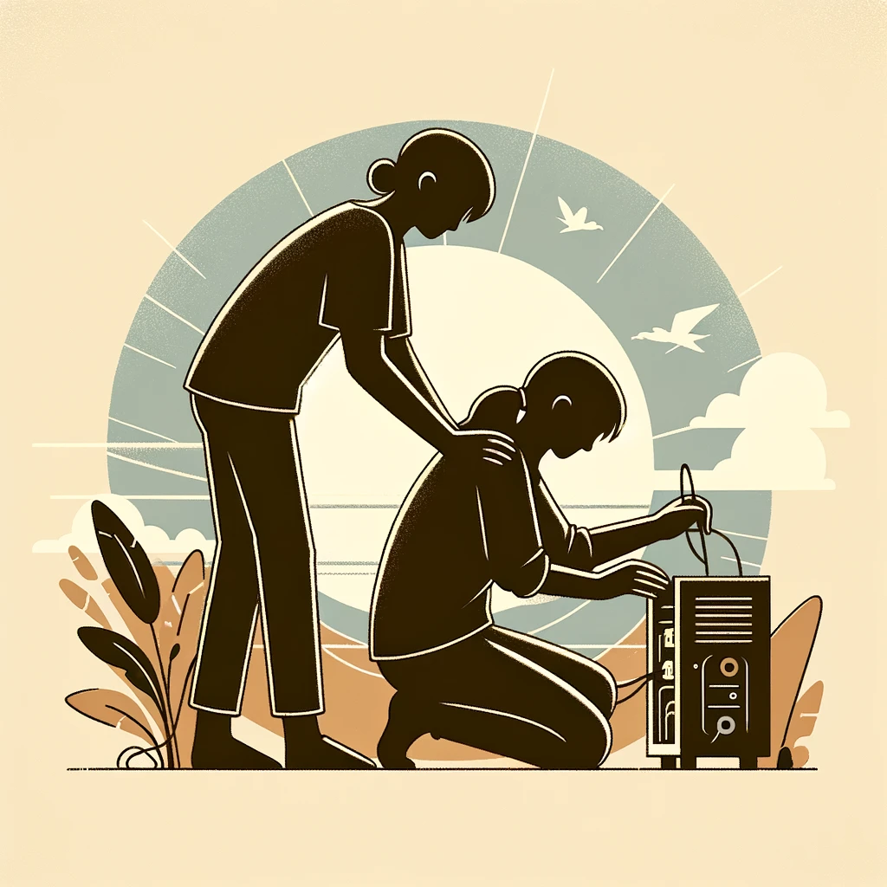
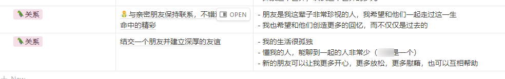
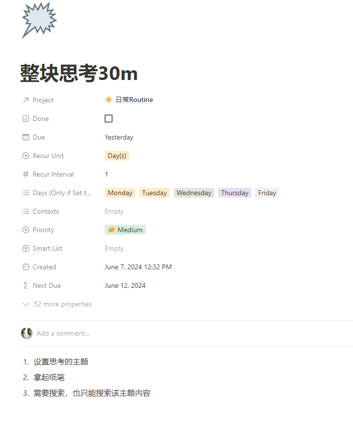
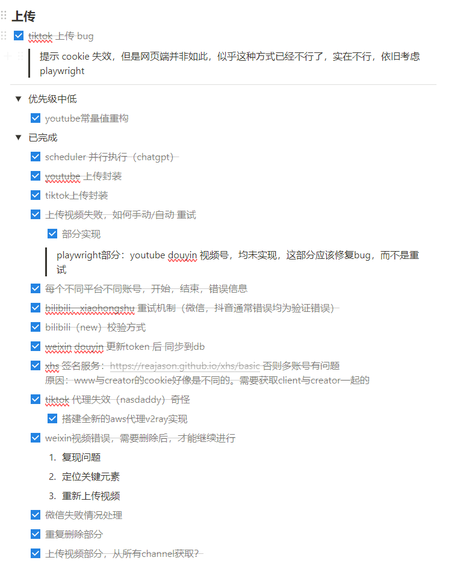
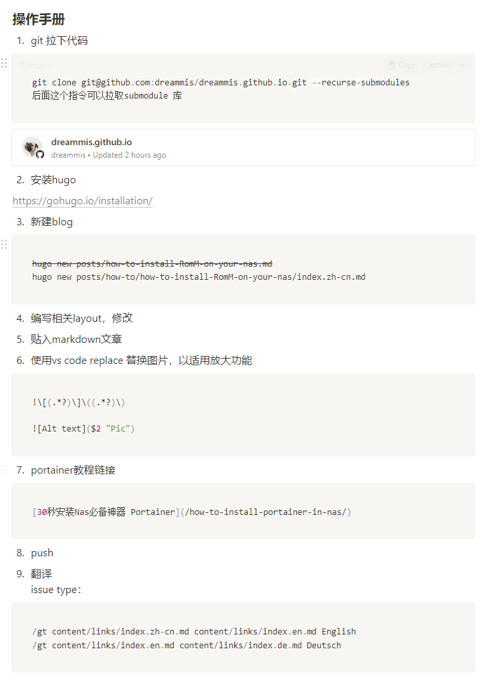
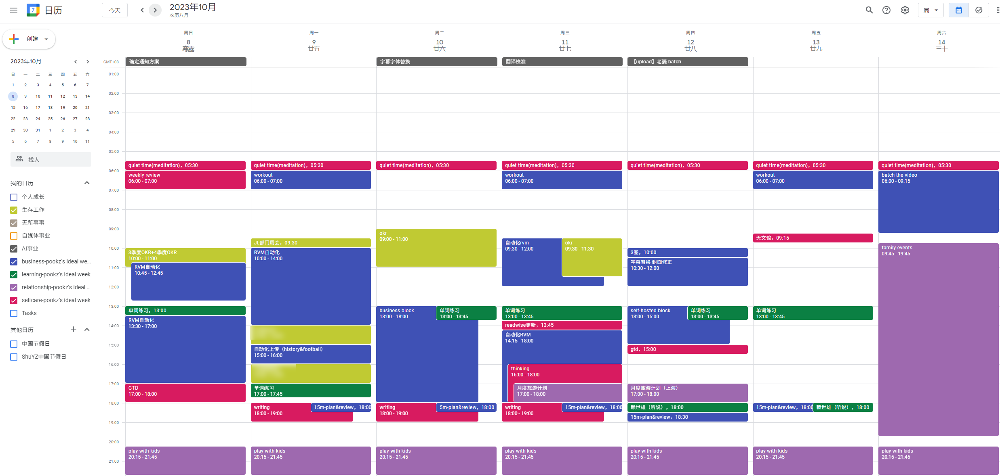
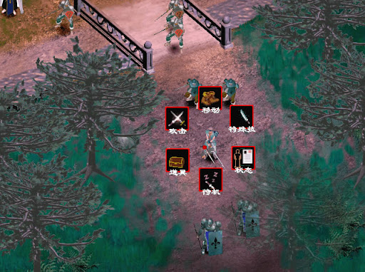

## 前言

接着上一篇 [2024 半年度 Review（折腾篇）：此刻你是否清醒？](https://www.nasdaddy.com/2024-half-year-review/)， 强行给自己挖坑，必须要写出来关于个人成长篇。甚至我觉得这一篇对我的帮助，以及对其他人的帮助，远远大过于那些复盘和总结

其实早在去年，2023年度review  [复杂又简单的一年-2023年回顾（记X生物存在于地球的一年）（事业篇）](https://www.nasdaddy.com/2023-review-buiness/) 当时我想要写一些关于除了事业以外的领域

无奈想说的太多，同时，我又陷入无尽的做做做，后面会说为什么`行动力大并不一定是好事`

## 上下文（content）

今年的自己36岁，到了世俗意义上的`中年`，又加上自己是做`互联网`的，这些年`经济下行`

我这个中年，互联网，技术大叔，从原来的`香饽饽`瞬间变成了过街老鼠，人人喊打。

这个时代，偏偏有那么一群人，喜欢拿`中年危机`来说事

什么，樊登、还有那个年会翻车的刘润，连我常常看的一个九边，动不动就要把中年人拉出来鞭一下尸。

说中年男人

- 躺尸开关开启
- 又是从基因的角度，男人35岁生育工作完成，就进入了躺平状态...
- 又是企业觉得35岁的人群性价比低
- ...

说实话，我估计，大多数中年人看到这样的话，不会觉得更舒服，反而更加焦虑。而有些人就开始利用这份焦虑来赚取流量，甚至开始宣传自己的产品和课程

我觉得`他们做的很对`，他们的客户群体就是这类中年人，而这类中年人的`痛点`，让他们说的淋漓尽致，甚至你说不出来的他们都说出来了。

这是做任何项目和产品必备的品质，`了解你的用户`，`说他们希望听的`，我们永远愿意`相信那个更懂我的人`。

而我这篇，则很简单，我想分享一下，我是如何避免打开躺尸开关，如何避免进入躺平状态

首先介绍下自己，我从毕业一直从事技术开发，发展上的路线

- 每一次跳槽，给自己岗位做一次提升（直到2019年），从后端开发到后端组长、到前后端技术负责、再到测试产品的整个产研团队
- 一直到19年，职位上没啥折腾的了，开始想办法逃离这个做了10多年的行业
- 22年跨行，去做心理自媒体，拍视频、写文案、做直播（一年做了6w收益，全网10w+粉丝）
- 23年觉得跨行并不太成功，又来上班了
- 24年6月的今天，我还在打工，打工的同时不断的折腾，妄图再次走出一条不同的道路

我做的，我会的远远不止于此。但是我也并没有你所认为的那么高效，我就是个`普通人`，我丧的时候，能玩游戏到半夜4点（现在依旧也会如此）

所以不要神话任何一个你看到的人，他们只是人，都会拉屎，也都会死掉

那些早上起床就去运动的人，我就很纳闷，每天早起光拉屎，洗澡就耗费我半个小时，他们是怎么做到忍着屎做运动，又是怎么保证自己不会因为强烈的运动而不小心拉裤子...

接下来进入正题，这也是我自己的心得体会，同时也可以告诫自己，需要加强的地方

> 此心得，领悟是当前的自己认为重要的，有可能无法适用于所有人

## 心态篇

### 以终为始

在开始前我想问几个问题，不妨思考下。

`你的目标是什么？你为什么活着？你来到这个世界的目标是什么？`

不妨给自己1分钟思考下...

.

.

.

目标是什么？我们为什么活着？

为什么的答案，往往是一个`理由`

给自己一个活着的理由，给生命寻找一个理由

佛陀说，`人生是苦`

我们换个角度思考下：

> 我活着没有任何意义，我的出生就是个意外，天上有一个玩家，无意间按错了键，我就出生了

>  于是这一辈子我就漫无目的的游荡、随便吃点东西，随便认识一些人，和别人一样他们做啥我也做啥，最后挂掉

这就是你来这个世界的目的吗？

在我这里没有答案，我只能告诉你，我思量许久，我的答案是，我来这里就是为了体验，冒险。

我不知道我死后会去哪里，我不知道我的生命是不是个玩笑，也`没人告诉我该怎么活着`，所以`我自己选择怎么活着`

世俗的`条条框框`，是我`极力要去避免`的，如果和我的价值相符，我遵守，如果不是，那么只要`不触犯法律`，我坚决不会遵循

这个世界没有任何一个人和我一模一样，即便我有个双胞胎的哥哥，姐姐、弟弟、妹妹，我们俩也是不同的。`没有人和我一样`

我想要活出自己的意义，而不是别人认为的，做一些有意义的事情，帮助更多的人，想办法赚更多的钱，给我爱的人，让他们的生活更好一些，教会孩子们成长，让他们成为一个独立的灵魂。

当我们有了一个更宏大的世界观，宇宙观，那么生活中遇到的那些烂人破事你就会选择性忽略它。

#### 行动项 action：

- 给自己一些时间，去思考你为何而来
- 读一些历史、传记，去培养更广阔的世界观
- 科幻小说是个好东西（我看的少，我希望孩子们多看），想象力好的人，烦恼一定很少

### 想得多，做的少

造成这个问题的原因有很多，具体方法可以参考下面的，[`工具篇`]

我这里随便聊点其他因素：`你需要有人与你同行`

大家都知道环境很重要，你在什么样的环境，大概率会成为什么样的人

看一个人最好的方法，就是看常常和他在一起的5个人是什么样的人

现在社会流行超级英雄（图片），钢铁侠，雷神、蜘蛛侠，任何一个拎出来都能打10个，还能独立完成任务

社交媒体上宣传各种企业家，也是：马云、刘强东、王兴。似乎这些人就像超级英雄一样，独自撑起了一片天

但是，他们很少说站在他们背后的人，他们的得力助手，发现他们的伯乐，取得关键性进程的合作伙伴，更不要说在创业初期陪在他们身边的一个个老战友

我们是社群动物，我们需要他人的支持。

- 在你遇到困难的时候，有人能给你指点迷津
- 在你灰心想要放弃的时候，其他人给你心灵按摩，加油打气
- 在你被人不理解的时候，有那么一群人在和你同行，让你看到你不是另类

我知道现在通信越发发达，而我们却和其他人渐行渐远，我就是个例子，人到中年，除了那些有着美好回忆的高中大学同学，这些年竟然没几个朋友

在心情郁闷，或者自己做出一个值得骄傲的东西的时候，却没有人去诉说

所以

- 如果你决定想要做什么项目，那么去寻找这样的社群，这样的人群是我唯一建议你做的
- 如果你没有什么项目，你也需要朋友（如果你和我一样感到孤独的话）
- 你也可以找一个希望学习的人，跟着他，帮助他，和他成为朋友，共同成长

于是我在2024年给自己定下了一个目标：结交一个朋友并建立深厚的友谊。

还好，今年主动，不收取任何报酬的情况下，帮助了一些人，其中有一位广州的朋友，我帮助他完成了一些开发上的问题和项目，他也帮助我，借用它的服务

我自认为和他有了比较不错的友谊，有些事情也都愿意和他聊

那么如何结交一个朋友呢？

#### 行动项 action：

- 寻找你想要的人群，去帮助他们，相信我，他们和你一样孤独，渴望有人认可。如果你想结交的人高高在上，可能比较难，其实有很多像我一样的，有一些能力，但是属于中不溜，甚至靠下的人，和这些人结交非常容易
- 如果这个人有自媒体或者产品，更简单了，花钱去购买他们的服务，认可他们的产品
- 真诚待人

### 行动力并不是万能的

我自认为比80%的同龄人，行动力要高，从我折腾这些破玩意儿你就知道了。但是我也是最近几个月，发现了一个比行动力更致命的问题。

我的行动更多的是`无效行动`，做的多，结果和自己想要的南辕北辙，每天沉迷在做做做

为什么？

我思考了之后发现：我错误的将行动变成了缓解焦虑的方式

我借助自己不停的做，让自己忙起来，好让自己不那么焦虑，说更难听点，好让自己假装很忙，自我感觉良好，让自己显得没那么差劲

再深一步去思考为什么？为什么焦虑？又回到了那个话题：对未来的恐惧

我不知道自己未来该做什么，要往哪个方向发展，我迷茫、恐惧、不知所措

那这个时候，我该做什么呢？

思考！而过去这么久了，为什么我还没思考出个方向出来呢？

因为我在逃避思考，我在让自己忙起来，好避免自己去做那个费力、又没啥立即结果的事情----思考

当我认识到这一点之后，我开始有意识的，给自己规定每天30分钟，什么也不做，就是思考。

这个过程是非常痛苦的，要强忍着去看各种资讯，强忍着去做那些我内心知道啥时候都可以去做的事情

最终这个决定是有效的，经过1周的强制思考，我明确了最近2周要做的事情

人常言：思想的巨人，行动的矮子。我现在觉得很多过度思考的人，他们的思考更多是无效的，他们天马行空，夹杂着各种负面情绪，想一会儿又去做别的，并没有做深度思考。

#### 行动项 action：

- 强制自己30m，不去做别的就是思考
- 拿出纸笔，可以画画写写

## 工具篇

### 细化任务

做技术，以及做技术管理，需要具备非常重要的能力，这个能力恰恰又能应用在生活和事业。那就是：``任务拆分``

许多人有了一个想法，一个idea，最后往往不了了之，很大程度上是因为

- 人类最惧怕的是模糊和未知：许多idea都是从一个模糊到具体，一旦一个任务很模糊，我们就会产生恐惧的情绪，这就会驱使你去逃避，去选择更简单的事情去做
- 娱乐消遣的事情容易又快乐：短视频，电影节说，手游，网文小说，哪一个不是去了就很难回来的东西。我们的大脑非常容易选择那些简单，令你愉悦的事情
- 大脑很笨，大多数时候他们想着眼前的东西，能快速获得结果的东西
- 大脑没有去细化里面的action（执行）

这时候就需要你趁热打铁，在脑海中把问题细化，将复杂的问题拆解成一个个action（可执行的步骤）。就像这样，我使用的是[notion](https://www.notion.so/)来管理这些任务

我是在做自动化视频的时候，将任务拆解为：

- 采集
- 下载
- 音视频抽离
- transcript 音频
- 等等

同时，当我们把任务拆解的足够细致，甚至要做什么，具体做什么都写成一个个不用动脑子的操作步骤

这样会极大降低这件事情开始的难度，几乎是没有任何摩擦就自动化执行。因为你的大脑不需要耗费任何精力，只需要一个个步骤执行即可

在做技术管理也是如此，你需要给团队成员具体而明确的任务

#### 行动项 action：

- 给出专门的时间来细化任务
- 遇到无法解决的强迫自己不要去解决，而是先拆分大模块，大模块拆分成小模块
- 脑子是有血条的，用多了就会累，同时脑子用来思考的，能无脑去做的，行成文档，无脑去执行

### calendar

经济学里有一个著名的定律，叫做帕金森定律（引用自[维基百科](https://zh.wikipedia.org/wiki/%E5%B8%95%E9%87%91%E6%A3%AE%E5%AE%9A%E7%90%86)）

`帕金森定理`（英语：Parkinson's law），又译做“白京生定律”，是由英国作家[西里尔·诺斯古德·帕金森](https://zh.wikipedia.org/wiki/西里爾·諾斯古德·帕金森)提出的[俗语](https://zh.wikipedia.org/wiki/俗語)。这个俚语最早出现在1955年《[经济学人](https://zh.wikipedia.org/wiki/經濟學人)》中的幽默短文，[帕金森](https://zh.wikipedia.org/wiki/西里爾·諾斯古德·帕金森)说：

> 在工作能够完成的时限内，工作量会一直增加，直到所有可用时间都被填充为止

意思是，当一件事情，如果没有规定有效的截止日期，那么这件事情，大概率会无限期延期。

你思考下，是不是这样，许多生活中你想要做的事情，很多年都没有开始做或者没做完。要不这件事情不紧迫，要不就是你陷入了完美主义，不断的填充新的东西进去，而迟迟没有一个阶段性的成果出来

所以我们需要给自己的任务设定截止日期：

- 增加紧迫感
- 强迫自己有一个不完美但是完整的交付物出来
- 随后再逐步迭代

而这里最好的工具，则是calendar

这是我一周的calendar，我通常都是每天早上或者头一天晚上制定好自己第二天的任务，给他们画出整块的时间。每个时间段我不至于因为不知道做什么，或者这件事情做多久而摩擦力太大，不了了之

当然这是一个很理想化的，最终可能我因为某件事情或者某个问题困扰了一天，都是有可能的。

国外calendar这类工具非常受欢迎，甚至他们的社交活动，booking call 都是发一个calendar链接，以加入对方日程。

#### 行动项 action：

- 将任务分配到各个时间块，估算截止日期，营造紧迫感
- 在时间范围内，尽可能的专注
- 没有按照calendar执行没关系，渐渐的，你的calendar会越来越准确
- 日常习惯，或者周期性的事情也可以使用calendar来管理
- ios 与android都应相应的calendar软件，而且都是免费的

## 我的问题

因为这是一篇关于成长的自我回顾，这里自然也列举了我自己遇到的一些问题

### 1. 读书太少

这两年读书似乎不是我主要的学习方式，这是我目前遇到的最大的问题，产生的原因可能是信息太多，忙着工作，折腾项目，孩子教育，太多太多事情了

晚上么，睡觉拿着kindle么，又不利于孩子睡觉（他们总凑过来看）。于是开始慢慢偏爱有声书（因为外表他们觉得我睡了，其实我还在听书）

### 2. 尼古丁

我有着很长时间的抽烟历史，而且我常常尝试自己戒烟，最终都是失败了，仅仅今年，我1个月能尝试戒烟个3-4次，因为戒烟这件事情让我承受了巨大的心理折磨。同时也带给家人很多不好的影响

尤其还有孩子，你对孩子说一万句：抽烟不好，不能抽烟，也抵不住说完之后，你嘴巴上叼着的香烟

我经过大量的研究，发现香烟确实能带来很多好处，只是它的坏处更大

所以最近几个月我不再折腾戒烟了，等待我从当前环境脱离出来后，决定一次性戒掉

### 3. 睡眠与运动

我不清醒的最大原因，在于自己睡眠不足

1周我能有4-5天，都保持在夜里3点睡觉，早上8点起床，这其实对我的身体和情绪造成的负面影响巨大

运动就不赘述了

## 娱乐

这也算我一个毛病吧，只要玩起游戏来，就会陷入废寝忘食的阶段，不舍昼夜。

本半年，玩了几个游戏：《赛博朋克》，《死亡细胞》《p5r》，熬夜通关了

### 《P5R》

早在22年就加入了我的待玩列表，算是今年玩通了。为了追求利益最大化，全程看着攻略玩的，感觉体验感大打折扣。反而最后玩完觉得没啥意思了。

`好的东西要自己体验`

### 《火焰纹章engage》

从小我蛮喜欢玩战旗的，小时候意外的喜欢的不是《仙剑》这样的游戏，反而对《幻世录》这样的游戏特别钟爱

我玩了好几代火纹，if，但是似乎都没有通关，这算是我玩通关的第一代火纹

这也奠定了未来玩游戏的主线，战旗类游戏比较适合我，又有点动脑子，又可以随时停止，还可以长久钻研玩

## 总结

终于写完了，还有很多想写，但是没写，实在不想写了。写这篇更多的算是对23年总结，只写了事业篇的一个弥补。

如果你觉得这个对你有帮助，也许你的支持，是我继续往下写的动力

