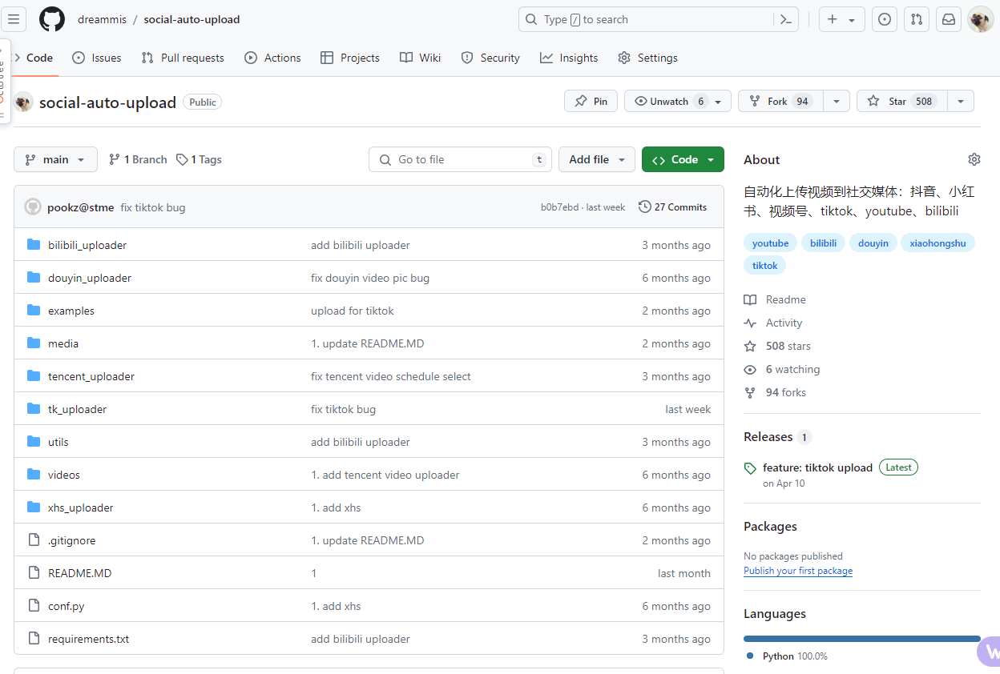
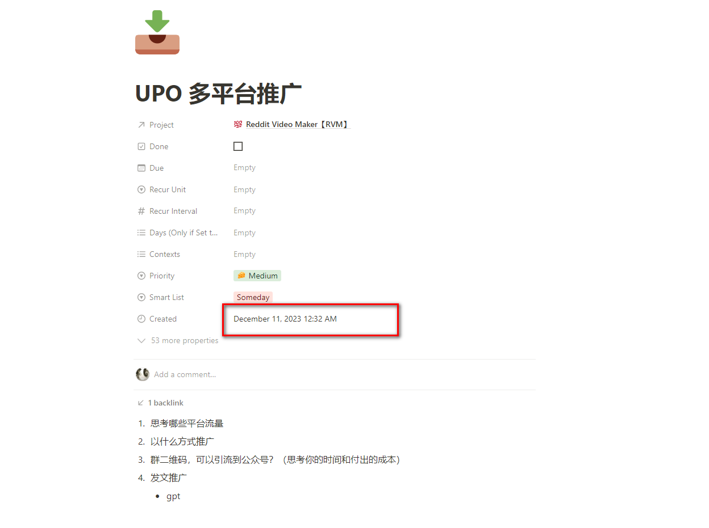
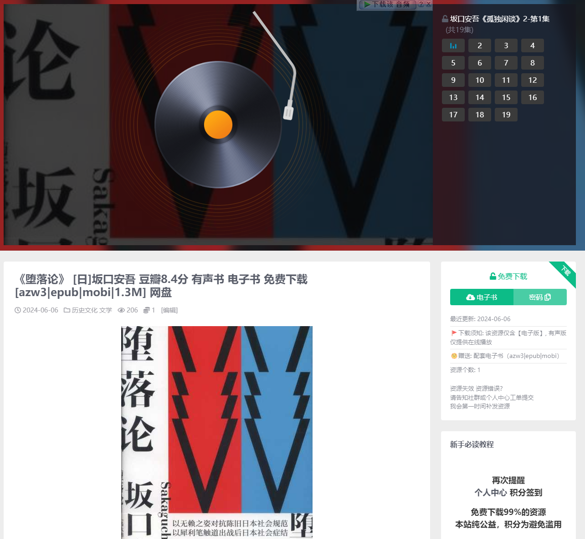
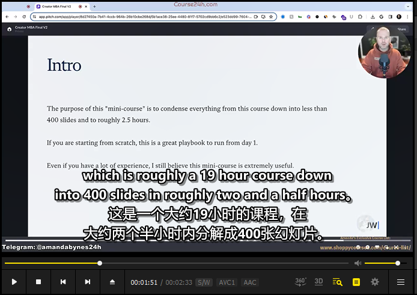

## 前言

这一篇2024 半年度review 本计划在5月末完成的，恰逢6.1 带小朋友去迪士尼，导致推迟了整整7天。 

这一篇review 的副标题是：**此刻你是否清醒吗**？

你现在清醒吗？这句话是在我的**每日checklist 列表**中的其中一项。我每一天都会尝试问自己这个问题：**你现在清醒吗？**

我们常常会陷入各种**负面情绪**，焦虑、恐惧、愤怒、怨恨、自我怀疑等等，而这些负面情绪会

- 令我们看待周遭的事物产生**偏差**
- **无法理性**的看待周遭的一切
- **被情绪大脑肆意驱动**

比如你因为童年曾经被狗咬伤，此刻看到狗，陷入了恐惧的情绪，而即便眼前是一个可爱活泼的小狗，你依旧认为这是危险，不敢上前

同样，我们生活当中都是如此，同样一件事情，

有人看到的是**机会**，而我们看到的是**危险**

有人很自然的**表现自己**，而我们却因为负面情绪而**不敢表现**...

而这182天里，很多时候，自己就属于一个极度不清醒，而导致这个不清醒的原因有很多：有焦虑、有不自信、也有人际交往上的问题...

于是我也制定了一些策略，来规避这种现象，后面会讲到。

以下，我会逐步回顾这半年来的所思所想，所作所为，涵盖事业、~~个人成长，家庭、学习、教育、娱乐等~~（剩下的我实在不想写了，有机会再写）

希望我的碎碎念，能让无意间看到这一篇的你，有所启发。

## 事业

> 自娱自乐

### 自动化制作视频RVM

一句话：稳定运行

这个项目本质是上一个**搬运**项目，将国外的视频，通过程序二次剪辑、配音、字幕、翻译、上传一体化上传到国内平台

目前依旧是38个账号，依旧是部分表现良好，部分一般

表现一般的就不贴了

#### 总结与反思

一句话：**食之无味弃之可惜**

该项目就是自己玩，靠搬运赚点零花钱而已，这些账号的收益，我至今都没统计多少。因为少的可怜😄

更多的是**学习**：

- 学习程序化剪辑
- 深度使用ai，ai帮助我解决了许多项目难点
- 流程化管理
  - 批量收集素材（每天1分钟刷youtube tk，收集了大量频道）
  - 批量运作
  - 自动化管理
  - mvp，我养成了快速实验的习惯（2周测试一种内容是否可以，如果不行，账号立马删除所有视频，开始其他类目的）

不足之处：

- 我深知仅仅就是个**玩具**，无法给自己带来多大的收益
- **盗取别人劳动成果**并不道德，所以这套程序出来的东西，我从来不做去水印操作，甚至我还会给原作者发邮件，征得同意..

### social-auto-upload（SAU)

后面简称**SAU**

该项目是上个项目我剥离出来的，因为上传工作枯燥切无聊，于是我用playwright的方式，模拟了浏览器的行为，做到了自动化上传，cookie管理等等

我又想到可能有其他人需要这个东西，于是开源出来

目前gayhub 意外有了500+star，拉的学习交流群也有100+人

#### 思考与总结

唯一一点，也是最重要的一点：

任何时候，你**不该放弃去营销自己**

这是在，该项目无意间吸引了几个公司来找我帮忙定制开发后，我猛然间意识到的。

其实在我开源这套代码的时候，我就规划，要适当营销这个项目

而到了5月份，我才真正意识到，这个问题。这也印证了：

- 这182天里我不清醒的时候也许真的很多
- 我并没有找到**最重要的事情去做**
- 我并**没有识别重要事情的能力**

但是，没关系，此时此刻并不晚。以后无论你做什么，只要是帮助别人的事情，你都应该想办法让更多的人知道。他们真的也渴望找到你。

### WLP（电子书、有声书下载站）

WLP是一个**免费**，**公益**的电子书、有声书下载站

为什么做这样一个站？

1. 首先我是一个**有声书爱好者**，我特别喜欢听书
2. 大量书籍，尤其社科类是**没有有声版本**的

于是我想要做一个通过程序自动化制作有声书的网站

但是在做着做着的过程中，不断的抛弃原来的想法，最后变成了这么一个站

#### 总结与反思

目前该站，稳定运行，每日自动化录入20+书籍

用户200+ 

反思：

1. 同样这样的东西只能是玩具
2. 因为这是**侵犯版权**的事情，侵害作者与出版社利益的事情
3. 所以我仅仅做成公益的方式
4. 一开始你想的再好，在做的过程中也会发生变化，不要迷信你一开始的想法

所以该站同样只是学习与练习：

- 设计了整套的自动化解决方案

  - 自动化抓取
  - 自动化下载电子版
  - 自动化制作有声版
  - 自动化下载有声版（其他网站）
  - 自动化上传网盘 生成分享链接
  - 自动化发布帖子

  

  - 自动化发布营销视频

  

  - 自动化tg推送

呵呵，又是**一个玩具**罢了，然后花了2天时间，我就复制出来2个这样的网站，只是不同的类目

我还是计划下半年再启动2个自动化项目

### 其他

#### nas相关更新

并不是那么频繁，感觉nas没啥新鲜东西玩，本来nas就是折腾一次，就一直用着了

我看其他人写教程一天一篇，在我看来那些都是为了**凑数**而写的，不知不觉成了借助各种开源项目来推广nas的了

事实上，他们并没有错

1. 如果你真正想要经营好自媒体，**勤奋**是必须的
2. 其次，你不知道你的用户喜欢什么，你不知道你该发什么，这时候有两个办法
   - 想办法找到用户真正需要的东西（做足用户调研，这就是我之前写那篇formbricks 我为何如此激动了）
   - **大力出奇迹**，啥都写。就是我看到其他人那样做的方式。但是这种方式同样也是需要你静下心来去**分析**你这些大力出奇迹的内容数据。找到用户真正需要的，否则你一直在碰运气

#### 视频翻译

一句话：**ai的生成双语字幕**

因为我自己有学习国外课程的课程的习惯，于是我借鉴他人的项目，自己改装了一套自动化做字幕，生成字幕文件的项目

以前我是用别人做的软件，还得配置一大堆密钥，现在ai出来了，真的学习和工作方便太多太多了

这个项目完全运行在本地，配置要求不高，gpu只是加速而已，翻译我也改成了免费的翻译引擎，当然ai翻译更好（更好的上下文）

同类的你可以使用：

- [飞书妙记](https://www.feishu.cn/product/minutes) 
- [通义听悟](https://tingwu.aliyun.com/u/47z39vaweze9edgk) （带af code，也就多给我点时长）

通义多了ai总结的功能，做笔记的功能，也带视频翻译，但是我觉得他的总结很一般

另外我想多说一句：网上各种summary插件，一键总结

我自己感觉，是无法替代我自己学习的，即便这些ai总结的再好，也无法给你产生过多的神经连接，自然也就无法真正学到

## 总结

距离上一个review [复杂又简单的一年-2023年回顾（记X生物存在于地球的一年）（事业篇）](/2023-review-buiness/) 已经过去了半年

不知不觉，又过去了半年，成年之后，时间过得越发快，人的欲望也越来越多

我渴望成就一番自己的事业，可以持续帮助别人，也能给自己带来利益的事情

但是苦于自己精力有限，周围又没有更多喜欢折腾的人

加之这个年纪，常常陷入焦虑。如果你也这样，我给你讲一个故事，这个故事我牢记于心，也常常提醒自己

曾经有一位王子，要钱有钱，要美女有美女，要地位有地位，可是他依旧很多烦恼，不开心常在，他百思不得其解

于是他下定决心，找了一棵树坐下来思考这个问题，跟自己说，如果我想不出这个问题，我就不起来了

就这样过去了一周又一周，终于他开悟了

他对自己说：草，我知道为什么了，我的脑子出了问题，脑子一直在跟自己玩一个游戏，叫做**如果....就....**

这个笨蛋大脑永远不满足当下，于是他创立了一个教派，用来告诉世人，告诉世人这个发现：你脑子有问题，它不停的依附于外界来得到满足

这个人的名字就是佛陀

希望，在读这篇的你，能有一颗宁静的心

下一篇(已完成)

[2024 半年度 Review（个人成长）：中年危机？36岁的我，是如何做到不躺平，无尽折腾的](/2024-half-year-review-self-help)我将注重聊一下，我有一些方法和技巧，帮助保持内心宁静，尽可能让自己清醒更多，混沌更少