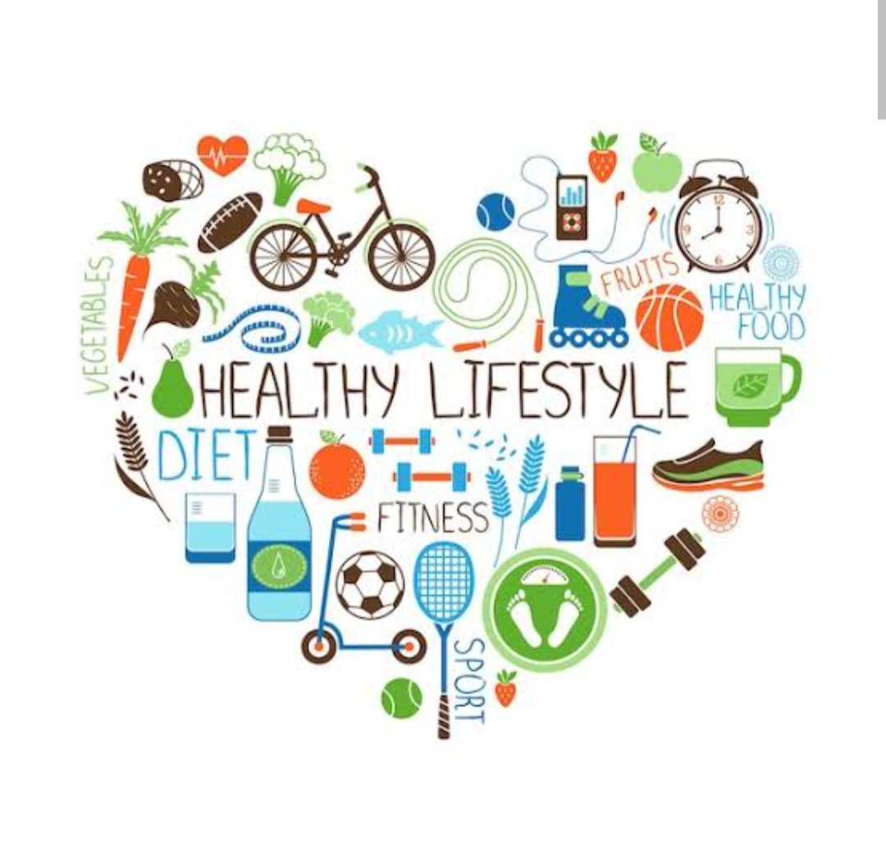

# 我的2025年，一个中年人的年度计划（todo）

## 前言

今天是`开工`的第一天，也是2025年一个`新的开始`，这里分享给大家我2025年的计划，你也许有这些困惑：

- `为什么要制定目标`，目标对人非常重要
- 为什么制定`目标又不那么重要`
- 一个`互联网人`、`中年焦虑大叔`、`自由创业者`是如何规划2025年的
- 如何`有意识`的度过2025年？如何避免在2025年的最后，感觉又是`虚度`的一年
- 究竟该`怎么制定年度计划`，如何让自己`2025年更加充实`

这一篇的分享，也许能让你找到这些答案

---

Q：**为什么制定目标对一个人如何重要**

A：目标是一个`方向`，而不是`最终结果`，这是我许多年过来的一个感悟

好比：

- 开车带家人出去玩，你需要`导航一个目的地`，你需要有个目的地，否则你只是在到处瞎逛
- 即便你是自由行，下榻酒店后，想要在外面溜达，站在酒店门口，左边是集市，右边是住宅区，你也需要有一个方向，否则`你只能站在原地`
- 你想要`健康的身体`，什么样的身体是健康的，怎么样的生活是健康的，你需要一个目标
- 你想要`找到女朋友`，什么样的女朋友，善良，贤惠，温柔，独立？你需要一个目标

有了`目标`你才有`前进和努力的方向`，否则我们只是`随波逐流的过每一天`

有了目标，才能`衡量你的进步`，你才知道你走了多远，否则你根本不知道自己是否在朝着自己想要的方向前进，你也不知道自己究竟进步了多少

Q: **为什么制定目标，又不那么重要**

A：如果我们能明白我刚说的这句话`目标是一个方向，而不是最终结果`，你也就知道

`目标并不能让我们到达重点，重要的是怎么做`

引用《Atomic Habits》的一句话

> Goals can provide `direction` and even push you forward in the short-term, but eventually a `well-designed system` will always win. Having a system is what matters. Committing to the process is what makes the difference.
>
> 目标可以提供方向，甚至可以在短期内推动您前进，但最终一个设计良好的系统总是会获胜。拥有一个系统才是最重要的。致力于这个过程是与众不同的。

这个怎么做就是一个系统，这个系统关乎如何推进你的行为朝着目标行动，接下来我会展示我是`如何设定目标`，又是`如何设置系统`的

接下来的内容是`非常主观`的，如果对你有帮助，有启发，那是最好的事情

## 2025年计划

那么如何制定目标，我们人该设定什么样的目标呢？

是赚多少钱？学习多少本书？这样的目标可以

但是太片面，我们的`人生是复杂`的，是`多个领域`的

我把自己`人生分为几个模块`，这些是我觉得非常重要的一部分（排名并不分先后）

- **健康**
- **精神**
- **事业**
- **爱情**
- **家庭**
- **关系**
- **成长**

在下面的章节里，我会逐个分享：

- 这些`人生板块`究竟是什么？
- 为什么我从这些领域来设定自己的目标
- 我又是如何规划这些板块的

再次提醒：这里是非常主观的，每个人的人生轨迹，思考方式不同，如果我的分享恰好，对你有启发，那是再好不过的事情了

接下来你会在各个小结逐个陈述

>  我使用的是notion这个工具来设置我的目标，模板取自之前一个Youtuber分享的，这个并不重要(如果你需要，也可以给留言，我分享给大家）
>
> 模板，只是一个框架，你可以完全使用手机的笔记软件，轻松的实现这个框架

### 健康

#### Why

我认为，`健康是一切的基础`，健康意味着

- 我是否有`精力`来进行自己的事业：如果每日困倦，生病自然没有那么多的精力去创业
- 我是否有一个`好的状态`来克服眼前困难
- 我是否能有一个`好的情绪`去面对，家人，爱人，朋友，孩子们
  健康是会极大程度影响我们的心情，比如你的脖子的轻微疼痛，都会让你感觉烦躁
- 我是否能持续`不断的成长`

所以，健康是一个基石

> 如果你常常感觉力不从心，想做的事情很多却没有动力去做，也许并不单单是你的心态和精神上出了问题，`你的健康也许也在影响你`

#### How to

依据目标的smart原则，我设定的目标是：**体重维持在65kg，身体拥有肌肉**

设定一个任务提醒，**每2天提醒我一次**，并且把具体的行动计划设置好

这里我设置了：

- **运动的方式**（确保我收到提醒后知道**具体的**行动方式，而不用去思考，人大脑是非常排斥思考的）
- **定时的提醒**（每天发生事情很多，我需要有一个系统有效的提醒我）
- **考虑如何无法执行的情况**：
  - 时间少：时间少该如何保障该任务能执行
  - 下雨：可在家做壶铃，或者做其他hiit（力争使用最少的时间起到锻炼的效果）

**健康是一种生活状态**，是日积月累的结果，这方面我在2024年做的并不好，希望今年能有所提高

### 精神

#### Why

**精神和健康是同等重要的**，一个好心情，正面的情绪，好的心态，更轻松和坦然看待问题的视角，会影响我的方方面面。

负面情绪过多，导致的结果：

- 自然也**无法教育好孩子**
- 会**自暴自弃**，**沉迷在短暂快乐**当中（比如短视频，垃圾信息上）
- 导致自己创业过程中**做出错误，情绪化，片面的决策**

我一直对周围人说一句话：**健康影响着你的精神，你的精神也在影响着你的健康**

健康影响着你的精神：试想，你刚大汗淋漓的运动完，此刻你的心情是非常愉悦和满足的，感觉自己可以克服任何困难

精神也在影响着你的健康：人常言人逢喜事精神爽就是这个道理，一个好的心态，好的精神状态，也会积极影响你的身体健康，心情好的时候，干什么都有劲

#### How to

依据目标的smart原则，我设定的目标是：

- **每周最少3次（不可间断超过1天）**
- **每个月一次情绪清理**

这里有几个关键的行为：

- 冥想，这个对我来说非常有用，但是我常常无法坚持，希望设定一个任务系统性的提醒我

- 每日感恩，则是在我的每日反思中，设定的，感恩我觉得是我们中国人比较少去做的事情，而**感恩**这件事情却可以给我带来极大的**精神慰藉**

  - 感恩可以让我**更珍惜现在的生活**，感谢现在拥有的一切，而**不只是盯着自己匮乏的部分**
  - 感恩可以让我**晚上休息的更好**

  

- 每个月使用**自己的课程《迈向真我》**来清理非必要的负面情绪

  我之前自媒体曾经创立了一门课程，可以帮助人快速清理负面情绪

  

  而我自己常常却很少用，哈哈哈哈。不知道是不是因为`外来和尚好念经`的缘故

### 事业

今年事业的关键词：**出海**，**多项目并行**

为什么选择出海：

- 我有优势，因为我`常年都在学习海外的东西`
- 加上本身是`技术`，出海对我来说比一般人容易
- 经济下行，而国外受到的影响较小，出海的事业可以有效`避免国内内卷`

Q：为什么**多项目并行，而不是专注一个**

A：一切都是数学问题，`概率问题`

- 高考，考公，自媒体，创业，一切都可以认为是一个数学问题
- 拿自媒体来说，不是你长得好看就一定出圈，不是你封面做的好就一定会有好流量，种种因素只是增加你出圈的概率
- 多项目运作，也是为了**尽可能的博取概率**
- 我**有经验和技术**可以多项目运作
  - 目前我在多项目运作的：足球，自媒体自动分发，两性出海等等
  - **深度使用AI**来实现工作流
  - 结合上一条，加我本身的技术能力，尽可能让大量工作**自动化或者半自动化**运作

**多项目运作的坏处**：

- **精力有限，会导致许多项目无法开始，或者做个开头**

解决：找到最重要的事情，**做最重要的事情**，永远记住28定律。劳动力能外包的就外包。迅速做出MVP来尝试。

- **项目可能会做不深**

解决：月或者季度要**深度复盘该项目**，如果有偏差，或者结果呈现不及预期，这时候考虑的**是大动作去调整策略**，或者**放弃**

那么今年主要是几个项目运作：

- CGS，继续当我的足球教练

- SYT 两性出海，前期3个月，出圈2个账号，并且有些账号已呈现IP化，接下来会矩阵化继续复制成功案例，扩大整个优势，深度做知识付费等

  

- **儒道佛出海**，做文创类输出海外华人（这里不阐述过多，有兴趣可以私聊）
- **China Travel**，入境游，做海外自媒体，品牌营销
- RUA 招聘海外主播来中国（这里和朋友合作暂时不表）
- 心理个人成长自媒体，这个我说了许多次，断更2年了，希望2025年，能重新启动，周更或者月更
- **Build in public**，希望把我的创业过程公开化，可以吸引更多同好之人，帮助更多的人，正如我这一篇所作的，可能在这个号，也可以新号启动

### 爱情

#### Why

爱人是会和我相伴到死的人（**一起进坟墓的人**），也是每日都陪伴在我身边的人，同时也是孩子的母亲，她的幸福与否，如何与她建立持续，健康，长久的关系，是一个非常重要的环节

#### How to

所以，我希望**爱人能有所成长**，我和她**关系能更加亲密**，于是我从几个方面设置系统

- 成长方面，每个月和她一起看一部top250的电影、一起共读一本书
- 每个月单独约会一次，不带孩子

拿单独约会来说，为了保障任务能有序执行，提防紧急情况，我设置了每个月，**以周为单位查看**，月初第一周查看该任务

- 如果能定下单独约会日期，那么就ok，修改下个月提醒
- 如果不行，设置下一周提醒，再次协商

这一切的一切都是为了尽可能的让自己设定的目标，和任务能顺利执行，而不是只是一个目标，这也是为什么**关注系统**才能实现你的目标

### 成长

#### Why

- 我需要不断的学习，这样才能**发现新的盲区**，**避免陷入自大，自负**

- 终身成长，也可以让**内心更多平静**，转移注意力，发现不同的视角，而不是一直陷入在某些事情上，造成更多的不良情绪

- 不断的学习，还能让我有**更多的收获感**，**内心更加充实**（比短视频那种满足感要好得多）
- 我需要不断的学习，才能更好的过好这一生，因为正是不断学习才能有此时此刻的自己

关于成长，除了学习我想要学习的，这里又细分出一个新的具体方向：

- **英语**
  - 通过英语更广阔的认识这个世界
  - 可以与更多海外的人建立连接
  - 高效的吸收知识
  - 同时这两年在做出海的事业，不可避免是需要和海外的人沟通

#### How to

目标是：

- 自由的英语沟通，因为我的目的不仅仅是应试考试，更多的是自然的听说读写，所以我决定使用**赖士强**的一套**广播英语**来作为日常学习的材料（这个可以**解决用的问题**，而不只是背单词学语法）
- 通过**剑桥C1考试**（这个不需多说，这是学习的结果呈现，以及一些场合需要这些东西来证明）

### 家庭

#### Why

这里指的是我的**父母**，我的**孩子**，我的**亲人们**，他们是这个世界上唯一**无条件爱**我的人，也是我无条件的爱着的人

父母年事已高，能伴我左右的**时间并不多**，我希望有意识的多关心他们，多陪伴他们，给他们多一些温暖，**感谢他们给予了我生命**

孩子们，我赋予了孩子们生命，在他们成年之前，我**有责任保护好他们，教育好他们**，让他们成为一个**思想独立**，足够的**学习能力**，让他们拥有**乐观的心态**，面对**这一趟人生之旅**

亲人们，他们给了我许多温暖，也是我来这个星球上，唯一对我无条件爱的人

#### How to

这里设置的目标是：

- 每周至少与父母，亲人互动一次：不限于聊天，吃饭，关心起身体，心理，安全的需要

- 整理孩子们的书单，每天30m和他们玩，睡前陪他们读书

### 关系

#### Why

这里的关系更多的指的是**朋友，合作伙伴**，和我一起**度过青葱岁月的同学们**

**我很孤独**，懂我的人，能聊到一起的人非常少，而且**越来越少**，我希望我能带给他们更多的温暖，能**创造更多与他们的回忆**，而**不仅仅是过去的回忆**

我也希望能在彼此的人生中，给与对方更多的帮助，快乐，和放松

#### How to

这里则拆分出来两个部分：

1. 与亲密朋友保持联系，不错过他们生命中的精彩

2. 结交一个新的朋友并建立身后的友谊

这两部分设定就是一个任务提醒即可，关键词是`主动`，你需要友谊，那么你就主动些，又有什么关系

## 结束

说实话，写到最后**越写越心累**，因为怕写太多啰嗦。写这一篇之前，我刚刚梳理了今年的计划，也算是给2025开了个头

今天还有一些重要的事情尚未完成，就先这样吧。

如果有想法也可以留言，共同交流进步哈

最后希望这一篇可以给你带来丝丝启发，祝福你在2025年的尾巴，回顾2025年的时候，可以感到`满足和充实`~