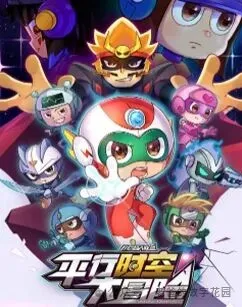
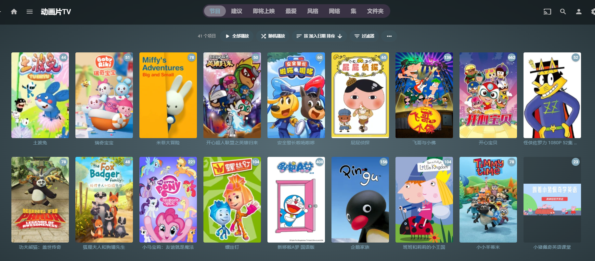
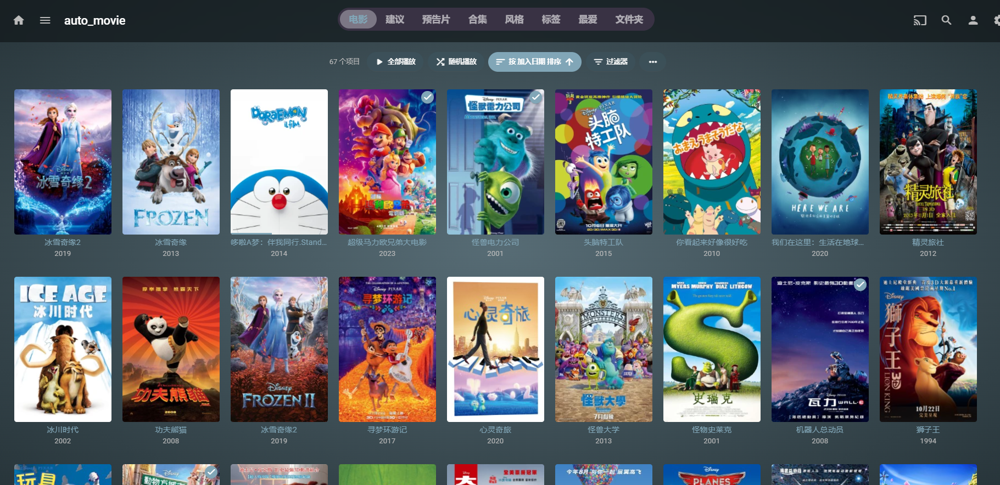
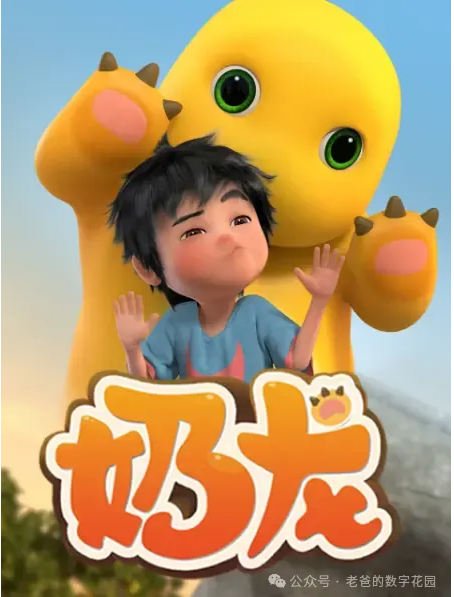
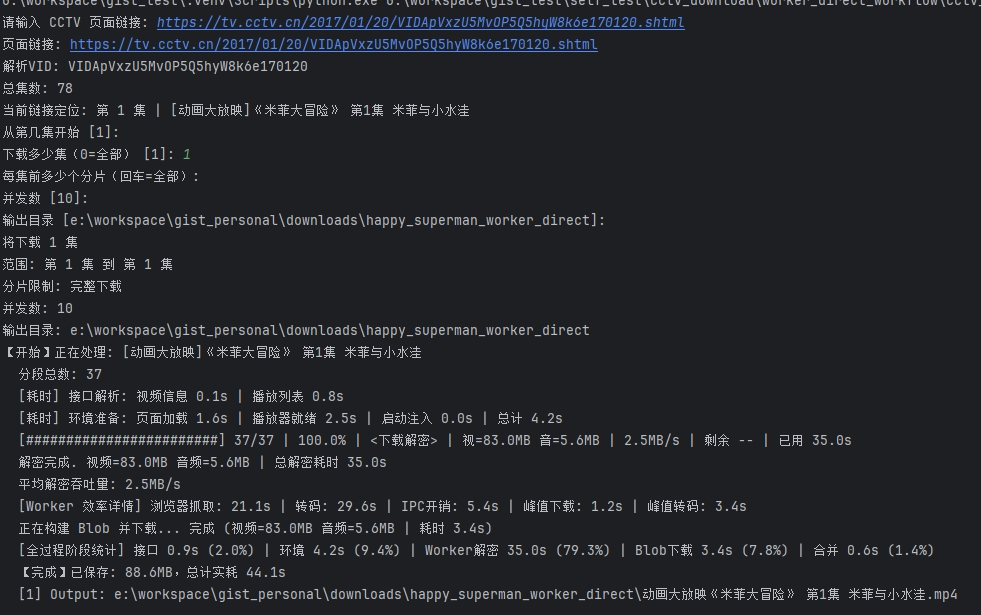
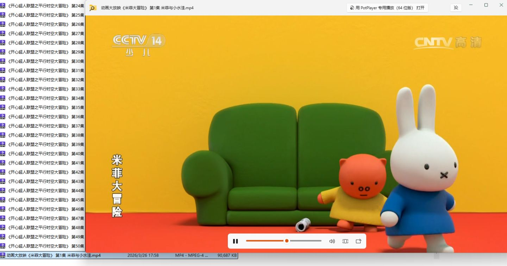
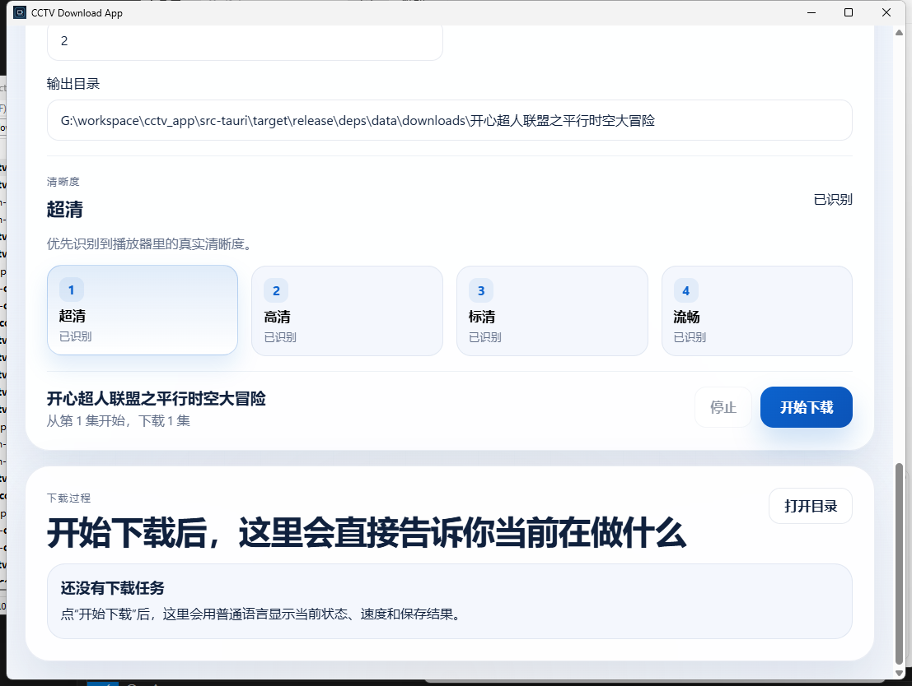
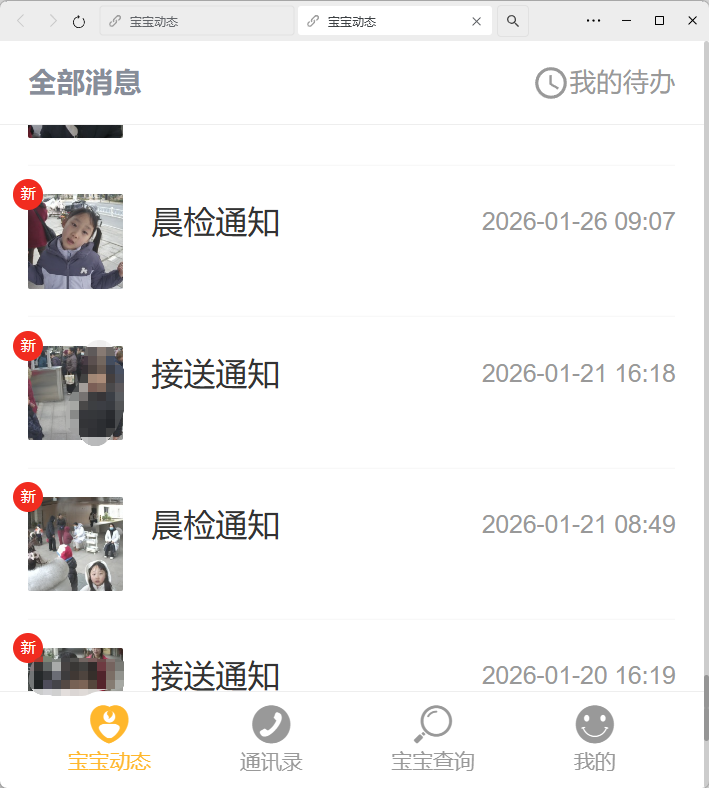
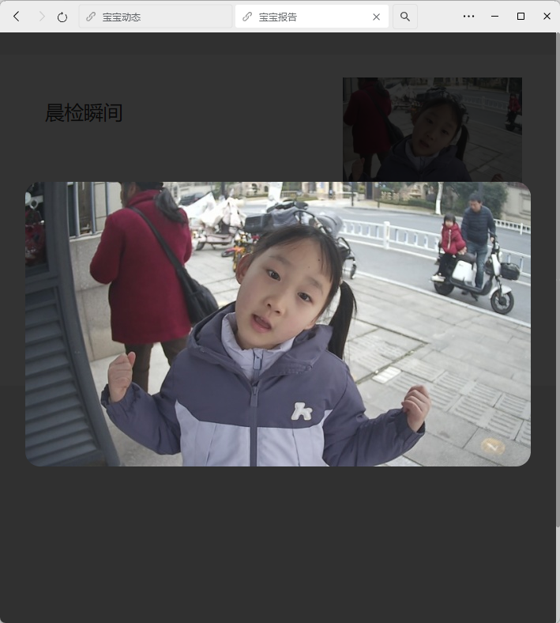
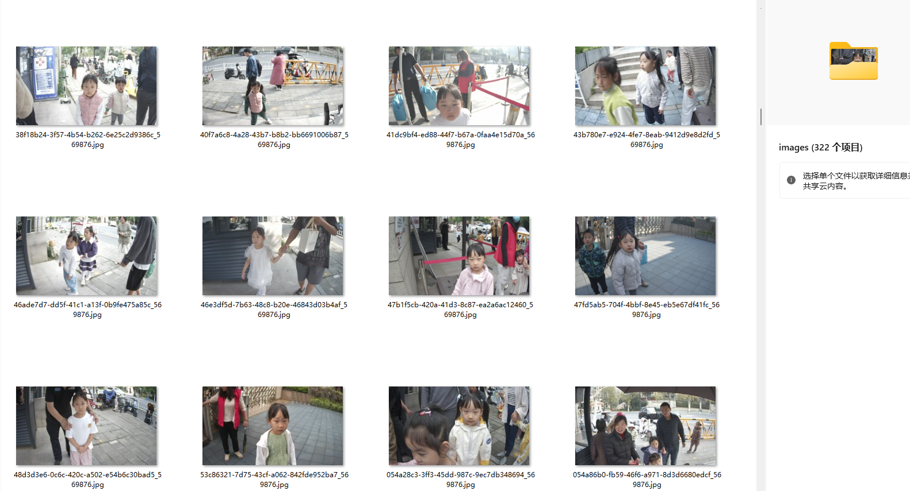

# **娃一句话，我写了个应用：一个程序员老爸的AI失控日记**

## 一切的起点：开心超人

春节回老家，俩娃看了一个动画片叫做开心超人。

从此之后，一直缠着我，让我给它下载。

为什么非要"下载"呢？

## 我为什么要控制孩子的"输入端"

因为我是严格控制孩子们输入端的。之前关注我的人可能知道，我没事就爱捣鼓Nas，所以他们所有的动画片，一律走Emby。

Emby可以控制每日观看时长，控制看什么内容——也就是说，**所有内容都由我手动下载**，我来把关输入端。

目的很简单：**不让他们接触劣质的动画片。**

为什么要控制这个呢？因为我看到他们在视频平台上看到的动画片，真的是粗制滥造，有些甚至价值观严重有问题！

### 举几个"翻车"案例

**《奶龙》**——姐姐之前要我下载的。

IP挺火的，在外面经常能看到周边。但我自己看了看网上的评价，也看了一集。结论就是：短视频乱七八糟的梗堆砌在一起，屎尿屁笑话频出...

**《奇妙萌可》**

动画片里全是各种俊男靓女、漂亮的裙子、华丽的装扮
这个世界已经充斥着医美，生美
病入膏肓的追逐美丽，容貌（这种先天性的东西）
长得好看的人天然就具备优势（这是不可否认的）

我并不是世外高人，追求所谓的特立独行
但是我可以左右的是让他们在小的时候，对他人，甚至对自己，多一些单纯，少一些世俗的价值评判

### 反观国外

史莱克、疯狂动物城、尼莫
你看这些主角基本都是怪兽、动物、非人类形象。它们卖的不是颜值，而是在用角色和故事教导孩子们价值观。

> 迪士尼曾经也是各种公主王子的故事，现在已经在不断的反公主，反王子了，哈哈哈
比如艾莎，最后有点拉拉的感觉，王子则是反派

《疯狂动物城》用动画片来告诉人：**放下偏见，拥抱多样性**。1和2都紧扣这个主题。

而同样面对"偏见"这个命题的《哪吒》
> 这个我也给娃下了，因为他们圈子太火了，不是他们圈子，而是全国都太火了，总不能让他们当个孤儿吧）

它的答案是什么呢？

> **"我命由我不由天"——然后干死你。**

不敢说哪吒不好，我只是尽可能选择我认为对的给自己和孩子们

---

## AI 加持下的"给娃下片之旅"

扯远了。说回正题：娃们下了死命令，必须给我把《开心超人》搞到Emby里。

我就开始到处找资源。找来找去，发现CCTV的资源质量最好——都是国语的，清晰度也够用。

问题来了：CCTV的视频怎么下？

于是，**AI + 我**，捯饬了好半天。

先是搞定了下载脚本，能把CCTV的视频批量拉下来了。

然后我心想：脚本都有了，要不——**干脆弄个应用程序？**

于是就有了这个：

一个完整的、带界面的CCTV视频下载应用。从脚本到GUI，**全程我就是动动嘴，让AI来干活**。

说实话，AI极大地提升了我的生产力。但副作用就是——**让我睡得越来越少了**。因为能做的事情太多了，脑子里的想法可以立刻落地，一不小心就搞到凌晨三四点。

这就是所谓的**"AI Vibe Coding"**——你不需要一行一行地写代码，你只需要描述你想要什么，AI就帮你实现。作为一个程序员，我以前需要花好几天做的东西，现在可能几个小时就搞定了。

**这既兴奋，又细思恐极。**

兴奋的是生产力真的爆炸了。恐极的是——如果连我这个写了十几年代码的人，都开始靠"嘴炮"搞定一切，那那些初级程序员怎么办？那些刚转行学编程的人怎么办？

不过这是另一个话题了，今天先不展开。

---

## 另一件事：我一直想做的事，终于做成了

除了给娃下动画片，我心里其实一直有个疙瘩。

我闺女从幼儿园开始，学校门口有个人脸识别系统。每次她进出校门，系统都会自动拍一张照片，推送到微信公众号上。

我一直想把这些照片全部下载下来——**给她的童年留一份完整的回忆**。第一次上幼儿园、每天接送的瞬间、换季时衣服的变化、个头一点点在长高……这些东西，以后再也拍不到了。

但是！这个系统在微信生态里，是个公众号里面的H5页面。

想下载？没有任何官方入口。一张一张手动保存？三年的照片，几百上千张，疯了吧。

于是我放下手头所有的事情，**专门花时间攻克了这个技术难题。**

抓包、分析接口、绕过鉴权、批量下载……最终，我成功拿到了**三年时间里，孩子在学校门口的每一个瞬间。**

我会把这些照片Nas留存

第一次去幼儿园的生死诀别、早上生气不愿意去学校的小嘴鼓囔囔，这些都是回忆
是我的，也是他们的
还有每一次家长的接送...
我觉得活着没有什么意义，意义就是创造了各种回忆，而人则会忘记这些回忆
不知道从什么时候开始，一些朋友聚会，多年没见的好友，最后我都喜欢大家合个影
因为一别之后，又不知道什么时候再见，甚至一段时间后，根本就不知道当时见过或者说过什么

---

## 写在最后

这篇文章看起来东一榔头西一棒子的，又是动画片，又是CCTV下载器，又是学校照片。

其实我就是碎碎念，和之前那些一样

最近我开始优化我的开源项目，结果因为这些所谓的“小事”不断耽搁，下周把视频号的自动化上传重构下，skill化吧

:smiley: