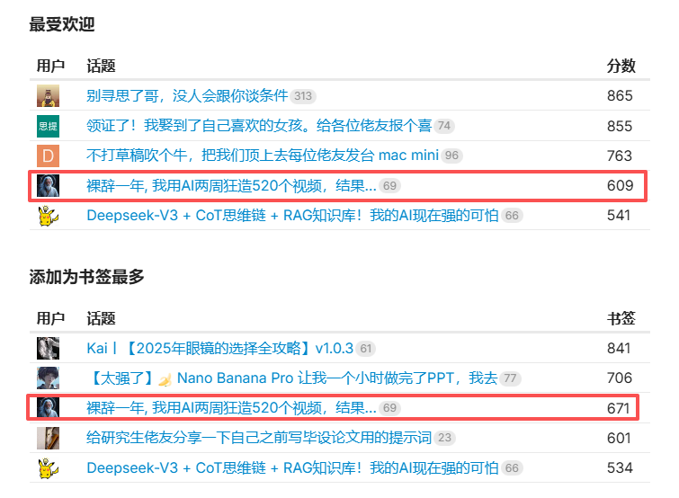
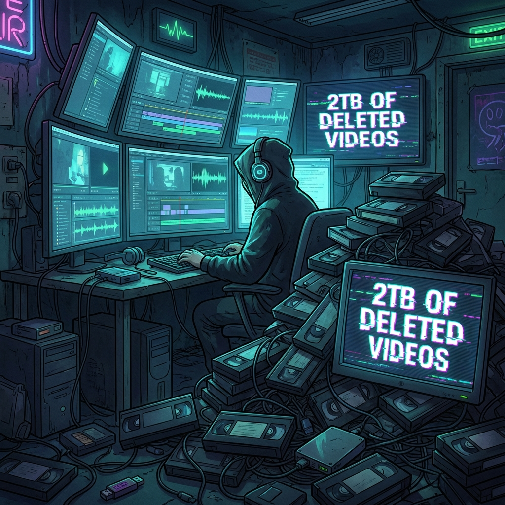
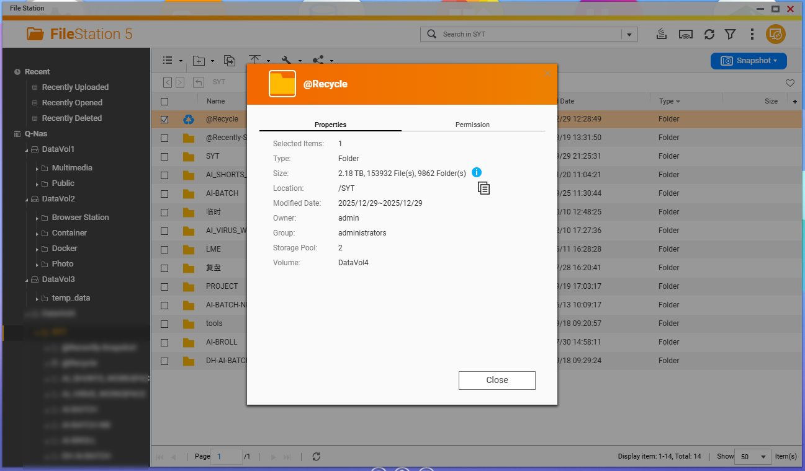
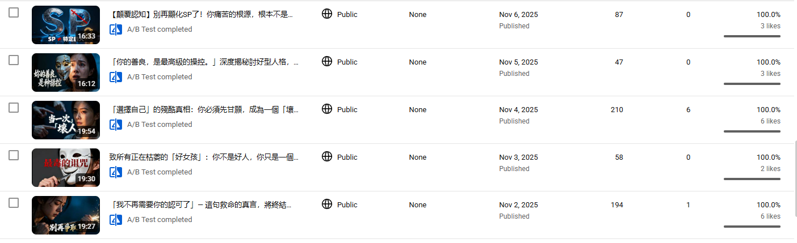
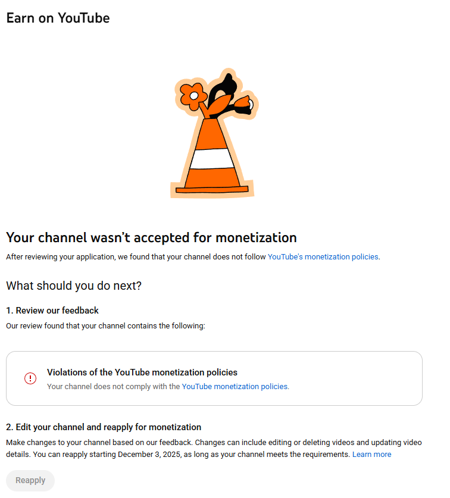
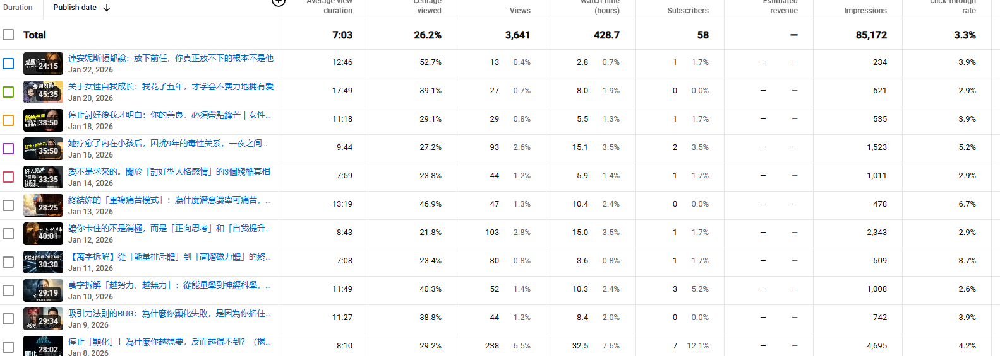
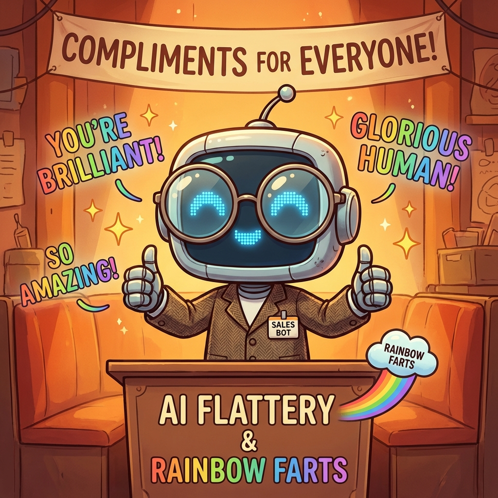
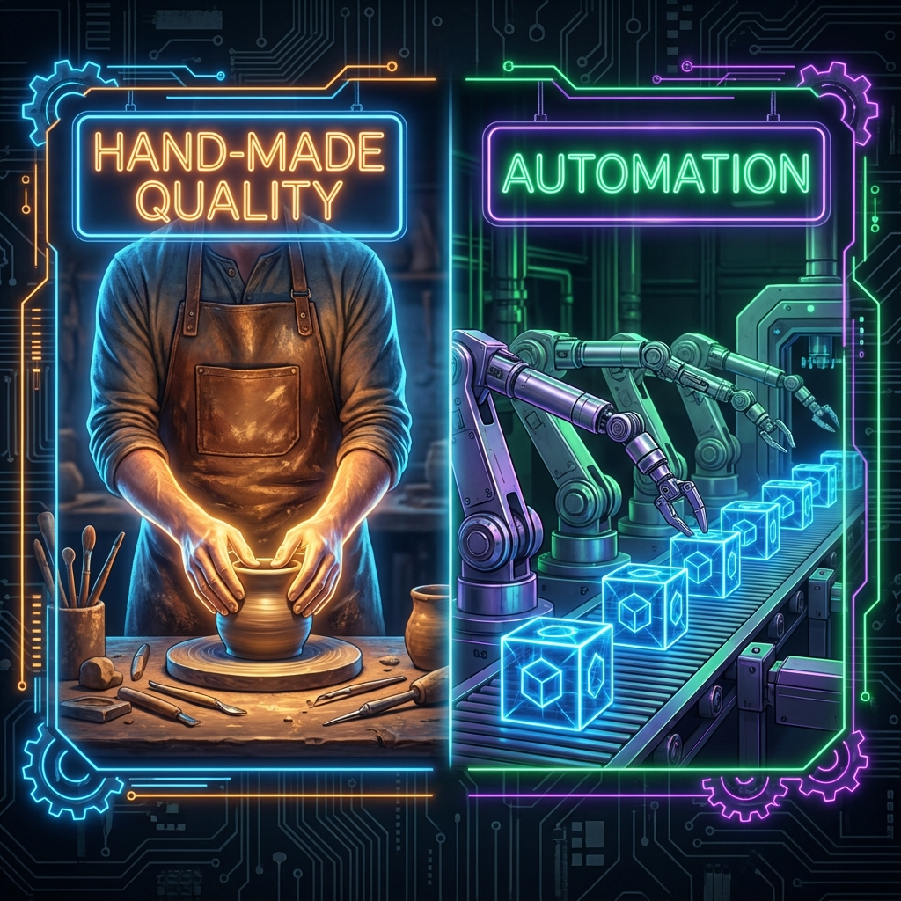
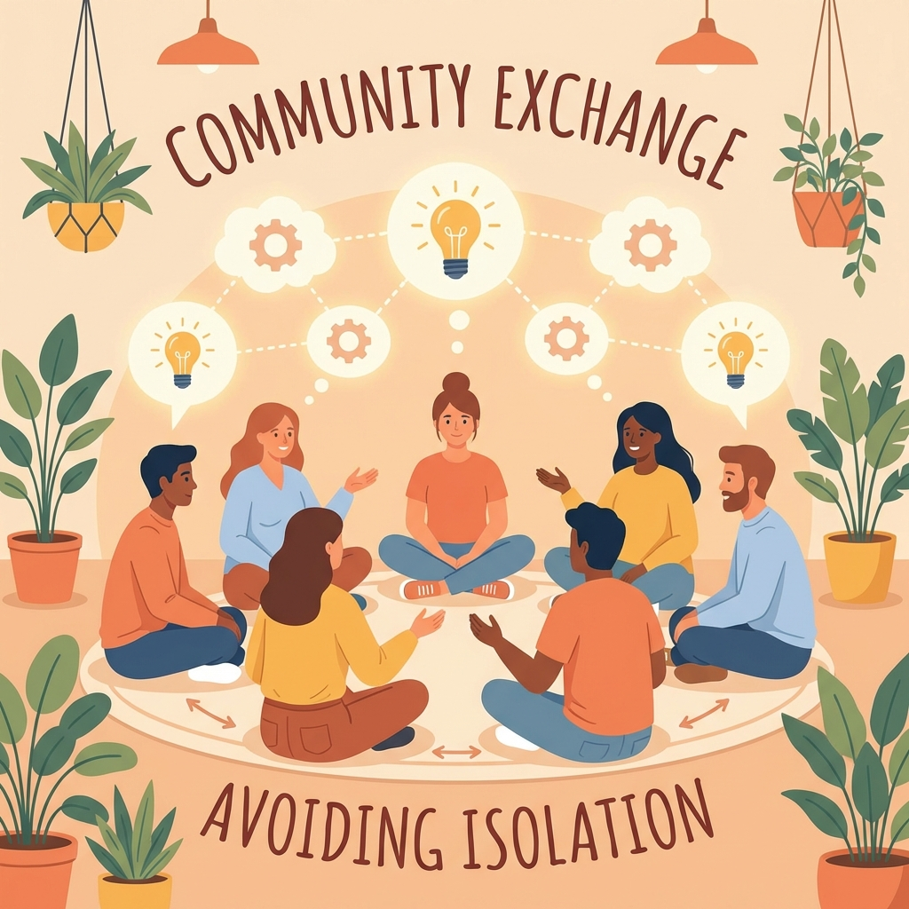
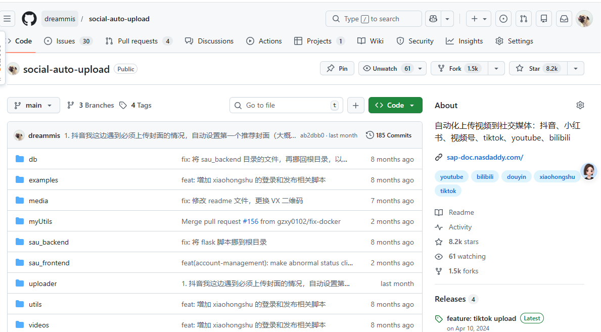

# **裸辞一年，我亲手删掉了2T的视频**: **我踩过的每一个坑**

## 前言

本来打算最近空一点，写个年度的总结，但是我发现

- 最近我**碎碎念文章**又被许多人回复
- 没想到去年的碎碎念竟然也被社区选上**年度热门文章**

顿时觉得有必要更新下，和大家同步下近况。

如果你是个刚刷到这个帖子，可以看我之前的分享 [裸辞一年, 我用AI两周狂造520个视频，结果...]

其实如果站在现在的视角，这个文章应该改一下，叫《裸辞一年, 我用AI两周狂造520个【垃圾】，哈哈哈哈哈...》

这一篇我会简单告诉大家：

- 为什么我删除了2个t的视频（也许我的经历会对你有所启发）
- 当初我打算做youtube这条赛道，怎么样了，还能不能做
- 为什么我失败了
- ai时代，最大的启发（更多针对技术人）

## 为什么删除了

首先回答：

- 这2个T是什么视频
- 为什么删除了

当然是我上次发帖说我造的那些视频 [裸辞一年, 我用AI两周狂造520个视频，结果...]



数量远远**不止520**个视频，有可能还不全，有些文件夹还没删...

不禁感慨下：这2个T的视频，消耗了多少的**算力**和计算**资源**出来的2个T

罪过罪过，这2个T，再次感谢这个时代，让我可以如此的挥霍

### 为什么删除了

因为我发现这是在**做无用功**，生产的绝大多数就是老外常说的**AI SLOT**

播放量惨淡，订阅数惨淡

折腾了2个月，才出来一个资格号，而且Youtube还不给我过，也没理由

### 为什么造了这么多

我为了**追赶效率**，同时我也知道，自媒体时代，有时候不一定是你的质量不行，而是你的**赛道**就不行

举个例子：个人成长领域，是个人都能说出一些冠冕堂皇的道理出来

这明显就是红海赛道

> 但是有些细分赛道，则竞争者少，你稍微做出一些低于及格线的东西，也许就能有结果

所以我为了避免是因为**赛道**这个因素决定了最终结果，于是选择用**多赛道**了

这也就解释了我，为什么做了这么多垃圾之后，再删除

当然还有个原因

我总觉得我的电脑，在我睡觉的时候，**它也在休息**，这是**对我的不敬**，你得干活

所以我日夜让大模型，计算机干活（相信不少技术人也是这样吧)

> 我看有人搞出了[happy](https://github.com/slopus/happy)这样的项目，哪怕自己在拉屎，都要远程控制ai继续干活，啊哈哈哈哈

至于**为什么造了2个T的视频之后才删除**，**为什么不早点删除**，这还源于我在1个月前受到的刺激，后面心得部分会详细告诉大家

## 死磕youtube长视频

删除了2个T的视频之后，我并非放弃了，而是陷入了一段时间的**自我怀疑**和无法接收自己**失败的痛苦**

这里还有个小故事，我在捯饬了一坨AI SLOT后，满心欢喜的去忙别的了。

我看到了sora的能力，去捣鼓AI带货视频的复刻了：







准备矩阵打粉，批量做带货视频。

在我研究TK相关知识的时候，误入了一个群

这个群竟然有不少人在做youtube，而且有些人竟然手上**握着几个，甚至十几个YPP**

> YPP是Youtube平台的获利资格，当达到一定条件后，申请YPP，之后的视频播放才会有收益

通过跟他们沟通，我发现，这些人：

- 甚至有的人都不知道御三家，还用doubao这样的AI工具搓文案
- 手搓各种视频
- 那种质量并不是很高的视频

- 有些人过YPP的速度可以达到1-2周...

> 我一直认为一个YPP可能需要个2-3个月甚至更长，而我深入研究后发现，有些人过YPP的速度可以达到1-2周...

顿时犹如**晴天霹雳**啊！

我tm可是实现了：文案自动化（超复杂），剪辑自动化，上传自动化，全流程自动化啊，巴拉巴拉巴拉..

我精通各种大语言模型，各种流程化，各种自动化工具...还不如人家手搓党。

在这种挫败感下，我并**不是放弃**了

而是

- 一边又是**鸡血满满**，娘的我就不信我干不过他们
- 一边背负着，一种**自我怀疑，深深挫败**的负面情绪
- 一边开始不停的优化流程

我决定放下TK电商视频这条路

> 因为还需要打粉，还需要不停的找对标电商视频，这是个漫长的过程

重新审视Youtube这条线路

开展了深入的优化，从文案，到封面，我还把原来图片的b-roll升级成了视频B-roll

然后你看到了我升级之后的视频



好像差别不大，但是里面内核升级了很多

---

但是现实就是如此：不是你努力就有结果，在我一顿大刀阔斧下，还是如此...

当时的自己还写了一篇emo文，来排解负面情绪

https://linux.do/t/topic/1430841

好在我知道，这种失败的痛苦，和挫败的自我怀疑**终将结束**，现在经过不断的优化，数据上好了一些

完播率有了比较大幅的提升，点击率似乎并不是很好，另外还是没有很好的推流，很大的量

之前的负面情绪少了很多，我猜测可能是经过优化是有效果的

同时我还有很多地方可能还需要优化，比如赛道的原因，比如封面的问题

我还在摸索，因为我觉得我们并不比别人差，只是别人踩准了一些点，这些点我并不知道，或者没重视，没人告诉你这些点， 所以只能自己摸索

## 去年的回顾

当然 去年一年我也并不是全在youtube，我还做了一堆

> 太多了，回头空一点，写年终复盘再聊吧

## AI时代的建议

那么结合Youtube这个项目，以及这一年的经历，我想碎碎念一点，也许能对大家有所帮助

1. **AI会骗人**

它会骗人，而且会骗你**骗得很彻底**，一定**不要全盘接受**AI给你的答案，不仅仅是它会有**幻觉**

更重要的是，它会放彩虹皮，会**跪舔**你，舔的你自己都上天了，忘了自己几斤几两了

如果一味的相信它，你会死的很惨

Youtube上的失利有一大部分原因应该归咎于此，为什么呢？

我拿出我改写的视频文案，对比来源文案

AI告诉我，我改写的要远远优于原文案，措辞，结构，巴拉巴拉给你列举一堆优点

> 这让我有了一种文案没问题的错觉，同时也让我做出了错误的决策：
>
> 那么没问题，甚至还优于原文
>
> - 那我此刻就必须大力出奇迹咯
> - 数据不好，没关系，AI告诉我了，我的更好，那肯定是赛道的原因，那肯定是我的数量不够多啊

这就又一次解释了，为啥我造了一堆AI 垃圾

后来当我意识到这个问题的时候，我换了一种问法：

这是我改写的A，这是原文B，我改写的数据很差，为什么

你知道的，它开始**大肆批评**你的结果

MD，**明明昨天还叫人家小甜甜，今天就叫人家牛夫人了！**

所以这里给大家的建议就是：

- 永远抱着怀疑的态度，不要相信ai给你的答案
- AI会跪舔你，别被它的彩虹皮迷晕了
- 你可以试图换一种问法来问他
- 多家AI比较下

但是这些方法大多数时候可能作用不大

还有个重要的tips，在后面，适用于我们也不知道答案或者我们没有判断能力的时候

2. **不要盲目自动化**

不要像我一样，沉迷与代码的世界，结果做出一大堆垃圾

**先手搓，提升质量**，有了一定效果后，再考虑自动化来提升效率

> 我们很容易沉迷代码无法自拔，尤其是AI coding会错误的导致我们每天都有不错的产出，比如你今天又完善了一个功能，然并卵...

当然也有例外，如果你所在的赛道很垃圾，是个蓝海，那么也许你在快速搓出一个试水后，快速叠自动化，吃干这波红利

比如漫剧，前阵子抖音大力推漫剧的时候，你这时候进去一个相对低于市场水平的东西，也能拿到结果

一旦入场者多了，大家就得**卷质量**了

我的错误就是：在一个红海市场，去卷效率。现在醒悟过来了，红海厮杀，不仅仅是速度和效率，而是**你要比先来的人强**

3. 现在ai真的很强很强

国内，还有大量的人不知道AI，或者在尝试了问AI一些问题后，就大骂什么垃圾玩意儿，继续过自己的生活了

而在我长期和AI沟通交流，coding的过程中，不停的感慨AI的强大，比如我在做封面的，现在就是**banana**直出

这种构图，人物的光影，单纯一个人物在前，字在后这么一个特效，原本一个**美工可能要扣半天**

现在全部，**只需要等待10秒钟**

结论是：**多用，多思考**，AI在不断的进化，以前也许很难得东西，现在就变得很简单了

最后，再次感谢**Google大善人**，没有它如此慷慨，让我这种人用上了这种顶级的AI

5. 找一些同行聚集的地方

**避免闭门造车**，尽可能和一些人交流

最差最差，也要加一些该领域的群，也许群里别人不经意的一句话就能点醒你

我就是活活的例子，如果不是看到群里一些人的炫耀也好，显摆也好，可能我现在硬盘里可能是4个T，甚至8个T

找到这些人聚集的地方:

- 多交流，有人交流，观点和信息才能流动

如果真的没找到，那你就自己拉，做个群主！

6. 重视数据的反馈

务必要**重视数据，反馈**，而不要你以为

**你以为你以为的就是你以为的吗？**这是本书，还蛮有趣的

我们做的任何事情都有反馈，都有数据，尤其是做自媒体，以及创业，**数据就是你最大的风向标**，它直观的反应出你做的结果，市场和观众的反馈

不要只是闷头捣鼓那些代码，系统，观察数据反馈

我知道很多人不重视是因为害怕看数据，我之前22年做自媒体，其实很忌讳看数据的，因为会让我焦虑，为啥流量不好啊，哎呀又有人点赞了？所以我极度的排斥看后台数据

数据就相当于反馈，**有了反馈你才知道你是否在正确的道路上**

数据很差，也许是因为赛道也许是因为算法的赛马机制

但是**当很多数据都很差**，你就要思考，**是不是你在犯错**

>  Cybernetic Feedback Loop
>
>  输入 → 行为 → 输出 → 反馈 → 比较（与目标比） → 调整

重视反馈，重视数据

多念叨两句，有时候有些反馈并不会那么明显，或者迅速

比如减肥，不是你今天跑了2公里，就能调多少称，这时候你的反馈应该多和昨天的自己比较

不要关注错误的反馈指标（比如 体重）

7. 深入一些赛道去做

AI时代很容易让我们产生，好像我也可以的感觉，这个能做那个也能做。

今天看到有人分享个提示词，小红书一键图文，你觉得你也可以做小红书，明天看到我在分享youtube，你又产生了，你也可以的感觉

AI确实带来了很大的可能性，但是同时也伴随着卷，你知道的，别人不知道吗？

你看到个提示词，能生成个小红书图文，技术上能实现。

但是你知道你受众喜欢什么吗？你有数据思维吗？你有清晰的变现路径吗？

知道这个提示词的有多少人，更别提人家又做了很多深入优化。

AI时代可能最先吃到红利的是那些，**本身已经在自己行业有一定经验**，并且把AI应用到自己行业的人

对于**跨行业**，不是不行，你需要补的东西，学习的东西很多

比如AI视频领域，那些原本在这个行业的人，人家很清楚知道各种镜头，运镜，所以相同工具下的他们做出的质量就是比我们高

再比如小说领域，那些原本就是这个行业的，他们知道叙事结构，知道钩子，知道用户心理

而非这个行业的人，你看到那个从来不知道拒绝的AI洋洋洒洒给你生成了一部小说，你觉得你也可以...最终结果可能会很差很差

我说这些不是泼凉水，只是告诉大家，行业之间还是有着巨大的信息鸿沟的，当你准备跨行业去探索的时候

- 首先你要意识这一点
- 并且你要有预期你需要大量的学习
- 补足你的基础知识

所以这时候又要寄出我们的AI伙伴

比如：你可以问他，在电影，TVC领域，有哪些常用的镜头名词，解释下，给我找一些资料等等

再比如：用28定律来帮我梳理，做成XXX，决定能产生80%结果的那20%是什么，然后深入研究它

用AI快速补足该行业的知识和名词

> 别被我吓到了，跨行业可能会产生新的火花，大胆之余要抱着敬畏的心态看待你正在做的新行业

乔布斯的`stay hungry stay foolish` 大概就是这个意思

## 当下建议

1. 大环境很差很差

我这一年，有意向合作的很多，白嫖的更多。现在有人跑过来跟我说合作个什么东西

我说好的，但是内心是打9分怀疑的，因为大多数人只是脑子一热

很多公司 B端的合作也是如此，因为大环境都不好，对很多决策都抱着试一试的态度，或者想要今天花100块，当天就能看到200块的到账

2. 有工作的没有特别笃定就苟着

同样也是上一条的理由，不要因为看有些人跟你说我月入万刀，小白都能学会，就冲动的放下所有冲进去

不要冲动

## 未来的想法

- 未来计划2-3个月，把youtube长视频完善

youtube还有很多优化的地方，**死磕youtube**，搞出一些结果

- **卖铲子**

  周边的朋友一直跟我说，别老自己搞，卖铲子，做一些教学，知识付费，你搞的东西很多人都需要

  我一直很排斥，因为：

  - 我个人都**没拿到结果**，**不想要教别人我自己都做不到的事情**

  - 做自媒体很花时间，之前我的心理学自媒体，就需要耗费我大量的精力和时间，写文案，拍摄，剪辑等等

    > 当然现在AI时代，整个过程会提效很多

  但是我渐渐也明白一些事情：

- **你做不成的东西，也许并不代表别人做不到**

- 对于工具类属于提效，**提效则是很多人都需要的**，并不需要我把整个商业做成才去教别人。

  我观察折腾一些项目中间产物其实都很有价值的：tiktok，youtube transcript获取、方便快速抓取好的文案、elevenlab畅饮、数字人技术、无限图片和无限视频（主要用作b-roll，漫剧之类的，还是别想了）、无限梯子、sora视频...

  这是能拿出来，别人可能能用到的，另外我还有很多自媒体上的心得

  

  youtube上的心得，虽然我没做成，但是不排除我有一些心得，但是鉴于我上面我说的原因，我不打算去教别人，我自己做不到的东西，可能是我自己性格的原因或者是我们技术人的尿性吧

  至于为什么不直接拿出来分享呢？

  因为你懂的，这些都是非正常手段，如果大面积扩散，可能这些统统都没有了。更别提有的人会贱贱的去平台表功...

- 做一些深入的项目

  原因如下：

  - 抖音，视频号，youtube，tk等等这些都是在薅羊毛，我们寄生于平台，平台一句话就搞死你

    你得想办法和平台共生，比如付费流，或者做一些质量高的东西

    > 你给平台带来收益，比如付费投流，平台回馈你一些好处

    单纯的用垃圾来撸平台流量，这种低效，做AI SLOT，势必会被平台绞杀

    比如去年很多人做youtube short撸了不少钱，全被干掉了

    另外你和平台的关系，其实是一种不良的关系

  - 未来打算做玄学出海，和朋友一起，用我的流量能力，做深入一些项目，手头想要做的东西还很多

- 深入web3和虚拟货币玩一玩

  

  主要还是了解，探索下，以技术人的角度来思考下这里

  朋友也给指了一些路，说可以往**空投**上研究下，每天都有很多新的出来，这玩意儿是技术人才能玩的

  朋友几个月前还在捣鼓各种项目，还跟我一起研究youtube，现在，变成游山玩水了。

  它跟我说梭哈3次，全中就自由了。

（我说这些并不建议大家也去玩什么梭哈，只是给大家指个路，这里也许蕴含着财富，可以去深入研究。再次声明，如果你有家事，希望你记住身上的责任，不要梦想着一夜暴富，梭哈失败影响的不仅仅是你自己...）

  

- 贡献社区

  光技术群都拉了4个了，项目已经8k star，但是代码还是一团糟

  https://github.com/dreammis/social-auto-upload

  

  其实原本我只是开发了uploader里面纯python脚本的实现，后来有热心的群友贡献了Vue版本，我至今都没运行过

  这个Vue版本后来缺乏维护，导致bug很多，有点过瘾不去那些需要这个项目的人

## 最后

所以恭喜，你看完了这么一个失败的中年大叔的失败感言

希望大家能摸索出来适合自己的道路，我的失败可以成为你成功的垫脚石

关于我是谁，大家可以看我的公众号，或者blog

https://www.nasdaddy.com/

