# 短短2个星期，我使用AI做了520个视频，然而结果却...

首先我可**不是标题党**，我真的做了520个视频，而且现在还在源源不断的产出，我找出一些做了个**集锦**



> 后面会放一个，大家也可以评判下如何，**虚心向大家学习**

这些视频涵盖

- **长视频**（这里没放出，太大了）、**短视频**，涉及语言中文，英语，西班牙语

- 类目：中老年人养生、星座、两性、个人成长、戒烟（哈哈哈，我自己想要戒烟）、商业故事、AI资讯、恋爱知识等等

这一篇我会简单告诉大家：

- 我是怎么做的
- 为什么要做这些，这些视频是发往哪里
- 结果又是如何
- 后半部分则是我裸辞一年后的感悟和分享（碎碎念）

我也会**毫不避讳**的告诉大家，我的账号是什么，随时去监督和指导我的工作

## 前言

好久没和大家聊天了，最近2周闭门造成，废寝忘食，不停的构建、迭代和优化

另外我这是第二次从企业出来，已然一年了，也想借这个时间点，简单回顾和总结下，主要还是想和大家聊聊天，聊一聊

关于这个年代

- 我们到底是辞职创业还是继续在企业
- 什么情况下我应该辞职创业
- 什么情况下应该在企业
- 以及未来我的一些规划和打算

对于新朋友至于最后我会放出来之前的一些分享，兴许我的一些经历会对你有帮助

## 自动化剪辑

### 为什么做这些

首先为什么做这些，我是打算**矩阵化运作Youtube**，我这次连国内都没发，那为什么是Youtube呢：

#### YPP

因为youtube的**ypp钱还是可观**的，RPM（千次播放）高的可以达到几刀

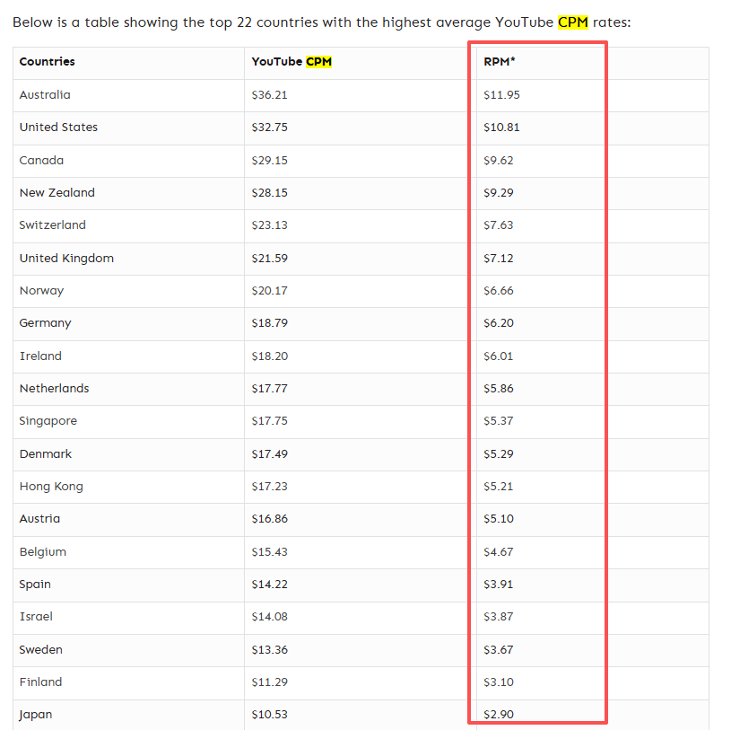

简单，比如你的RPM是3刀（**实际上会更低**，跟你的赛道，受众语言有关系），刨掉**税费**

- 一条视频**1w播放**，那就是**30刀**（RMB270）
- **10w播放**，那就是**300刀**（RMB2700）

还是很可观的，这就是Youtube平台的好处，**创作者只需要关注内容创作**，而google这个平台可以**贴补下你的家用**

这也是为什么很多创作者国内国外一起发，因为国外有钱啊，甚至我看到有些国内做youtube的，人家**国内就不更新了**

还有最近**何同学**不是开了一个新的youtube，而且人家是**全英文频道**

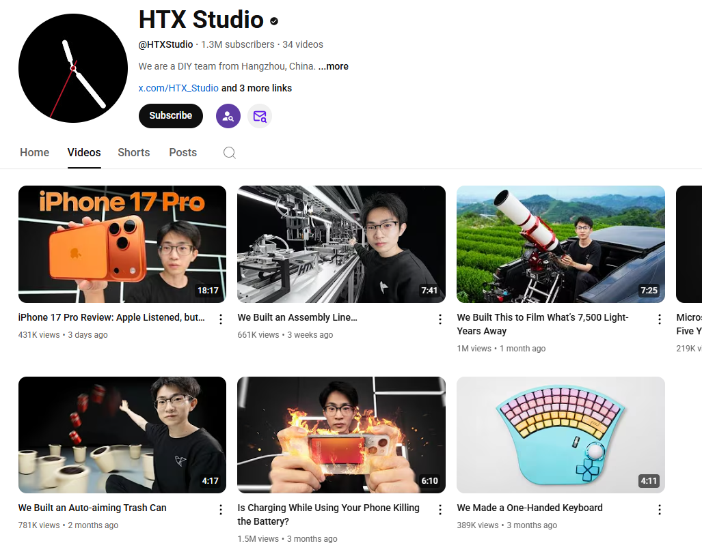

**34个视频，130w订阅**

再看看他的**中文频道**

![image-20250929111414920]image-20250929111414920.png)

**67个视频，才21w**

当然咱不能和和同学比，人家是顶流，高端，走精品路线

但是这是个趋势，**做海外社媒**，而且有了ai的加持，你的内容完全可以像和同学一样，做**各个国家**的频道，**各个语言**的视频，用英语，法语，德语，西班牙做各种语言

#### 未来可能的机会

除了平台给你的补贴，最重要的还是要能**经营一个持续盈利**的事业

而事业的第一步，有产品，还得有流量，当某些领域有一定沉淀，比如我之前的足球项目（具体可以看我其他的分享），**有了流量就思考围绕着这些流量**怎么变现

当有一定流量基础，就可以深入去做，简单点你搞个**独立站**，卖点东西也是可以的

### 这些是怎么做的

其实一条视频看似很简单，其实整个流程很长，说太细致就篇幅太长了，简单来说

1. 选题

2. 文案

3. 文案->tts（音频）

4. tts做ASR处理，抽取transcript

   - 做字幕（srt）

   - 后面AI帮助做b-roll（也就是视频画面）

   > B-Roll是视频制作中的“辅助镜头”，用来让你的主要内容（叫A-Roll，比如你讲话或讲解的部分）更生动有趣。把它想象成“背景画面”或“补充片段”，用来展示你讲的内容、增加情境或吸引观众继续看下去。（来自grok解释）

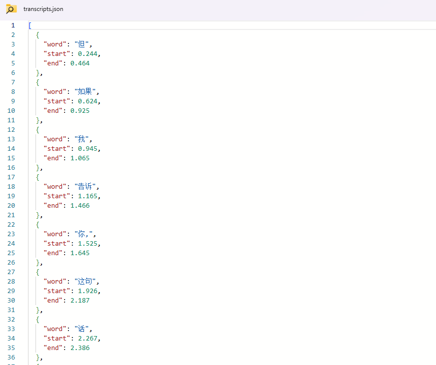

5. 数字人生成

6. 步骤4里的transcript，使用AI生成B-roll 图片的prompt

7. 批量生成b-roll图片
   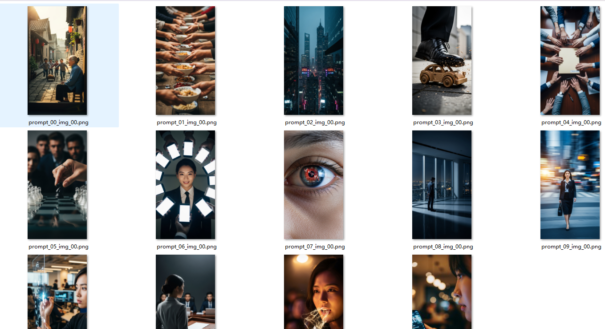

8. 自动化剪辑（将以上3，4，5，7，组合成一个视频）

> 我使用的是**[pyJianYingDraft](https://github.com/GuanYixuan/pyJianYingDraft)**，非常感谢大佬做的封装库，借助剪映强大的资源库（特效，字体等等）
> 自己手撸这些特效要累死了...

9. 导出

于是你就看到了这么一个视频



以上就是大致的流程，当然里面有很多**细节非常多**，一个篇幅也说不明白

这里有做**自媒体的朋友**，也可以就视频的各个点，文案，画面，剪辑等等，**提提意见**，哈哈哈

### 损耗与时间

很多人会问，这些视频的成本的多少，我有些是硬件跑的，这个不好算成本，ai的token，图片的算力，而且有些东西，我是通过技术手段免费（白嫖）来的

至于制作时间

一条视频，制作时间大概：

- **短视频3-5分钟**（视频长度3分钟之内）
- **长视频大概10分钟左右**（视频长度在20分钟之内）

比较耗时的部分，还是ai，b-roll，数字人这部分

这些还没算前期账号规划，人设等等

### 结果如何

那么结果如何呢？

大部分是这样的，哈哈哈哈哈

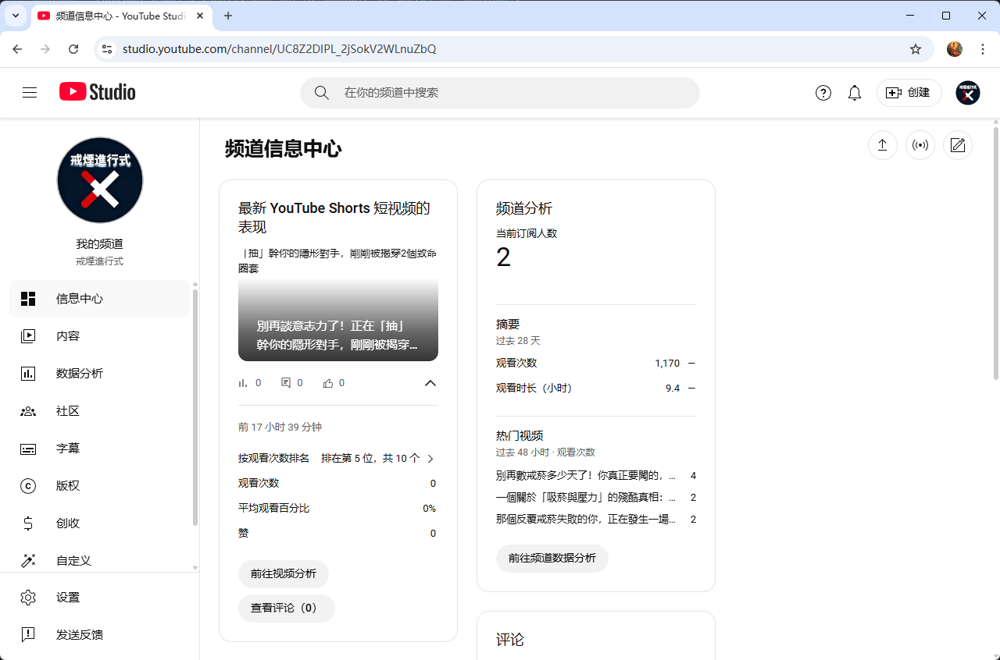

还有更惨的

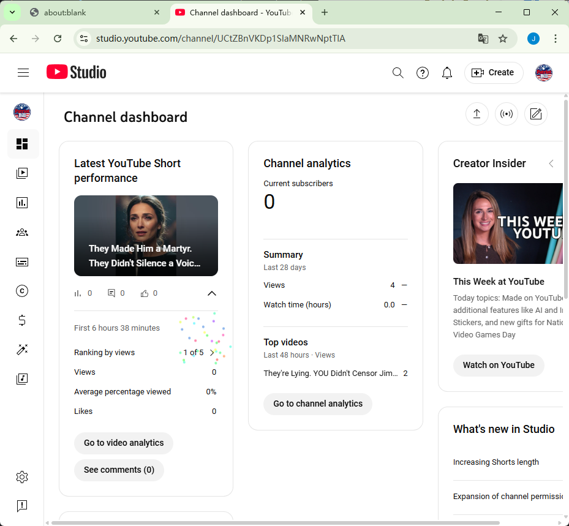

**少部分还可以**

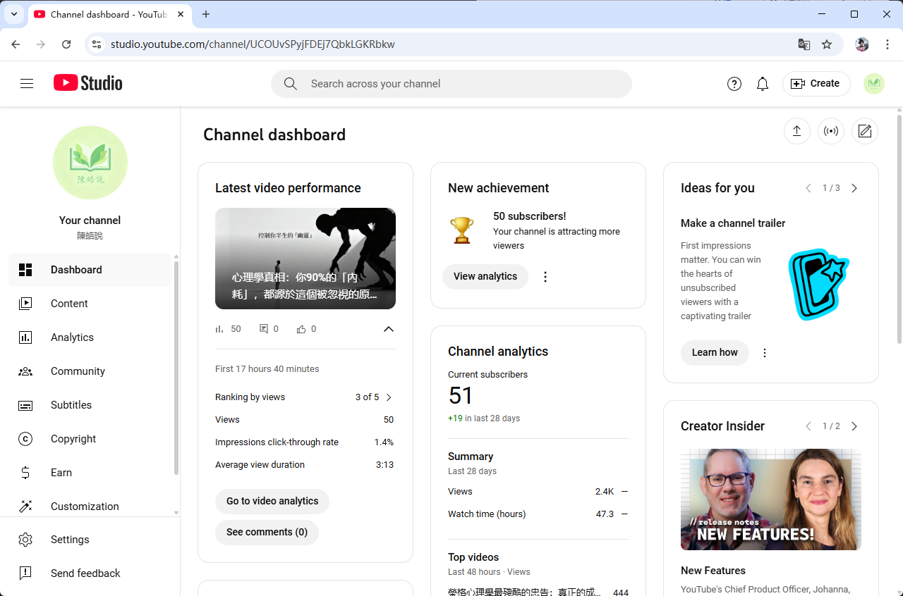

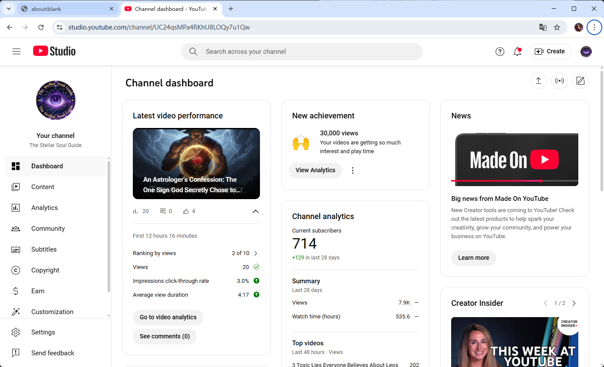

少部分可以，可能因为**之前的积累**，有一些**基础流量**，目前还不能看到一个立竿见影的结果，需要时间来验证

> 这里有做自媒体的朋友，也可以就视频的各个点，文案，画面，剪辑等等，**提提意见**，哈哈哈

个人还是眼界有限

### 心得

#### 感谢这个**AI时代**

为什么说这个呢，照以往，任何一个问题可能都是门槛，而现在**AI时代**，一切都变得非常容易了

比如字幕，由于openai最初开源的whisper

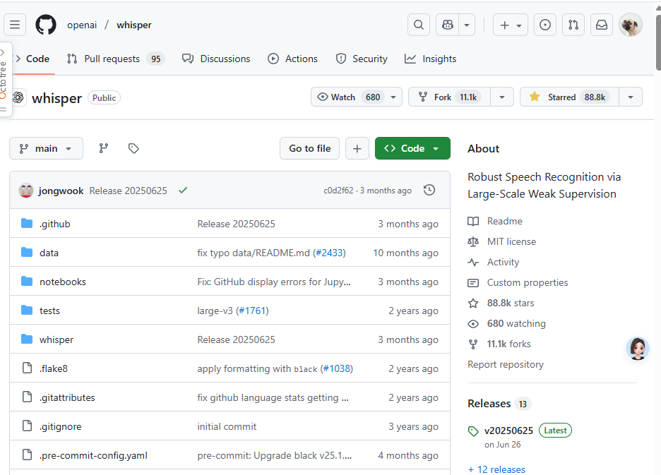

再比如这是我做的封面

感谢有了AI，之前做封面是个很痛苦的事情，现在有了ai，封面的事情变得非常简单（出自**字节的seedream 4.0**）

而英文版的封面，用的自然是国外的模型，因为对字体的处理更好

再比如账号logo，轻松就搞定了，感谢（**lovart**）

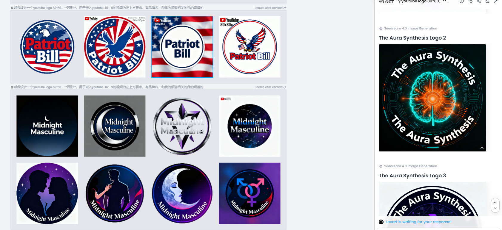

我还用它给自己娃做了个粗糙的**表情包**

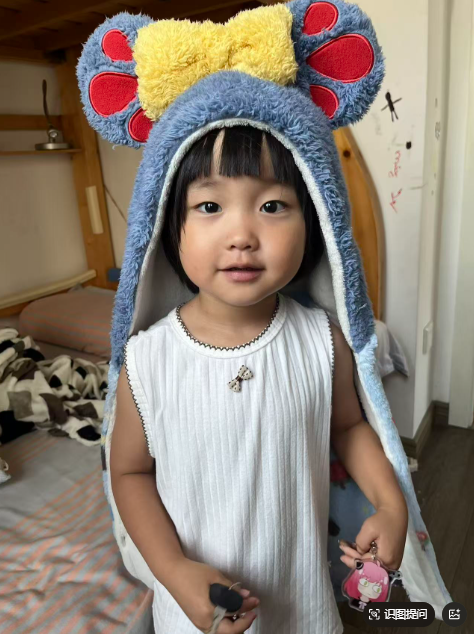

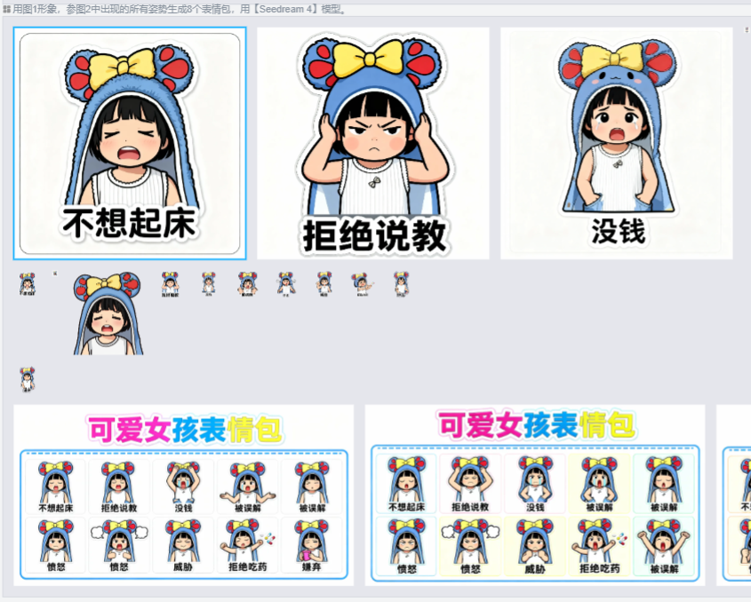

#### 文案依旧非常关键

借用技术群里一个朋友的话，**观点不重要**，这个世界的观点太多了，是个人都知道，想要你的内容脱颖而出，你需要的是**讲故事的能力**，**诠释**的能力

旧酒新装就是这个道理

你看到网上各种个人成长的视频、书籍，很多你看完之后，还是那些东西，坚持，放弃，巴拉巴拉这些。

#### 朋友赌约

最近在技术群里交了个朋友，2周前专程来上海和我**面基**，这老哥也很厉害，搞技术，自己创业，公司卖掉，没事半夜还在撸代码，我没少半夜和他交流社交媒体的事情，他曾经2个月，做了个20w的英文推特，也是吊的。老哥名言：**垃圾时间只能学习**

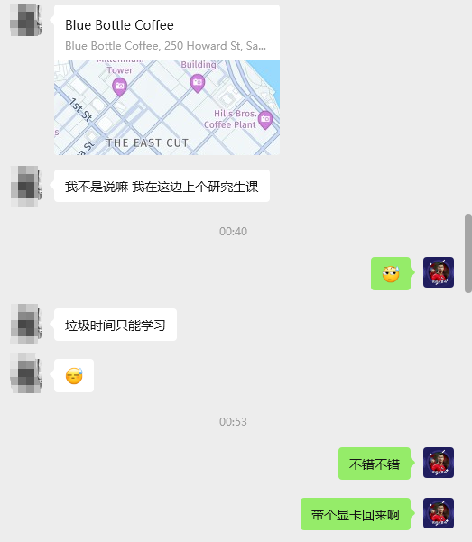

这次我还和他一起下了个赌约，谁先过10w粉丝

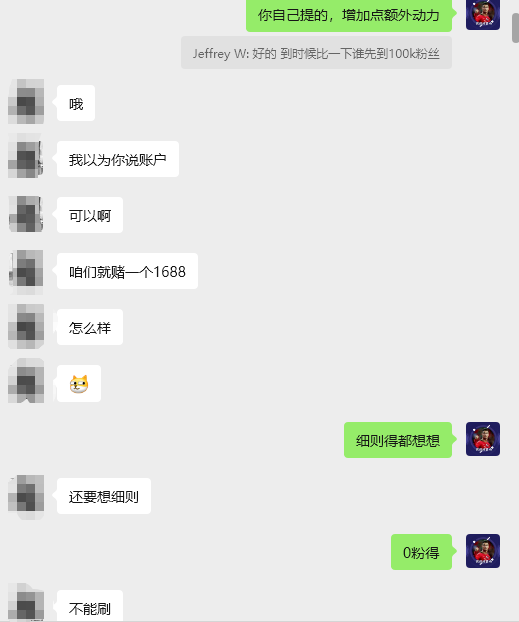

时刻有个**竞争对手**互相打击，讨论，还是挺有趣的一件事

## 碎碎念

后面和大家聊聊现状，以及一些碎碎念的话

看这个的可能更多的是技术人，因为我这个公众号，是从github加**技术交流群**的必经之路，我呢又是技术出身，所以一些话**也许**能对大家有帮助

### 离职一年后的自己

首先，我是去年差不多这个时间**第二次离职**了，之前其实我曾经gap过一次，在22年，跨界搞了一个**心理学的自媒体**

没错，那个**怼着屏幕**的**大头娃娃**就是我本人，哈哈哈哈

哈哈哈，没想到吧，我搞技术还能露脸，拍视频做心理学自媒体

说回到现在，先解释下，为什么是第二次离职，因为上次搞了一年，好累，而且靠**卖课**，**1v1咨询**，**课程高的2899**，也卖出过几单

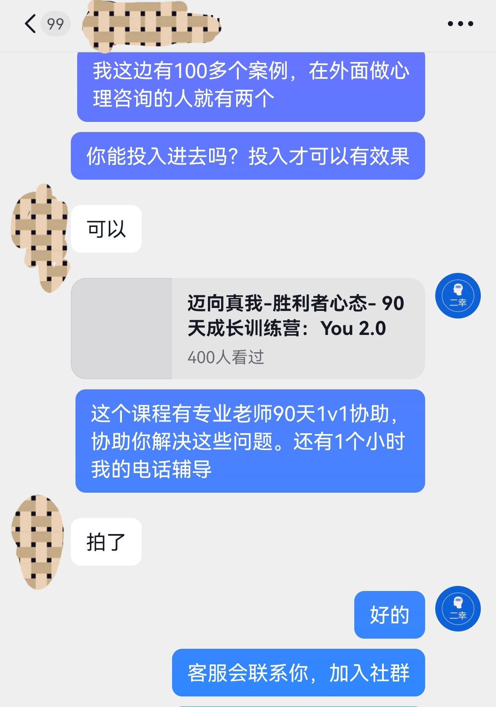

虽然我接过赚的100%没上班多，因为我原来工资还是可以的：`互联网，又是技术管理岗位`

但是太累了，这是我刚截图的（我已经**断更2年**了）

要**一个个聊**，还要**做交付要服务**，而且我是个技术人，我们就是喜欢**搞框架**，**搞范式**，**搞流程化**，让其可以**自动运作**

后来就寻摸先去上班，再思考思考...

这不去年又出来了，哈哈哈哈

这一年，做了很多事情，也接了点代运营的业务，自己也做一些业务，怎么说呢，没啥大的结果（money），但是每天都忙得不可开交

> 也可能是我自己焦虑得原因吧，之前也说过，我自己闲不下来，甚至一度我强迫自己什么也不干，就闲下来思考

从**功利**的角度来说，这还是失败的，但是**长久来说**，我觉得都是值得的，而且这一年吸收的**经验很多**，不知道脑袋顶的**Lv（等级）**提升了多少级

这一年的酸甜苦辣，哈哈，有机会聊

### 这个时代该不该离职

这个话题其实跟上一篇有一点关联，我简单说下我的看法

如果现在**公司还可以**，也**喜欢**，那自然不用说，**待着**呗，**多学点东西**，但是，如果你考虑某一天**可能自己会出来单干**，我有一些建议：

- 千万不要太深入某个领域(除非你真的喜欢)
  - 未来是**复合型人才**，你只会一个领域的东西，你的创业路上和**那些复合型人才+AI**的人相比，会付出大量的成本（人力，技术成本），这会导致你的初始得成本很高
  - **未来都是小型公司**了，因为AI会**极大提高人效**，除非深入某个领域高精尖人才，企业是需要的，否则**中不溜都没戏**
- 闲暇之余，找一些自己感兴趣的，去钻研，学习
  - **AI时代，学习不是什么问题**，网上资源很多，B站，youtube，甚至各个大型公司（openai google）的文档，都是非常优质的学习资料，比你听**那些二道贩子**好多了
  - 拥抱AI，**养成好习惯**，遇到什么事情，先不要退缩，先不要忙着去干，**先问问AI**，多家（deepseek，gemini, openai，grok【检索能力】）问问，慢慢提升自己的思维能力和决策能力

如果你不喜欢你现在公司，想要自己搞，我的建议

- 苟着，现在大环境不好，尤其现在全面AI化，但是有些传统行业其实是后知后觉的，可以先勾着
- 自己倒腾下自己的副业啥的

唉，这个话题打住吧，这么久以来我都在节制自己**不要盲目给别人意见**，唉，刚打这些，兴许对大家有点用，没用也没事

最后：提建议是最简单的事情，挑毛病也是最简单的事情，我没事，叉着腰，对着一个东西能说半天毛病

但是做决定的还是你自己，别人的建议只能是建议，它可以引发你思考，审视自己，但是不要完全听从任何人的建议

## 对于未来的看法

我其实是很悲观的，AI的发展，已经在改变我们的生活，而且以非常快的速度迭代升级（国内可能不明显，科技圈是最感同身受的）

大概率2年，5年，10年

这里借用我和朋友的一个故事

- 我有个朋友，也是高中**同学A**，最近我们俩聊的比较多
- 另一个朋友、**同学B**，他们家族在马来西亚办了个大学

于是我们三个人就想做点什么可以在马来西亚布局，聊到**帮助同学B招生**的事情

同学A说可行，他想着未来**自己的女儿学习不好**了，可以直接**去同学B的大学**，花点钱搞个**研究生**，**博士**...

我说：你女儿现在幼儿园，等他上大学最起码10+之后了，这个世界会是什么样子，你女儿学那些东西，还有什么用处

- 论记忆力：计算机AI比人类强
- 画画比人类强
- 创意也在人类之上
- 观察力比你强
- 分析逻辑推理能力比你强

只需要假以时日给他装上手脚（现在各种流行的机器人），人类还有什么用武之地

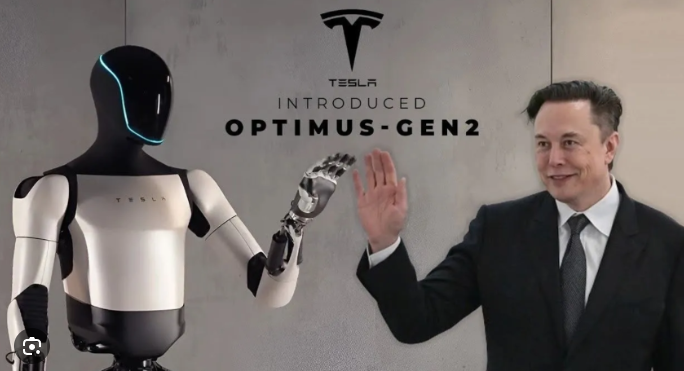

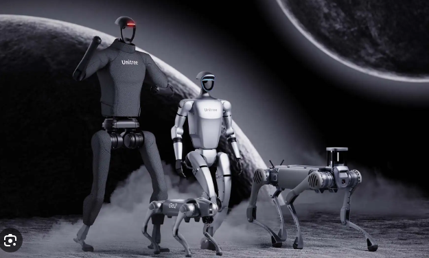

未来可能是两种结局：

1. **乌托邦**的时代，人类已经不需要工作和劳动，就可以获得食物和资源

大家也许就吃吃喝喝，找点乐子，人生的意义就好了

2. 贫富差距再次加大的世界，95%的人已经没有什么实际的价值了，可能被迫去做一些边角料的事情，上层人士拥有者高端的算力和生产力

这个时候，大家也是吃吃喝喝，找点乐子

就像一个毛毛虫，出生，随便乱爬一通，要不产卵生子，平时就是找找吃的。要不就是被太阳晒死在某个角落，当作给这个地球供养了。

哈哈哈，大家就当看个乐呵哈，我是个爽文写手，**不要当真**。

找点有意义的事情，赚点钱，让周围的人生活好一点，照顾好自己的家人，朋友，爱人，孩子，多交一些朋友，人生多留一些回忆。

很多我把控不了的事情，就放手，卷孩子不可能，你有ai卷的厉害么，人家可是不睡觉干活的

## 未来打算

等我这套工作流跑顺了，后面还是要大力研究和应用vibe coding，做出一些独立的产品

为什么vibe coding我看的如此重要？

### 迎难而上

因为我是后端，服务端出身，所以**前端一直很弱**，因为这个弱点，导致我其实一直没有什么能**拿得出手**的**商业产品**（因为需要**设计页面，写前端**）

而vibe coding则给了我这个机会，AI写前端的能力是有目共睹的

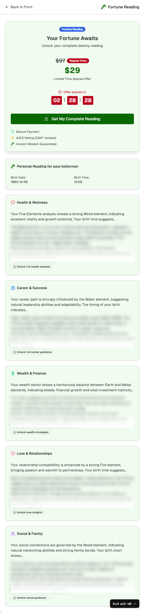

所以我**不能因为自己的弱点**，而一直去逃避一些自己觉得困难的事情

最近试了试codex，spec，mcp搞起来，有点感觉了，哈哈哈哈，还请大佬，多指点指点，我也希望AI在我睡觉的时候，帮我写代码

### 变现渠道

还有一个原因是，vibe可以让流量有个很好的变现渠道

我之前做过几个tk的账号，国学玄学的（用的数字人）

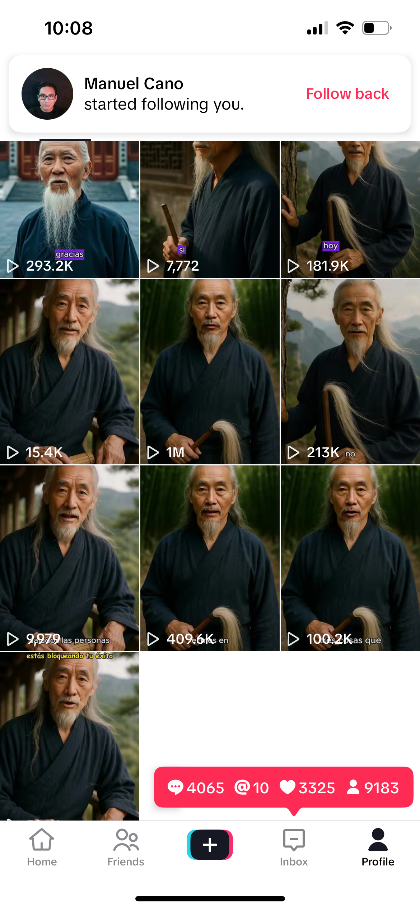

假如借助vibe coding，可以快速搭建一个9.9刀的运势独立站，帮你算运势，国外人很愿意为小东西花个9.9，19.9来测一下

> 这个也是技术群一个朋友给的建议

### 技术人的优势

还有一个必须要研究vibe的原因是，这是**技术人的优势**，不能丢下优势不管，逮着自己的劣势一顿捯饬

技术人有着有别于其他行业的代码工程基础，普通人vibe coding，如果不懂这些基础，会导致AI写成**屎山**

最终要不产品有风险，有bug，甚至未来根本**没办法迭代**

而我们则有这个优势，只需要补足你没有的，前端，后端，产品、营销的经验（哈哈哈，有点多，别怕，我都没怕），你就可以自己**独立开发出自己的产品**

对于非技术人，不是不可以，刚才说的这几项【前端，后端，产品、营销...】，你需要补足这些地方，其实没啥

99%**技术人可能是掌握了其中一项**，**他们需要补其他3项**，你**只比他们多补一项**而已

### 未来趋势

之前也提到过，未来公司大多都是小型公司，而且可能是非常细分领域的，改变世界，改变市场的产品，没错需要团队，但是对于我自己来说，我没这个想法

有这个想法的，我支持，因为我始终信服一句话：**能够取得多大的成就，取决于你解决了多大，以及多少人的问题**

而我目前想法，只是解决一些小问题就好了，哈哈哈哈

## 最后

我也是普通人，不是什么非常厉害的人，只是随便聊聊，我自己当作这里的碎碎念，我的路子，可能**并不太适合很多人去复制**，原因如下：

- 我本身是技术人，又带了很多年技术团队，又做过自媒体，又自己1v1面对客户销售...

大家需要**摸索出自己的道路**

关于我是谁，大家可以看

[]

也欢迎大家和我做朋友

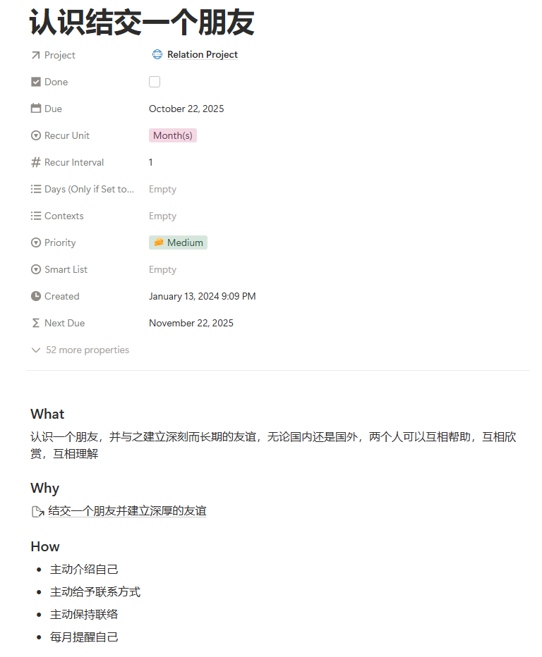

我年初给自己定的计划，就是结交一个朋友，感觉超额完成任务了，但是朋友谁还会嫌少吗？哈哈哈，人生漫漫，多一个朋友多一份心灵的慰藉

最后，再见