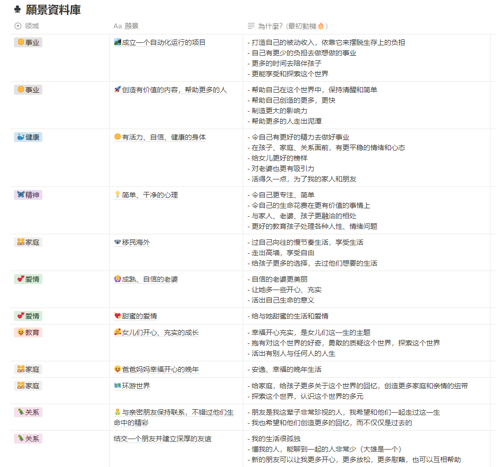

# 我的2024年复盘：计划一时爽，年底打脸特别响，走过的路，踩过的坑，取得的成绩

## 前言

再过一天日历就翻篇了，不知道你是不是也这样...

每年像现在这个时刻，年末，当我终于习惯了无论是纸上写下**2024**，还是各种手机、电脑屏幕的2024，在跨年那晚之后....

看到手机上，显示的是一个**陌生的2025**，每当在合同上要写下日期的时候，下意识的**诧异**一下，该写2025了...

这种感觉有些**无奈**，**惆怅**，又不得不接受...

为了更**坦然**的面对2025的到来，我决定今天用**40个问题**回顾下2024年，一年了，总得**留点垃圾**在这个世界上

你也可以使用这份模板，这是来自于github的一个仓库， [40-questions](https://github.com/kepano/40-questions)

想要认识我的，可以参考这些：
- [互联网人 自断双臂 离职后的2个月](/what-happened-after-i-quit-my-job-2-months/)

- [36岁互联网人，公司没裁我，我把自己裁了](/why-i-quit-my-job-at-36-age/)

- [复杂又简单的一年-2023年回顾（记X生物存在于地球的一年）（事业篇）](/2023-review-buiness/)

- [2024 半年度 Review（折腾篇）：此刻你是否清醒？](/2024-half-year-review/)

- [2024 半年度 Review（个人成长）：中年危机？36岁的我，是如何做到不躺平，无尽折腾的](/2024-half-year-review-self-help/)

## 1. 你今年做了哪些之前从未做过的事？

- 没踢过足球，却做了2000+人眼中的**足球教练**
  - 顺利**卖出专业课程**给他们
- **自我负责**，摆脱了我自己觉得不爽的环境（从公司离职的1/5原因）
- **主动帮助别人**，交到了一个朋友
- 做了一个有声书资源站（再次增加了自动化的经验，目前0维护状态，随时舍弃）
- 养了只猫（取名**小彩虹**）

## 2. 你有没有遵守年初时和自己许下的约定？

回答这个问题，就有些痛，我是定了24年计划的，还没细致回看，粗略回顾后

**一半一半吧**

图一：**愿景**，粗略的方向

图二：基于愿景，拆解细致的**目标**

对于没完成的目标，可能几个方面吧，自我剖析下，也许也能给你一些安慰，你没能按照计划完成的目标，原因可能几个：

- 它根本不重要
  没错，如果它很重要，那么你一定会想办法去实现，也许在你的生活中有更重要的事情
- 这个目标可能不是你真的想要的，而是别人告诉你，你该实现什么
  所以你就无法实现咯，没啥动力
- 也许你真的是因为其他事情耽误了（是真的，而不是借口，毕竟生活有许多未知突发的事情）
- 也许你陷入了负面情绪，比如我，我一直说要更新我的自媒体（一年到头，还没发出一个视频，我猜想可能是当时自己做的太累了，让自己伤到了，理智告诉我要坚持，潜意识却说不）

Q：那么要不要定目标呢？

A：目标还是要有的，不是什么狗屁万一实现了（那是幻想天上掉馅饼）

**目标意味着是个方向**，能否实现另说，如果没有目标，那就是**随波逐流**的生活，好像一个**活死人**

> 别人说，哇，快看这里，你就看向这里，你应该干这个，你就跑去干那个。

我希望自己**掌控自己**的人生，做自己的选择。

## 3. 你身边有人生孩子了吗？

我这个年纪，同龄人基本上都生完了。

## 4. 你身边有人去世了吗？

有，外婆去世了，特意回去了几天，和几个外祖母（婆婆同辈）聊了聊当年那个年代，孩子肆意被换做粮食，小孩子自己出走，被人发现被野狼啃食殆尽

我问我哥，生活都那么难过了，为啥他们还要生孩子？

我哥说：那年代没啥娱乐，不生孩子，干啥...

## 5. 你去了哪些城市/州/国家？

- 山西
- 山东
- 深圳
- 日本
- and 杭州

## 6. 明年你想要获得哪些你今年没有的东西？

- **inner peace**
- a heathy life

## 7. 今年的哪个或哪些日子会铭刻在你的记忆中，为什么？

- 外婆去世（父辈的父辈，基本上都不在了，我内心中一个时代的陨落）
- 日本旅行（内心享受着片刻的安宁）

## 8. 你今年最大的成就是什么？

其实仔细回想，没啥自己觉得太大的成就。家人安康，孩子快乐成长，钱就那么些，项目做了一大堆。

如果你也像我一样，想不出来自己最大的成就，不妨把眼光放小，再小都可以是你的成就，比如：

- 我竟然公开了自己事业一面，在自己的朋友圈
- 计划在2024年养成锻炼的习惯，在12月29日，第一次跑了30min😊

## 9. 你今年最大的失败是什么？

- 我教人如何摆脱负面情绪，而自己却常常深陷负面情绪无法自拔
- 说好的要更新个人成长的自媒体，**又一年断更了**
- 说好的要英语考级，资料都准备好了，**没有去持续学习**
- 计划太多，实践太少（我**错误的预估**了对于某些任务的耗时）
- 每月一本书+读书笔记（只完成了2本）

## 10. 你今年还遇到过哪些困难？

- 人际交往上曾经让我有些头疼，不过我自我了断了，哈哈哈
- 看着时间一点点流逝，却迟迟没有下定决心离开职场（最终还是出来了，晚了4个月）

## 11. 你今年是否生过病或受过伤？

- 幸运：感冒，无大病

## 12. 你今年买过的最好的东西是什么？

- 折叠桌子，太好了，用的时候拉出来，不用的时候折叠进沙发，**家里宽敞，心情舒畅**

## 13. 谁的行为值得去表扬？

- **爱人**开始思考，并有在积极的去增进双方感情（我猜测受她那些爱学习的同事影响多吧）
- **家人**一如既往的帮扶着这个家
- **姐姐**突然变得很懂事，让我受宠若惊（我觉得这不是好事，我不希望孩子是个世俗眼中的听话孩子，我希望她有自己独立的思考，在理解后做出自己的决定）

## 14. 谁的行为令你感到震惊？

- 前同事，为了证明自己价值，站稳脚跟，搞下属不在话下，两面三刀，看人下菜碟

## 15. 你大部分的钱都花到哪里去了？

- 没怎么统计，但是ChatGPT花了几个月，给我帮助不少
- 没乱花钱，也没过于节俭，对于金钱，更多的是看重它能帮助我什么

## 16. 有什么事让你感到超级、超级、超级兴奋？

>  卧槽，我开始有点后悔开始这个了，还有这么多问题...

每个项目开始的时候，都会让我很兴奋

- 有声书
- 海外youtube tk
- soccer
- SYT
- ...

但是，感觉就是这个问题所描述的，超级超级超级兴奋，前期期待拉的太高，导致后面觉得很无聊

## 17. 哪首歌会永远让你想起这一年？

《**若是月亮还没来**》，女儿总是唱

## 18. 与去年的这个时候相比，你是...

> 你是：感到更快乐还是更悲伤了？变得更瘦还是更胖了？变得更富还是更穷了？

- 胖了一些，原来保持在60kg，现在70kg

## 19. 你希望自己能做得更多的是什么？

- **多动脑子**

- 哪怕无聊也该让自己**无聊**，而不是让自己沉迷在那些低级娱乐（电影解说，游戏...)

  > 不是说他们不好，是因为我对这些没抵抗力

- **Be Present**

  > 尤其在和家人在一起，和朋友在一起，关注他们，而不是脑海中的其他事情

- **专注**

## 20. 你希望自己能做得更少的是什么？

- **分心**，今年以来分心尤为严重

  有时候是因为外力

  - 每天都有许多人加我好友，github（技术人）soccer（足球人），另一个项目（招聘）时不时我要回复他们消息
  - 程序出错，导致计划打乱

  有时候则是内因

  - 看账号数据
  - 看到任务列表里一角，就想要去了掉，刚深入一半又沉浸另一个事情（导致任务列表越来越多）

## 21. 你是如何度过节假日的？

- 带娃，尽可能去钻小众地方（讨厌人多）

## 22. 你今年坠入爱河了吗？

nope

## 23. 你是否有讨厌某个你去年此时不觉得讨厌的人呢？

有，不知道是他变了还是我变了

## 24. 你最喜欢的电视节目是什么？

- 《Loki》（似乎是23年的）

## 25. 你读过最好的一本书是什么？

- 《人生十二法则》
  不能说这是我今年读的最好的，但是这本书让我产生了一个很大的矛盾点，并且让我自我和解了

  - 我一直让孩子有自己的思想，不用在乎别人是怎么评价自己的，你想要和谁玩勇敢的去发出邀请，被拒绝也没关系
  - 但是我看到《人生十二法则》，龙虾教授则希望让人成长为一个有礼貌，受人欢迎的人

  下面是当时和自己和解后的一篇记录

  

## 26. 你今年发现的最好听的一首歌是什么？

《若是月亮还没来》，女儿总是唱

## 27. 你今年看过最喜欢的一部电影是什么？

- 《异形：夺命舰》
- 《头脑特工队2》

今年电影院也就看了这俩...

## 28. 你今年吃过最好吃的一顿饭是什么？

- 大阪 阿波座 街边的一个大阪烧（啤酒很好喝）

## 29. 有什么是你想要且得到了的？

- 周围的人健康，安康

## 30. 有什么是你想要却没有得到的？

- 尚未找到那个能让我自由的创业项目

## 31. 你生日那天做了什么？

- 老婆硬拉着去海底捞，尬听陌生人唱歌
  （当时有心事，有点不在状态🤨）

## 32. 有什么还未发生的事，如果发生了，会让你的这一年变得无比满足?

- 每天能实现承诺做最重要的事情，并且在睡前复盘并规划第二天

  我发现每次我能这样规律的过一天，会非常满足的入睡

## 33. 你会如何描述你今年的个人时尚风格？

- 优衣库2年买一套，脚上还是那双ecco，浑身沾着我家小彩虹的猫毛，家人吐槽我邋遢，我自己觉得自己很时尚，不在乎别人怎么看我

## 34. 是什么让你保持理智？

- 责任，对自己负责，对家人负责
- 角色，父亲，创业者，爱人，儿子

## 35. 你最欣赏哪个名人/公众人物？

**马斯克**，这个世界需要有崇高理想的人

## 36. 哪个政治问题最令你有感而发？

不关心政治

## 37. 你想念哪些人？

- miss old days, old people

## 38. 在你新认识的人之中，谁是最好的？

- 24年结交的人不多，不能说谁最好，哈哈

## 39. 今年你学到了什么宝贵的人生经验？

- What You Left when You leave this world.
  - What You make to this world
  - What you leave to your love
  - **You Will dead at Every single day**. Maybe is today.

## 40. 能够总结你这一年的一句话是什么？

- 变革总是带来痛苦，而一切的痛苦都是值得的。从苦难中学习，自我负责，而不是在苦难中自怨自艾，成为一个怨妇

## 结束

这一篇更多的是个记录，如果能对你有所启发，那是最好了

希望你能拥有轻松而充实的生活~