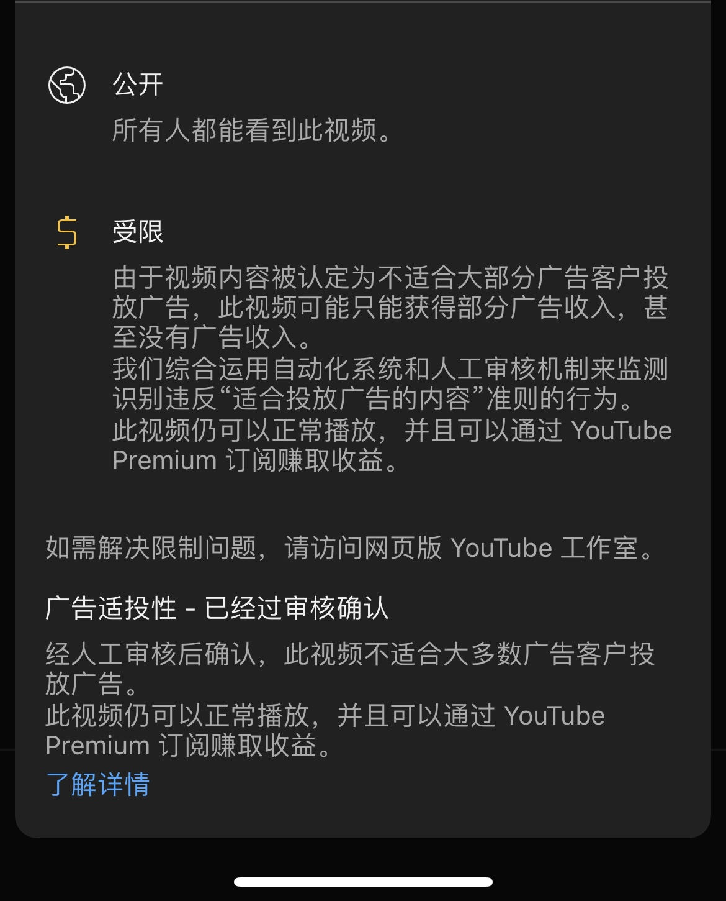

## 前言

许多人也许关心：

- 一个`技术人`，离职出来后的现状是怎么样的？
- 自己究竟该不该`离职下海`？
- 如果开始一个`副业`？

这些也许会在这篇给你一个答案

---

上一篇是2024年10月16日，距离从老东家离职出来，已经过去2个月了

2个月说长也长，总共60天，说短也短的，一辈子有`29200`天

一句话总结：这60天带给我的改变是`巨大`的，非常开心与这段时间的`收获`，也庆幸与这段时间带给自己的`教训`

希望我这份不起眼的`《互联网人，自断双臂 离职后的2个月》`能对你有所启发

关于我是谁，大家可以参考这些来了解

- [36岁互联网人，公司没裁我，我把自己裁了](/why-i-quit-my-job-at-36-age/)

- [复杂又简单的一年-2023年回顾（记X生物存在于地球的一年）（事业篇）](/2023-review-buiness/)

- [2024 半年度 Review（折腾篇）：此刻你是否清醒？](/2024-half-year-review/)

- [2024 半年度 Review（个人成长）：中年危机？36岁的我，是如何做到不躺平，无尽折腾的](/2024-half-year-review-self-help/)

## 事业现状

接上一篇，我目前手头主要在做的两个项目：

1. 足球项目`CGS`(Crazy Green Soccer) 

一句话阐述：专门为想要提高足球技能的青少年，足球爱好者，提供专业，国际化，循序渐进的足球训练计划。球队的训练无法顾及到每个人的发展，这些训练是给那些想要提升技能，身体素质而打造的足球训练计划。

2. Youtube擦边项目`SYT`（Sexual Youtube TK）

一句话阐述：专门为全球华人，提供有趣，生动，多样的两性关系，两性话题的自媒体

### CGS项目

#### 项目基本情况

- 粉丝数量：`3w+` （主流平台加起来）

目前该项目，社交媒体的粉丝数量并不多，因为账号的内容问题，以及未做任何投流动作，导致粉丝数量增长并不快

- 流量情况：日均`1w+`

与上面情况相反的是，流量情况是非常好的，每日发布两条，平均播放量可以破万，点赞数据都不错

这是该账号非常让我满意的地方，`不依赖投流`，即能享受到如此多的`精准流量`

- 流量精准：
  账号吸引到了大量`足球运动人群`，足球是个庞大的爱好者人群，而足球训练人群，则是一个`非常小众`的群体，这也是我为何决定深度去挖掘这个项目的原因

> 视频是讲解后卫需要具备的技能，视频最后则放出钩子，如果需要专业的训练计划则留言pro

- 变现情况：一般

> 我课程普遍高客单价1599为主，1599这个sku就卖了5份，当然远远不及我上班了。我也常常因为这个而沮丧

但是从另一个角度想，这个项目，我自己从一个`足球门外汉`，一步步，成为客户口中的`教练`。还`成功销售`出这些人专业的产品，这本来就是一件非常不可思议的事情...

这个原因我分析下来可能有几个后面再说

- 公众号的建立

离职后我就开始了公众号的建设，借助ai来生成大量的专业内容，截止目前关注数有1300+

- 私域沉淀：目前微信私域添加了大概1500+的足球专业领域，涉及的人群
  - 学生（初中，高中，大学最多，小学比较少）
  - 学生家长
  - 专业足球运动员
  - 学校老师，青训教练

#### 问题与解决方案

1. `变现速度缓慢`

目前总结变现：`叫好不叫座`，用户觉得对他们`帮助很大`，但是`付费很少`

我目前的策略是，从公域（自媒体）以免费训练计划赠送的方式，来吸引人群到私域，这样做的好处：

- 前期更深入的了解用户，自媒体更多的是单向的
- 更好的与用户沟通
- 我希望依托私域的公众号和朋友圈来做营销转化

缺点也是显而易见的：`时间耗费巨大`

目前这样的策略并不是特别好，分析可能有下面这些问题

- 以免费训练计划吸引来的流量会陷入“[零价格效应](https://baike.baidu.com/item/%E5%85%8D%E8%B4%B9%E6%95%88%E5%BA%94/22303012#:~:text=%E5%85%8D%E8%B4%B9%E6%95%88%E5%BA%94%E6%98%AF%E6%8C%87%E4%BA%BA%E4%BB%AC,%E4%BB%96%E4%BB%AC%E5%B8%A6%E6%9D%A5%E4%B8%80%E4%BA%9B%E6%8D%9F%E5%A4%B1%E3%80%82)”

>  事实上与这些运动员接触下来，发现真的有这样的苗头，我甚至还在助长这样的苗头。
>
> 大家都在期待我还有什么免费的东西，而不去选择我的付费服务

但是与零价格效应对应的，还有个升级版，是[免费增值模式](https://zh.wikipedia.org/zh-hans/%E5%85%8D%E8%B2%BB%E5%A2%9E%E5%80%BC)，这常常用于现在许多软件服务

所以并不单单是免费造就了目前这个局面，还是营销策略上的问题

- 沟通引导的问题，其实和第一个有些类似，用户甚至都不知道我有许多付费的服务
- 用户属性导致：该用户人群付费，除了个别家庭富足的朋友，大部分这类人群的付费需要过一道坎：`家长`

目前的解决方案：

1. 在与用户沟通过程中，强调`免费为入门级`，我们还有更全面的课程

2. 做`用户分层`，筛选出具有强烈目标感的用户，而不是这些免费来蹭蹭的用户。这里我借助了之前写过的[Formbricks教程](//how-to-install-formbricks-on-your-nas-entrepreneur-require/)

在用户体验完免费的3天训练计划后，迅速收集客户资料留档，并做好用户分层。对于高价值高意向的客户，着重去攻略他们

2. 营销方式单一

目前的营销刚也说过了，仅仅靠`朋友圈、公众号`的方式，因为目前我还`没有合作伙伴`，所以我`无法尝试过多的营销方式`

未来可能考虑的方式：

- 代理机制，一般踢球的人都有自己的小圈子，发展某些客户为球队队长，拉新人进来，返现，并且赠送有别于队员的训练计划
- 自媒体平台商城
- 直播带货
- 与kol合作

#### 总结

这里也给大家一些可能用得到的建议

1. `不要怕你不熟悉的项目`，以前你需要怕，现在真不需要，`因为你有AI`，AI可以帮助你快速了解一个行业，这些人群

2. `大胆的付费`，其实我一直有些不自信，这个项目到底行不行，是不是他们想要的，是否专业
   内心无论怎么给自己打鸡血，都不如结果（第一单成交）来的实在。

3. `警惕零价格效应`，这会让你有许多客户进来，让你营造一种很受欢迎的假象，实际上肯付费的，还需要你额外努力

4. `简单的事情重复做`，不要没事整花活，浪费时间和精力
   对大家也对自己说：不要总想着花活，许多事情很简单，因为简单，所以许多人不愿意去做，总想着去想一些花活

   我的例子就是：`公众号，朋友圈断更`，中间是因为带家人出国旅行导致的
   公众号是我营销的主阵地，而且公众号上已经开始有许许多多非社交媒体的流量，被我内容吸引来的精准用户了

   `持续去做简单，而枯燥的事情`，这些事情`累积`能让你看到结果

5. `时间线拉长`，足球这个项目我是打算长期做，陪伴一个个学生也好，职业球员也好，帮助他们提升自己的足球水平

最后也在这里呼吁：`如果你对你这个项目感兴趣，那么可以联系我，一起经营这个项目。`

我很希望有人能一起和我合作做这个项目，最近一直也在和一些朋友，包括一些别人介绍的陌生人去谈

因为我深知自己的能力有限，时间也有限，单靠我自己可能无法做好这个项目，在如此好的基本面的情况下，希望能有感兴趣，志同道合的人一起合作。

### SYT擦边项目

#### 项目概述

因为国内平台上审查严重，而国外youtube tk规则更为人性化和开放，国外自媒体平台`单纯靠广告收益`就有不错的收益，再加上现在这个时代背景，经济下行，大家更愿意纸醉金迷的沉迷这类信息，于是诞生了这个项目

项目流程：提供文案，拍摄建议，找女性兼职人员，来拍摄录制两性关系，两性健康类口播视频

批量化文案，批量化上传，做`矩阵`

项目前期是想要借助youtube的ypp来实现，后期变现路径就会丰富

结果：

1. 完整的工作流走通，包括招聘，文案，封面等
2. 目前跑出一个账号粉丝2700+，并成功过了ypp，其他部分账号表现也不错，在上涨的势头

#### 问题与解决方案

1. `矩阵不稳定`，0播放

这个相信许多做youtube都会遇到过，这个问题，我尝试了不同ip，不同账号，甚至使用指纹浏览器，均无法完美破解，摸不清楚规律

2. `AI生成文案返工率高`，无法使用api来，因为ai模型都有审查，而文案均不行，我则采用了jailbreak的方式破解了网页版的ai，让其可以生成这类话题的文案

但是ai生成质量低下的问题，还在不断的优化

3. `视频黄标`

youtube会常常把这类内容标记为黄标，导致ypp收益下降

目前还没能有很好的解决方案，但是也有一些，不断的调试标题，描述，以及内部文案，这无疑耗费大量的时间

### 其他

其他项目，诸如我自己的自媒体等等均没有开展，下个月要开始搞起来

`同时运行多个项目到底好不好`？

那天有个加群的朋友给我打电话，聊起来，说他不会像我一样分太多精力在其他项目上

我呢，则告诉他，这么做有这么做的道理

1. 多项目并行，这是在`博概率`，我不知道哪个会更好，正如我2年前决定试水自媒体，也是同时做了俩号，一个情感类，一个则是心理学个人成长类。最后哪个账号数据好，就专心做哪个
2. 许多项目，都会陷入一种`枯燥的例行公事`，每周写文章，拍视频，做营销。我自己觉得我把时间规划好，比如周一统一把足球项目的营销类文章写好，设置好自动发送，其他时间可以安排做别的

我也不知道自己这么做是不是好，我自己也觉得不太好，因为脑子里装了太多东西...

不知道看这篇文章的你，怎么想，你是会多个项目并行，还是专注的做一个项目？

## 家庭

### 家庭旅行之日本

离职后，终于如愿带俩娃出国一趟，这次去的是`日本`

整个旅途下来，你要问我感触，真的是`太累了`，100%的时间都在照顾娃的需求，2/3的时间，我和老婆要抱着这俩祖宗（1个5岁，1个2岁）

更别提这个小祖宗，动不动就发飙，被我老婆叫`小趴趴`，一言不合就趴地上，让大家欣赏我家老二的美照

累虽然累，但是孩子们还是很开心的，有娃的，和我家差不多岁数的，其实去个`奈良`就差不多了，满大街都是鹿，随便玩，随便喂，比国内那些圈在笼子里，还有饲养员厉声喝止“不要喂“的强

#### 建议

1. 有`娃太小的，慎重`，如果去能带个推车最好
2. 像我一样大小的娃，可以去奈良，孩子们很喜欢
3. `语言不通没任何问题`，基本上简单英语，还有你的手指头🤌都可以解决任何问题，更何况还有实时翻译的手机软件（apple，android都自带同声翻译）
4. 有娃行程别安排太满
5. 家庭出行，airbnb是个好平台，日本酒店多一个人钱就多一份。大多数airbnb则没事

#### 本次行程（8天行程）

- 东京
  - 浅草寺、晴空塔
  - 皇居
  - 富士山
- 大阪
  - 梅田
  - 奈良
  - USJ

#### 感悟

1. 这次来日本感觉和之前来`没任何区别`。还是那些地铁，那些人，那些玩的。
2. 去了8天，啥也不想，就是想去哪里玩，怎么带娃玩，全身心在家人身上，让我感受到了`前所未有的放松`
3. `作息`也跟着`规律`了许多，回到国内又有点恶化的前兆
4. `换一个环境`，真的能`改变`人很多，如果现在的环境让我喘不过来气，`来一场长期旅行`吧。一定会对你有所帮助

还有很重要一点，我这次去了日本，不知道为何对许多社会上的东西无感了，用流行的话说，就是`去魅`了：

- 什么发达国家，只是一群人占山为王，只是一小撮人类自封自己是xx国人。任何一个国家都是这样

- 你所以为的这些人群素质高，只是表面的而已，日本还是对外国人，或者中国人抱有隔阂的，正是因为如此，我才真正的感受到，自己似乎看穿了这些，觉得很无聊，无趣
- 包括国内也种地域黑，河南人，福建人，广西人，苏南苏北，北京人，上海人。都是一群无知的人，陷入自己所认为的世界，没事情找事
- 照顾好自己，照顾好家人，比什么都强

## 其他想说的

### 要不要辞职创业

经常有人问我，现在俩月了你怎么样了。前阵子去深圳和一个朋友聊天，他也在考虑年后重回职场，包括今天看到一篇关于自由职业，超级个体的讨论

我的答案是`不知道`。

- 因为我目前也`没什么好的结果`，没办法告诉你难不难
- 即便有好的结果，我说难和不难，会有什么关系吗，`你又不是我`，`我又不了解你`

如果`以我的视角`来看的话：

- 难，0-1非常难，你需要`掌握`的东西非常多

- 你需要非常好的`时间管理`，合理的规划工作与休息。原来打工，你只需要专注上班的时间即可，而现在你可能没日没夜的做，你也可能醉生梦死的颓废

- 你需要有非常好的`心态管理`，就像男女那种事一样，也许你一通操作下来，对方来一句：就个这？（抱歉，我可能擦边频道做魔怔了）

  - 你会在一开始经历非常大的进步，然后进入`瓶颈期`，而这个瓶颈期会比你想象的要漫长的多，甚至你都意识不到这是一个正常的瓶颈期

    

  - 也许你在一开始就`经历滑铁卢`，没有任何反馈。导致你开始自我怀疑，自我否定

- 还有就是`欲望管理`，其实和上一条类似，`不要大喜大悲，平常心`

  不要因为有一点点结果，就把自己对于未来的预期拉的超高，也不要因为一些挫折就对这件事情的期待跌入谷底

  `平常心不是佛系`，而是`科学的做事情`，`平常心的看待结果`
  科学的做事情意思是，我该定目标定目标，为这个目标做各种行动和决策

  佛系的看待产出的结果

- `一定要休息`，我这方面做的就不够好，这是非常非常非常重要的。为什么呢？

  - 如果你目前暂时`无法`从自己做的事情上`得到快乐`，再加上你`不休息`，会不自觉的增加你对于目前在做的事情的`痛苦程度`

    你可能自己浑然不知，但是你的大脑，潜意识非常清楚，久而久之，你的动力，你的激情会`消散`，导致你会无法坚持你正在做的事情

    许多事情是无法立即看到结果的，也就无法刺激到你走的更远

  - 如果你不休息，跟个机器有啥区别，`你是个人类。你需要喘息`。休息也是让你的大脑，让你活的更有意义。

  - 休息可以让你`换换脑子`，看山不是山就是这个道理，转头回看自己在做的事情，会有别样的视角和想法

### 辞职后的个人状态并不好

说实话这段时间我自己的状态并不是特别好，说好的`锻炼，冥想，戒烟，更好的规划时间`，`梦想的自律的离职生活`一个都没做到，哈哈哈哈

我分析了很久，也找到了可能出现这个状况的原因：`基石习惯`

这里讲一个从James Clear的《Atomic Habits》（《原子习惯》）中得到的启发，里面有一个概念，叫基石习惯。

我现在有许多好习惯，也有许多坏习惯，我希望能破除这些坏习惯，增加一些好习惯，结果就是有时候可以有时候不可以。无法形成好习惯的养成

什么是基石习惯呢，比如早起，比如锻炼，当你早起之后，就会不知不觉的增加了许多时间，加上清晨，你非常容易去锻炼，去读书，去冥想

`早起`，带动了`锻炼`，锻炼之后你觉得自己很健康，而就想要不去破坏健康的状态，选择去`戒烟`，同时因为你想要保持健康，所以吃饭也会`注重营养`，早起为了不浪费清晨美好时光，你会想办法去做一些`有意义的事情`，而不是玩游戏荒废光阴

而这里举例的早起，无疑就是个非常好的基石习惯

再比如`睡前的自我反思`，这个能让我的心理有个非常大的改善，总结一天心得，看自己做了哪些，规划第二天的计划。这让我自己有许多掌控感，睡觉就很踏实，而且不会因为焦虑，而选择报复性的熬夜。

回到我这里，我回想自己，可能就是因为`睡眠不足`导致的，睡眠不足，导致我起床后就很晚了，早上送孩子急急忙忙的，当坐下来准备工作后，又会选择那些惯性的事情去做，因为你很疲倦了，你的大脑只会选择那些不用自己多费劲的事情。结果就是成效很低，又产生焦虑，焦虑让我抽烟，让我不愿意那么早入睡。于是恶性循环

我猜可能最大的问题就是这个吧

所以也许我的思考可以给你带来一些启发，找到那1-2个，坏的基石习惯，试图让他变成一个好习惯，推动破除你其他的坏习惯

## 结束

这篇又啰里八嗦的扯了半天。哈哈哈，各位就当看个乐呵，能对自己有帮助最好了

如果有想法也可以留言，共同交流进步哈

最后希望大家在2024的尾巴上，可以弥补一些年初定的计划。就像我，在最后，实现了带家人出国旅行的年度计划，哈哈哈哈