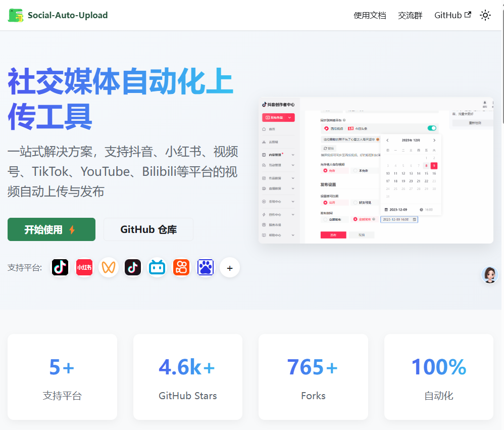

## 前言

距离上一篇blog已经过去了`2个月`之久，这俩月经历了好多好多... 这一篇是我自己对于这段时间的一个`回顾和总结`

但是同时也许能让读到这一篇的朋友能有这些`收获`：

- 在这个AI变革，经济下行，就业困难的时代下，一个普通中年大叔是如何通过`折腾项目`找到`新可能性`？
- 我是如何搞笑的`突破舒适区`的？
- 创业、带娃、生活的拉扯中，怎样在忙碌里找到自己的节奏和意义？

---

我是谁？你可以从这些地方了解到我，

- [复杂又简单的一年-2023年回顾（记X生物存在于地球的一年）（事业篇）](/2023-review-buiness/)

- [2024 半年度 Review（折腾篇）：此刻你是否清醒？](/2024-half-year-review/)

- [2024 半年度 Review（个人成长）：中年危机？36岁的我，是如何做到不躺平，无尽折腾的](/2024-half-year-review-self-help/)

简而言之，我是一个技术人，创业者，俩娃的爹，丈夫，儿子，兄弟，朋友，养猫人士...

---

接下来的会分为几个板块

1. `创业现状`：从两性内容到足球培训，我的项目进展
2. `成长部分`：开源社区4.8K⭐的意外收获和人生突破
3. `家庭与关系`：生活里危机和AI的意外救援

先来复盘下，这2个多月我都做了什么吧，我依旧延续了之前的风格，`多项目并行`，而且项目涉及五花八门，频率`1周启动一个项目`

## 事业部分

### SYT两性健康类

#### 项目概述

这个项目我在之前的blog中有简单介绍过【链接】

简单概述就是，讲述两性知识在海外（更开放的平台），`借助AI`，大`批量制作内容`，`矩阵化`运作

项目目前有了巨大的变化，从`广度扩展为深度`，深度运营一个项目，原因在于...

我们可爱漂亮的两性女主播，现在成为了这个项目其中`一个合伙人`，全身心来投入这个事业

于是这个项目从原来只是`单纯的赚取流量`收益，发展到开始全面做

- 营销内容
- 社区运营
- 私域转化
- 产品海外发货变现
- 课程变现

#### 结果

- 流量端：从上一次分享的2747，到现在`翻了5倍`（但是感觉`速度还不快`）

- 变现端

  - 两性`延时课程`的销售

    >  别搞什么两性姿势之类的知识付费，那可能涉嫌传播淫秽色情，但是教个人如何提升时间、Y度没啥问题

  - 1v1咨询

  - 两性功能性 + 滋补类产品

  - 还有...SW...

#### 问题与解决方案

1. `变现端能力偏弱`。我们的两性女老师，因为没有经验等各种因素，导致流量进到私域变现偏弱，目前`找专业的朋友`，帮忙转化。

   `专业的人做专业的事情`，尤其这种需要销售沟通的，需要专业的人来承接。但是人力来承接就必须得是`高溢价`或者是`边际成本很低`的东西，比如

   - `情绪价值类`产品，手串，佛牌等、两性用品（这类产品溢价高，成本低）

     >  这也是为啥玄学类，其实天花板很高

   - `数字课程类`（忽略前期时间和脑力的投入，基本上0成本）

2. 流量还是偏弱

   之前一直在做youtube`长视频`，未来计划`切入短视频`赛道

   长短视频均有优势

   - 长视频产生的`用户价值更高`，侵占粉丝`心智更深`，但是流量偏弱
   - 短视频`流量大`，容易`出圈`，但内容不成体系，`无法建立非常深`的信任

### CGS专业足球训练

#### 项目概述

这个项目也在之前简单介绍过，一句话介绍：通过`专业的足球训练`，来吸引用户，到私域购买`课程`成交

流量端，因为我是`自动化制作`，`自动化上传`，每周只需要1个小时（打开程序自动制作+上传完成）就不管它了

公众号我也做了自动化，哈哈哈，虽然很粗糙，但是能用

同时我也做了一个`会员专区`，按月付费（99一个月），这个我比较喜欢，`适合我这种不愿意人工做转化`、`销售能力不强`的人

其实有大量评论区留言，私信，加群申请没有回复😭

最早的，估计能追溯到去年了

#### 问题与解决方案

- 对于如此多的`精准流量`，我始终`不愿意深入的去承接`

  评论区的留言、加群申请、私信我都没回复，哪怕我坐这里写这个blog，我也不太想抽出时间去...

  主要原因

  - 我的`时间腾不出来`，因为很多事情想要做，终于晚上有点时间了，哪怕看会儿3分钟讲电影，也都不愿意去做

  - 可能和我性格和职业特性有关，我`极其厌恶枯燥，重复`的事情

    - 回复他们的留言，需要`复制、粘贴、复制、又粘贴`

    - 客户咨询，`复制、粘贴、复制、又粘贴`

      因为我做了完整的话术沟通...（事实上很搞笑，我`流程化之后，非常高效`，但是这件事情让我失去了兴趣...）

      

  

  我也不知道怎么解决，去年我一直在和周围的朋友聊，希望有人能`和我一起来经营`这个项目

  因为这个项目的好处：

  - 国家扶持足球
  - 足球是大类，但是专业足球培训则是垂直小类（竞争少，客单价高）
  - 为了复兴中国足球~~~

  但没遇到合适的人哇，哈哈哈...

## 成长部分

个人方面感觉自己`收获很少`，不知道是不是自己`长时间沉浸在专业领域，事务本身`，学习时间少了，缺乏接触新的观点和眼界了

但是还是想分享一些经历

### SAU 开源的矩阵化自动上传

首先是，我在去年从自己的小玩具里，剥离出来了一个`开源项目SAU`，目前已经到了4.8K的⭐了

还上了`github`周 trends榜单（群友给截图的）

`技术交流群`，加满500人，都开始开2群了

后来为了更方便大家查阅文档，还搞了个`官方文档库`哈哈哈，cursor真的帮了我好多，尤其是样式上

#### 想说

1. 我不是什么大佬，也不是什么厉害的人

许多人加我，动不动`大佬`，大佬的叫...甚至还会`尊称我：您`....

让我受宠若惊，谈不上什么大佬，也不必称我为您，`我就是个普通人`，没啥了不起的：只是我比你多看了一页书，正好你没看这一页而已

>  我刚参加工作的时候，我们这些毛蛋子看到组长那技术能力一流，纷纷吹捧
>
> 组长的一句话让我印象深刻：我没啥厉害的，只是我刚好知道一个你不知道的东西，只是我刚好看了这一页书，你却没看而已。你知道了，你看了这一页书，你也很厉害

2. 赠人玫瑰手有余香：`贡献社区`，`帮助别人`

除了技术群拉了几百号人，也有了`和很多人交流`的机会。有时候一个小问题，群友会热情的把自己之前怎么解决的，还有些会直接免费给我源代码，或者直接给我引荐、介绍。

前阵子还收到一个邮件来自加州，似乎像是招聘的，又感觉像是诈骗的，我的`经历和他的岗位`似乎不怎么匹配。我还专门查了下电话，看是`不是缅甸`的，结果是加州的..

`视频也好，文章也好，对需要帮助的人安慰的话`，github开源社区也好，无私的帮助他人，会给我们带来很大的满足感，同时也会给于我们许多`曝光`

但是同时也要学会`适度营销自我`与`利用互联网`的杠杆

- 营销自我，比如现在我虽然写了个blog来复盘下，其实另一个角度，我也在宣传自己的一些理念，项目，想法来帮助到他人，或者吸引同频者来合作
- 互联网杠杆，意思是，公众号，blog，抖音，自媒体，是个`放大器`，可以放大你自己。

### RUU 招聘俄罗斯主播

这是一个有趣的故事和经历，但是对于我自己来说也是一个`小突破`：让我第一次用自己蹩脚的英语口语跟老外沟通

事情这样的：过年和老同学聊天，一拍即合，决定从`战乱的俄罗斯`，乌克兰或者`各种斯坦`国家招聘一些有着`西方面容`的女孩子来中国当主播

我呢，自己去找相关的渠道，寻找各种有意向来中国的俄罗斯人，2月份联系到一个

大家约定开`远程zoom`视频会议沟通工作内容

对方么找了个在`广州的俄罗斯人(会英语)`，另一个合伙的朋友在开会前吹很大：没问题，我来主持，我来跟他们沟通

结果zoom会议开始后，`直接装哑巴`了，全程不说一句话。

其实我有预案的，怕意外，我提前找了个朋友的`亲戚小女孩`做翻译，结果小女孩么不懂业务

聊了10多分钟，大家聊的都`不在重点`，于是实在没办法了，我就用我`蹩脚的英语`与对方沟通，结果很意外，对方都`能听懂`，彼此沟通的还比较流畅

也许对许多看这篇文章的人来说，这不算什么，但是对于我来说，这算作自`己人生当中的一次突破`，哈哈哈哈😄

最有趣的是，我那个老同学合伙人，全程小嘴紧闭，像个`害羞的大家闺秀`一样，和之前跟我吹的，我hold住，完全相反

最后的最后，这个怂货竟然说话了，当他听到广州的俄罗斯人说自己会一点中文，他终于忍不住，开始掌控全场了：`你能听懂中文吗？`

事后让我狠狠的鄙视了一顿

#### 想说

- 从自身成长的角度来看待问题

  不知道从何时开始，我开始觉得`解决一个个问题`是一件非常`让我爽`的事情

  就如这个招聘国外主播来说，我朋友说这上哪里去找，这怎么来，怎么沟通...巴拉巴拉，我说，你要这么看，`这就是一个问题，你解决了你就比别人牛逼`。

  说实话我很享受现在的状态，一次次的突破，一次次的解决一个全新未知的问题

- 英语没啥大不了的：`完美主义的英语`

  我至今口语很差，我读文档，听的能力都还可以，讲很差，这大家都知道，应试教育，我们的环境给不了我们这个练习的机会

  我一直认为：`语言是用来沟通`，不是用来`咬文嚼字`的。所以上次硬着头皮讲的时候，我自己也知道，许多`语法是错误`的，单词是不准确的

  结果根本`不影响我和对方沟通`，因为对方能理解我想要表达的含义，就好像high和tall，我说这个人很high，对方也能听懂啊

  `沟通只要把意思`传达到位就行了，不需要准确，这个观点，也许能让你也可以勇敢的开口去讲，有了练习你才有可能有纠正的机会

  做事情也是如此：不准确，差不多就行了，`先做出个垃圾，跑起来再说`。切勿陷入完美主义

  多折腾是没坏处的：

  - 我们大多数人都是普通人，没那个资源，就像雷军起盘就是几百万上千万，大量的容错空间。所以不要总想着要多少钱才能创业，得有上千万融资，解决上亿人的问题。`从小做起`
  - 也因为我们是普通人，屁股小好掉头，错了就下个项目吸取教训

## 短暂的结束

我发现写不完了，越写越多，继续写下去今天就费在这里了。还有事情要处理

而且我也不想`像个苦行僧一样`，写一天东西。写一会儿就没意思了

下一篇，我会讲一讲这两个月，开启的项目

其中有：

- 恋爱赛道

- AI视频

  - `玄学`：星座，道家，佛教
  - 日本养生赛道的开启

  

以及`生活和家庭`中遇到的事情，以及我是如何`解决不掉`，但是`AI`竟然意外的`帮我解决`了这次危机

同时还有我之前就提到过的，`Build In Public`

什么时候会更新：我也不知道啥时候，看大家的意见

希望今天的碎碎念，能对大家有所启发

以上都是我个人的一个复盘也好，分享也好，非常主观，我在商业领域还是比较稚嫩的。我，包括你，都需要有人来一起协助（我是这么认为的），多交一些朋友没错。