# 36岁互联网人，公司没裁我，我把自己裁了

## 前言

此时此刻的我，已经在**办理交接**手续，坐在那个熟悉的工位上，其他的同事还在忙着自己的事情，而我决定写下这一篇blog，以此来记录这一刻，记录下在短短可能不到80年的人生岁月中，这个相对**重大的决定**。

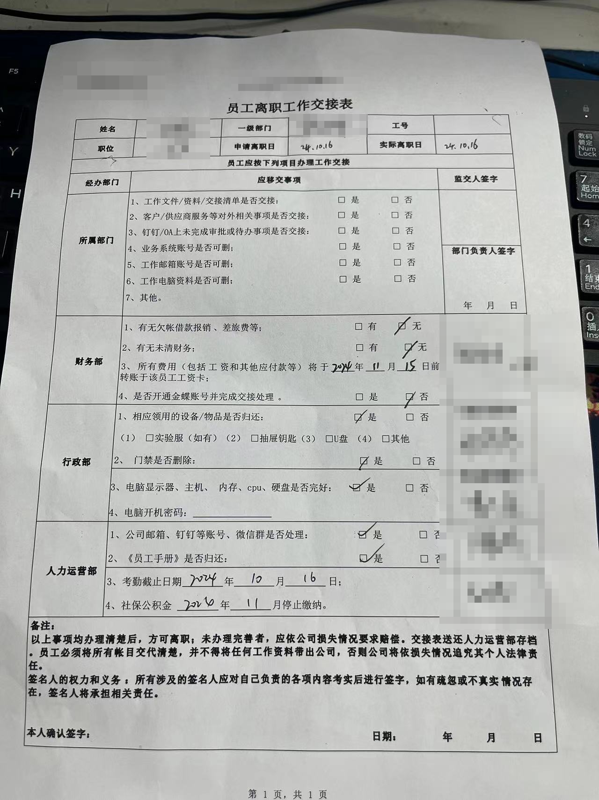

首先介绍下我自己，关键词：**中年，互联网，程序员，经济下行，裁员，自媒体**， 没错这些热门的关键词都装在我的身上

### 我的老本行

今年的自己**36**岁，到了世俗意义上的`中年`，从毕业至今一直投身于浩浩荡荡的`互联网`的行业，做过的行业经历的公司也蛮多的：互联网医疗，教育，直播，mcn...

这么多年的履历，一直都是以`技术人`的身份游走在各个公司，在2019年，开始在各种公司担任CTO，技术总监的岗位。之后就一直在这个岗位折腾。

薪资不错，中等靠上

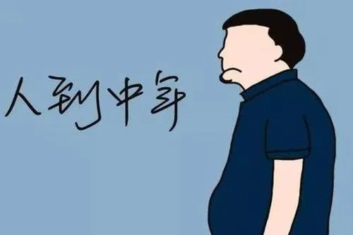

### 我的折腾

熟悉我的人都知道，我自己平时折腾的东西很多

1. 自己做过**心理，身心灵**的自媒体ip账号，自己出镜，拍视频写文案，直播，做课程（1年下来，课程收益6w+收益，全网10w+粉丝），帮助了许多人**走出痛苦的阴霾**，**重新振作**起来

2. 自己又搞nas，日常写一些nas的教程，nasdaddy[老爸的数字花园]，也就是可能你看到的地方

3. 这两年自己做自媒体矩阵号，做了20+的自媒体账号。全网播放量也有千万级别的了（但是大多都没啥价值，只是流量而已）

4. 开源了我的矩阵上传系统，支持一键分发至：小红书，视频号，抖音，快手，tiktok，bilibili等

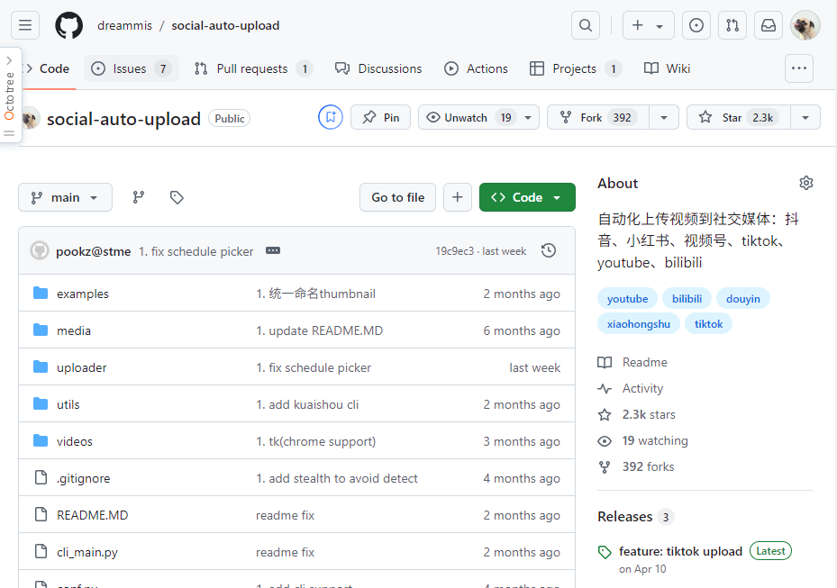

5. 海外自媒体，youtube tiktok
6. 我还兼职足球教练，哈哈哈哈哈

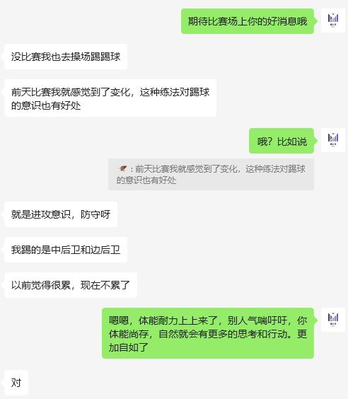

还有其他的就不一一列举了，之前的blog有提到一些

- [复杂又简单的一年-2023年回顾（记X生物存在于地球的一年）（事业篇）](/2023-review-buiness/)

- [2024 半年度 Review（折腾篇）：此刻你是否清醒？](/2024-half-year-review/)

- [2024 半年度 Review（个人成长）：中年危机？36岁的我，是如何做到不躺平，无尽折腾的](/2024-half-year-review-self-help/)

以上就是一部分的我：一个**有点想法**，**有点执行力**，有点矫情的技术男

## 为什么选择自我了断

Q: **为什么在这个节骨眼上选择自行了断？**

A: 这个节骨眼，不说大家也知道吧，**经济下行**，**企业裁员**，**倒闭**，收入骤减，工作岗位减少，人才溢出，产能过剩。

拿互联网来说，原来的**香饽饽**，现在都变成了**过街老鼠**，似乎人人都能踩两脚。

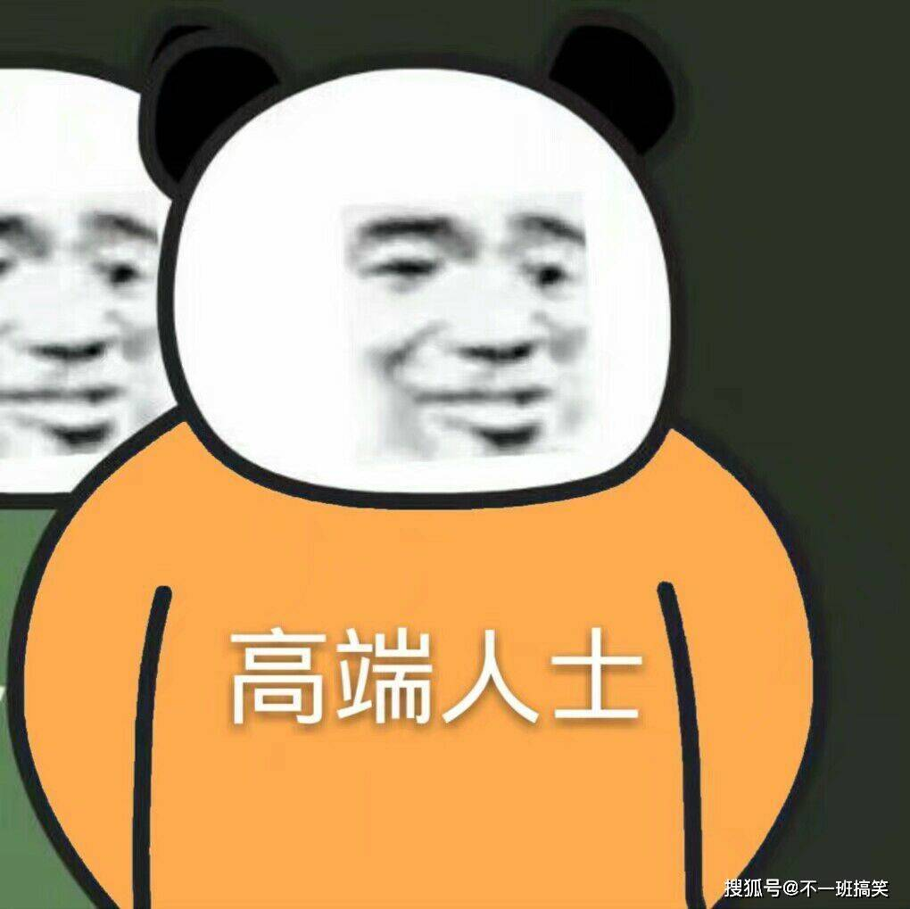

**互联网**很多依赖于**融资**，靠融资的钱抢占市场，现在国内经济形式不好，融资变少了，资本变得更加谨慎了。导致许多互联网企业无法支撑下去，纷纷裁员倒闭。

而当时看行业热门的人，一头扎进来的人，就苦了。唉...

去年面试3个岗位，只要岗位在一天，不用花一分钱去让BOSS直聘来增加曝光就能，每天能收到30+简历。要知道以前还得用什么炸弹，地雷炸出来一些简历

可见就业市场的严峻。简历太多了，人事直接将门槛提到全日制本科，计算机/软件专业的。当时有多少从其他专业转过来的人，他们的处境可见...

国家统计上的我不知道，我只知道我在杭州，面试技术岗位的状况。

说回到这个问题，**为什么在这个节骨眼上选择自行了断？**

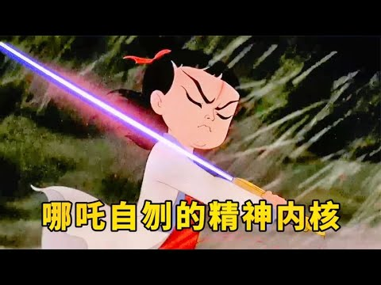

因为我已经**36岁**了，我知道自己在职场的时间并不多了，我知道我的时日也不多了。如此在企业里耗下去，还要向天祈祷，这家公司不要倒闭

2年，3年之后呢？我还得进入就业市场，以现在国内主流价值观，对于我这类**中年人的定义**就是：**工资高，干活少，屁事多，性价比低**

我不想等到那一刻，而且你看到这么多年捣鼓捣鼓那个，捣鼓捣鼓这个，你就能知道，我一直在试图自己创立一个生意，只是都不温不火罢了，哈哈哈

Q: **断了收入，压力会不会很大？**

A：大与小，这是个主观问题，全看自己

人活着只需要：一个温暖舒适的环境睡觉，每天2-3顿饭，偶尔洗个澡，就能活了。

剩下的都是**欲望**：我想住大房子，我想要开好车，我想要孩子去国际学校，我想要装X

没钱，孩子可以去公立学校，没住的地方回老家，50块钱收个自行车，出门公交地铁（月卡）。怎么着都能活

一件事情永远永远都有其**两面性**。

如果只盯着压力大，那你满脑子都是这不行，那不行

从离职这件事情：我**失去**了稳定的收入，继而失去了可以每个月潇洒吃大餐，肆无忌惮出去旅游消费的好处，太多太多了，列不完...

但是同时我也**获得**了：大把的时间，更多的自由，更多与孩子相处的时间，更大的挑战来高效的工作...

> 有一本书名字叫《每周工作4小时》，谁告诉你每天8小时，每周工作5-6天才能有结果，每周4个小时就够了。有这本书全篇就一个思想，找到最重要的那件事情去做。

这年头饿不死人的，我经常去的一家黄焖鸡店，点好鸡，自己去打米饭，小菜，打汤。我总是在想，我要哪天饿了没钱，我就从橱柜里拿个碗打份米饭，弄3碗小菜，找个别人吃过的桌子（装作自己吃的），配着小菜，干碗米饭，一顿就过去了。最后还能喝完海带汤，生活也不错啊。

哈哈哈哈，我想说的是这年头，不会饿死一个人的。

Q: **你家人知道吗？是否支持？**

A: 中午吃饭，我跟同事说，离职了，我都想好了，图书馆，咖啡店，有电有网有空调，办公太舒服了。同事跟我说嫂子不知道吗？你不会跟电视剧里那样每天装着去上班吧。

家人当然是知道的，他们或许反对，或许支持，但是**最终下决定的还是我**。如果你的重大决定有家人支持，你会更加坚定

但是据我几年心理咨询的客户了解到，有许多原生家庭对于成年子女的决定，非但不支持，反而会拼命的阻挠你做自己。

因为你不工作了，他们就无法吸血了。

对于这种家庭还是远离吧。老话说，你翅膀硬了啊？

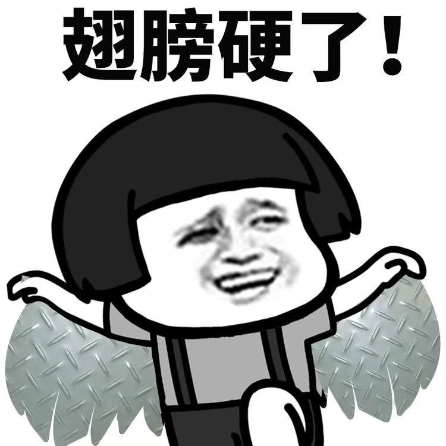

是的，**翅膀硬了**，应尽的义务，美德我会做。该感恩感恩，该孝顺孝顺，但是你别妨碍我的事情。否则翅膀忽闪飞你

## 未来的规划

一个全新的开始，这是一个自由的未来。

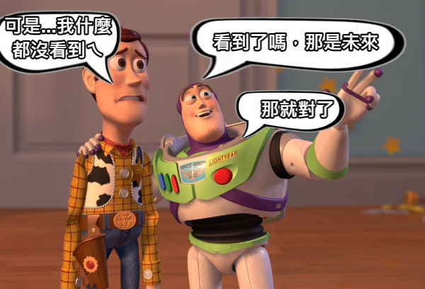

这个未来或许充满积极，乐观的美好生活。或许充满着消极，颓废，迷茫的痛苦历程

这一部分，自我梳理，也分享下，未来我打算做的事情。

### 事业

#### 足球教练

无意间我成为了千千万万人的足球教练，每天会有新的人来找我资讯，也有许多想要提升自己的人来寻求我的帮助。

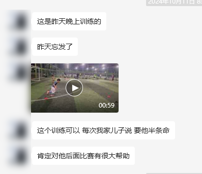

这个项目，有新的流量，有产品，有营销计划，也真切的在帮助中国年轻的足球运动员，更好的提升个人能力。这个项目是我决定要长期做的事情。

目前的规划是：

- 每周一固定1天时间，集中把营销的素材准备好。

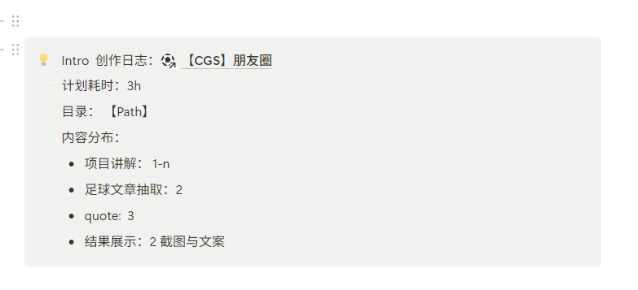

- 周5-6接待新客户

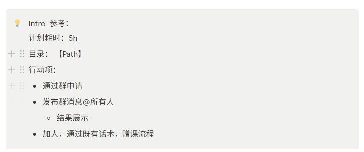

- 日常空了就回答下客户的问题，接待通过营销进来的意向客户沟通成交

力争高效的时间规划，尽可能的**batch任务**，**把控节奏**，让自己有更多的时间可以享受生活，忙其他的项目

#### 心理自媒体

内心一直对这个项目有所**愧疚**，心理自媒体我断更了1年之余，虽然我不再更新，但是还有源源不断的人来，有些人的留言，我都没能回复

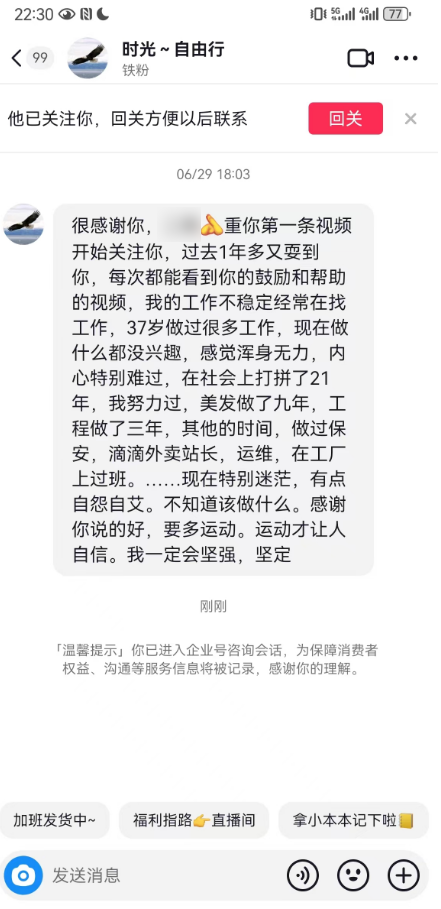

我的产品也切切实实帮助了许多人走出黑暗

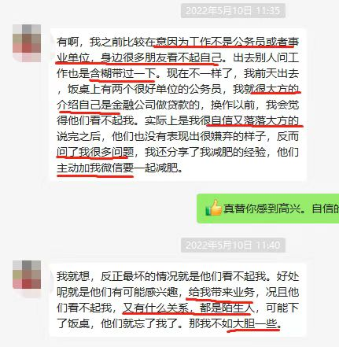

处于愧疚，我也决定继续更新下去，**增人玫瑰，手有余香**

况且这件事情也可以给我带来收益

#### SAU 继续更新与产品化

这个开源项目，帮助了程序员，公司，甚至自媒体，帮助他们解决了矩阵运作，批量上传的痛点场景，尤其是现在AIGC的时代，内容生产都是批量化的

同时也让我结识到了很多小伙伴，仅仅群里就有将近300人了。

同时我也发现一个问题，有不少是**小白用户**，不会代码，连基本的运行都不会。

未来我计划，将其封装成一个**独立的产品**，收取一个比较低的**费用**，方便这些小白用户，可以用上这个高效的矩阵工具

当然要产品化，对我的挑战是巨大的，原来程序有bug，慢慢悠悠修掉好了，其他开发者也有能力在此之上继续开发。

现在要产品化，那势必**要求更高**

#### 海外自媒体矩阵

这个因为和其他人合作，不多说了，仅列一下

#### 其他部分

这部分是我有比较深入的研究，但是苦于**没有合适的人**和**恰当的资金**，所以这部分，**等待时机启动**

1. 海外自媒体ip

我比较了解海外twitter，和linkedln等等主流自媒体的玩法，目前还没想好做哪一类的海外自媒体ip。未来遇到合适的朋友，可以帮忙一起经营

2. 身心灵

许多年前我学习了许多**身心灵**的知识，这方面海外发展的非常前卫，**life coach**，生活教练非常发达，国内发展的晚且慢，可能和社会对于这种**高端付费咨询**的服务接受度并不高。

同时随着社会和文明的进步，人精神层面的问题，人与人的连接都会出现许多挑战和问题，到现在我依旧觉得身心灵领域是未来一个非常好的方向

但是我有很多这方面的经验，我的自媒体就是个例子。未来如果有合适的人和契机进来，那么我会去好好往身心灵方向发展

3. 恋爱矩阵

当代年轻人的生活越来越电子化，恋爱，和异性交往是许多人面临的问题，如何展现自己，如何在社交场合更加自信。我有很多见解和思路，只是目前该项目需要技术来支持做一些矩阵化内容的事情。暂时搁置

还有其他的一些，想法多，并不是一件好事

这里还是提醒一下各位读者：**想法根本不值钱**，我可以把我所有知道的想法都告诉你，我丝毫不担心，为什么

因为我知道能实际行动，并且能落实好，坚持走下去的寥寥无几

所以我不吝啬与跟别人分享我的想法，甚至我的行动计划，我知道，大多数只是随便看看

这话对我自己也是如此：**如此多的想法，如果不能实现，那就是白日做梦**

### 生活

我有太多**坏习惯**了，常年**熬夜**到半夜2，3点，玩起游戏来废寝忘食，抽烟，体脂偏高等等。没错，我就是个普通人，我有很多毛病，**不要神话**你看到的任何一个人，无论他是总统还是明星，大家都是普通人。

> 那些每天早上起来就去跑步的人，真的起来不要拉屎的吗？为啥我拉完屎都半个小时了，早起1小时，单单拉屎都浪费了一半时间...

说回正题：因此，我想让我的生活变得更好一些，借着离职这件事情的改变

> 以下是我在离职前3个月都梳理好的

- 💥戒烟

- 💭保持运动

  - 2日间隔
  - 减肥为目的

- 充足的睡眠

  - 早睡23:00
  - 早起5:00 2小时黄金

- 学习计划

  - 每日读书最少5分钟（近一年读书太少了）
  - 英语学习

- 💥重启积分箱子（这是给女儿们的积分奖励箱子，用于奖励他们好的行为，已荒废许久）
  - 思考更多可奖励的地方（引导更好的习惯）

  - 更多奖励品

    - 涵盖妹妹、姐姐

  - 旅行

    - 💥日本旅行（签证办好几个月了，一直没去，朋友都看不下去问我，到底啥时候来）

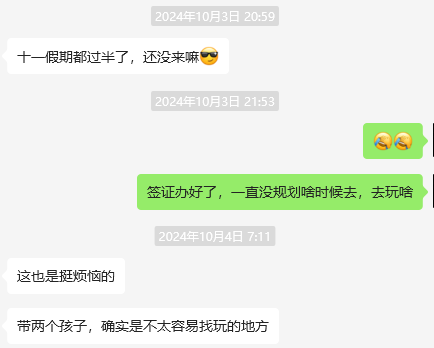

此刻是一个转折，是做出一些改变的好时机。

## 写在最后的话

写不动了！

这是一篇即兴blog，所以絮絮叨叨的一口气写了这么多，写的我有点累了。

但是还是希望大家看到这篇口水文能**有所收获**

这里也附上一些建议吧

1. **保持学习**

看这个的可能很多程序员，搞工科的。我想对这些人说，这也是我常常对自己说的：不要局限于，仅仅让技术成为你的吃饭的东西，让技术成为你的其中一个标签。况且我们搞技术的，**系统化思维**，**任务拆解**，**流程管理**，都是我们擅长的。

其次，这个世界是**多样**的，是**复杂**的。学习营销，学习销售，学习运营，学习设计，学习你感兴趣的一切。也许未来会用到，更重要的是学习会让你了解这个世界更多。

不学习的人会觉得**这个世界就是这样的**，一直受困于自己的思想中。而不断学习的人，知道这个世界是广阔的，会让我们的胸怀更大，更坦然。同时也会在适当的时机，展现出来

就如同我不是之前做过自媒体，我一个搞技术的，就不会对流量有独有的嗅觉。

2. **不要照搬别人的选择**

我的人生选择，我的思维方式，你无法复制，但是觉得好可以借鉴，但是我不建议你做和我一样的决定，你的人生需要你自己决定

每个人的人生都不相同，我们在互联网上看到各种人的生活，他们的所思所想所遇，大家并不知道的是，当你在看别人生活的时候，其实都是在和自己对比

> 这也是为啥我自己做自媒体却很少刷自媒体，因为我觉得会污染我的思想，尤其会让我变得焦虑

我想说你的人生，需要你自己掌控，可以学习它人所长，避免其他人的错误，但是**最终做决定的是你自己**。承担后果的也应该是你

如果你是一个严重依赖它人，并不是那么自信的人，我建议，尽可能的自己做决定，因为这样可以让你快速成长起来。为什么呢

当你的决定是依照他人而建立的

如果**结果好**，那么潜意识你会在下次依旧依赖它人的支持

如果**结果不好**，那么你会认为这个**错误是别人的问题**，那么你可能会永远无法承担起自己的责任，无法认识到自己的缺陷，自然也很难成长

看到这篇blog的大多数是成年人，希望大家能开始自己决定自己的人生该如何走，对也好，错也罢。

人生不过是一场游戏，你都不知道自己从何而来，也不知道自己死后会去往何处，没人能告诉你，别人也没权利决定你该如何活。这一刻的错误在我们弥留之际，可能都无法泛起一丝回忆。

临死那一刻，我们想到的只是，对于周围那些人的美好，和悔恨。

希望这番话能让你坦然一些，对周围的人好一点，多帮助身边的人。

