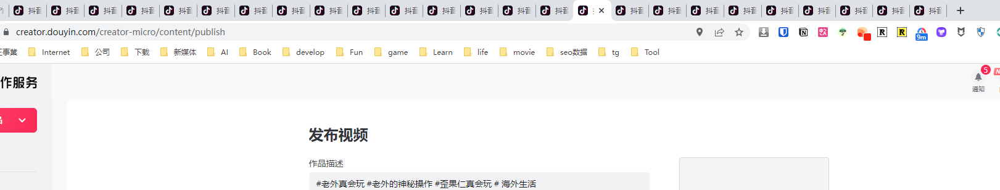
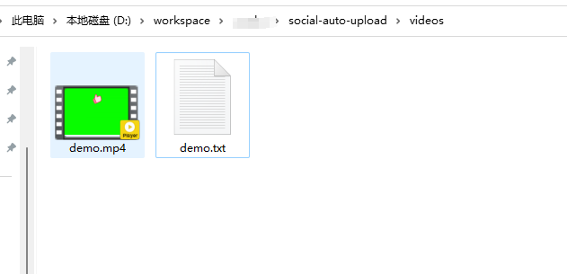
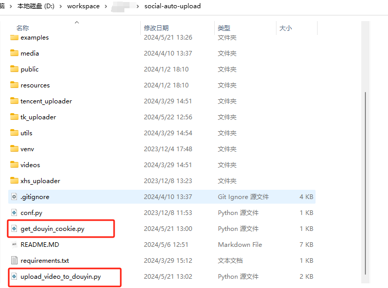
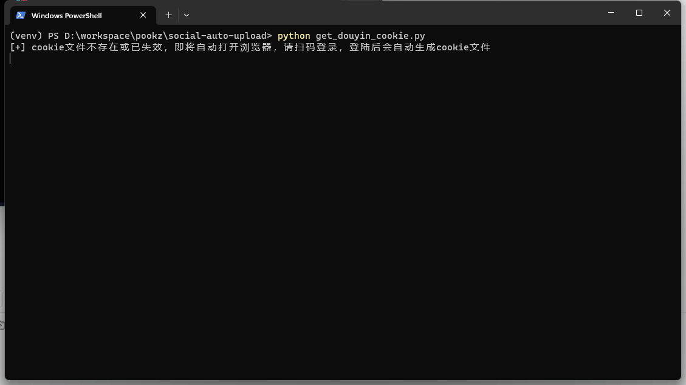

免费、开源的自媒体软件，实现自媒体多账号管理，提高品牌矩阵的效率与效果
<!--more-->

# 免费开源神器：一键分发，自动化短视频上传，支持主流个自媒体平台，矩阵化运营

## 前言
现在开个小店，还是产品宣传，还是课程销售，甚至是矩阵运营，都需要大量的短视频，图文来分发素材，以达到大量曝光

每天手动上传这些视频到不同的社交平台，`繁琐无意义`，而且还极其`容易出错`




而市面上有一些产品是可以批量发布的，但是`收费`啊！

况且我是程序员，我有个准则，用来衡量这件事情是否值得自动化：

1. 设定我的`时薪`：n/1h ，比如我现在算做200/h
2. 如果一件事情需要`花费我1个小时，但是不值200`，自动化它或者交给别人去做
3. 如果一件事情`经常去做`，每次都要`花费超过10分钟`，自动化它


于是我自己创造了一个，一键自动化上传各个社交媒体的工具 `social-auto-upload`，`完全开源`，之后简称`SAU` 

项目地址：https://github.com/dreammis/social-auto-upload


通过一次设置，可以帮助你按照你设定的时间，自动化发布到：抖音、小红书、b站、视频号等平台，甚至还有国外的Tiktok


## “SAU”的作用、特点、功能
### 特点与功能
- **支持中国主流社交媒体平台**：
  - 抖音：最大的短视频社交平台
  - 视频号：微信内的视频分享平台
  - Bilibili：知名的二次元视频社区
  - 小红书：以生活方式分享闻名的平台
  - 快手（todo）：快速增长的短视频平台
- **支持国际社交媒体平台**：
  - TikTok：国际版的抖音
  - YouTube（todo）：全球最大的视频分享网站
- **自动化功能**：
  - **支持多账号 矩阵化执行**：支持多个账号，分别执行各自的任务
  - **任务调度**（Cron）：支持复杂的时间设定，一次发布一周，半个月的视频

## 新手教程
### 下载python

1. [python org](https://www.python.org/)下载python3.10以上均可
2. 安装（我随便网上找了个图）


### clone 仓库

`git clone git@github.com:dreammis/social-auto-upload.git`

或者直接下载该仓库包：https://github.com/dreammis/social-auto-upload/archive/refs/heads/main.zip

### 安装环境依赖

1. 打开cmd

2. cd 进入仓库目录

3. 安装python 依赖

   ```
   pip install -r requirements.txt -i https://pypi.tuna.tsinghua.edu.cn/simple
   ```

4. 安装playwright 必要的浏览器

   ```
   playwright install chromium firefox
   ```

### 测试抖音平台

1. 准备视频素材（视频文件）meta文件（标题，hashtag等），放到videos



文件说明：

- mp4顾名思义，你得上传视频啊，图文其实可以（但是我还没时间放进去）
- demo.txt 存放视频标题与tag

格式为：

```
这位勇敢的男子为了心爱之人每天坚守 🥺❤️‍🩹
#坚持不懈 #爱情执着 #奋斗使者 #短视频
```


2. 将需要的从 项目中`examples目录`中的`get_douyin_cookie.py` 、`upload_video_to_douyin.py` ，拷贝到当前根目录（如果你会设置环境变量的话，那么你可以不拷贝）



3. 获取登录信息 

   cmd 执行`python get_douyin_cookie.py`



这时候会呼出浏览器，扫码登录，关闭浏览器即可

4. 上传

   执行上传任务`python upload_video_to_douyin.py`

   - 项目会使用刚才生成好的cookie

   	- 扫描videos目录
   	- 顺序发布视频

   

## 最后

开源的目的：

- 希望这个工具可以帮助到大家
- 而且完全免费，你可以自行修改里面的任意代码
- 也希望更多的人了解程序员这个行业，爱上代码

虽然ai能写代码，能画画，能写文章，甚至还能帮你读

但是我想说人类之所以能凌驾于地球的其他物种，是因为我们自己会创造，会学习

ai可以帮你读，帮你提炼，但是那是你自己的么，你能内化并付出行动吗？

这个项目ai也帮了我很多忙，ai是一个工具，善用ai，去创造你想要的生活


这个项目欢迎大家来一起开发，同时我也会一直维护的，因为我自己有些自动化做视频的项目，一直在用


如果你是一名自媒体从业者，正在寻找一款免费自媒体软件，实现自媒体多账号管理并优化您的抖音矩阵和小红书矩阵等多个自媒体平台，那么“`sau`”是您的理想选择。

这款开源短视频软件不仅支持一键分发功能，使得内容能够在多个平台上同步发布，而且作为一款高效的自媒体助手，它还能帮助您在品牌矩阵中统一管理和调度视频内容，极大地提高短视频获客的效率。

如果您对“`SAU`”感兴趣，不妨尝试自己搭建一套。不要忘记关注、点赞和收藏本教程，让更多的朋友受益。

开始您的自动化视频上传之旅，释放您的创造力，让自己的内容在多个平台上发光发热！