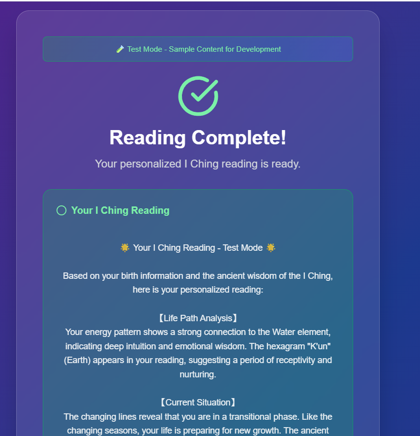

# Vibe Coding真能取代程序员？中年程序员的Vibe Coding刚出新手村

为什么写这篇，因为我最近在**学习vibe coding**，看到有价值的东西，就想着发个短文分享下，下半部分是我对于当前学习vibe coding的一些思考

结果有些平台发现我摘抄的部分内容已经重复，直接给我变成了一个**分享文**，把我自己那部分给删掉了

所以今天就再发一篇，写着写着，就越来越多了...所以大家随意看哈

## Overview

ai时代已经3年了

我却一直没尝试过**vibe coding**，所以我这个**中年油腻大叔**，因为**业务需要**（后面会说是用在哪），因为**好奇心驱使**，于是我想把我学习vibe的**心得**和觉得不错的知识，在这里和大家分享

**适合人群**

- 有技术基础的人群

> **做后端出身**，想要通过vibe coding 实现自己不熟悉领域和语言的ai自动化编写, 做出**独立产品**
>
> 我之前就是后端开发，之前都是团队作战，前后端测试，甚至运维，所以在这个时代因为这个弱项，导致**无法开发出独立的产品**（因为前端薄弱，ui很丑）

- 紧跟时代浪潮，想要了解ai编程的人

> 想要了解，AI到底能不能取代技术人员的吃瓜群众

## 泼盆凉水

**眼下AI编程绝不是0基础就可以的**

如果你**没有开发基础，可能不太适合**，**也不是不可以**，但是千万**不要轻信**网上那些**自媒体**的吹嘘，说什么我什么代码经验都没有，就做出一个app，一个产品，MRR到多少刀，那些人说这种话，**不是为了流量就是为了卖你课程**

另外为**避免骂战**，我把**上下文约定**下，这样大家有个基础的交流共识

我说的产品不是那种计算器，记事本这类**简单的应用**，这类东西ai确实可以很简单的完成，甚至完成的还挺好的

但是涉及到一个**正规的产品**，什么是正规的产品，包含但不仅限于

- 用户注册
- 付款，订单管理
- ios or 安卓编译，打包，上架等
- 状态管理
- 大量用户使用
- 不断迭代优化的长期项目
- ...

太多了，我不想列举，这些东西并**不是ai做不了**，而是**受限于上下文的限制**，工程越复杂，导致ai的出错率直线上升，它可能**抓不到合适的上下文**，继而出现

- 各种莫名其妙的bug
- 乱改你的代码
- 修复1个bug，产出3个新的bug
- bug可大可小，可能有
  - 重大安全隐患
  - 未知的局部崩溃
    - 造成用户体验下降，用户流失
    - 数据错乱
- ...

来看反面案例（摘自**guangzhengli.com**的朋友分享）

X 上的这位 Leo 老哥的故事，他在今年 3 月 15 号的时候，发布了一个帖子，介绍他使用 Cursor 通过 Vibe Coding 的方式制作了一个产品，在**全程没有参与手动编写代码**的情况下，**产品收获到了付费用户**。

但仅仅过去了两天时间，事情就发生了一些变化，在上一篇帖子火了之后，有了**攻击了他的产品**，**API 密钥的使用量达到了最大值**（意思你睡着觉别人把你的钱都刷光了），有人绕过了订阅，随意在数据库上创建一些东西。

因为 Leo 对技术不熟悉，**每一个问题的解决都要比通过 Vibe Coding 构建功能要花费更长的时间**。

最后在 20 号的时候，Leo 不得不选择关掉他的产品，并且承认**不应该将不安全的代码部署到生产环境**。

这里并不是说AI编程就一无是处，也不是各位搞技术的就可以长舒一口气

**未来已来**，这些**问题**也许在**未来**会得到极大的改善

## 我的Vide基础

这里说的并不是我没vibe过，之前我是使用过类似chatbot，cursor这类ai辅助类工具，可能大家对于vibe coding的定义不一样

毕竟vibe coding 这个名词也是刚出来没几个月

之前我的vibe coding使用经验，基本上，我自己很明确我想要什么，让ai帮助我**局部修改和添加逻辑**，或者使用tab功能

然后紧接着这个任务，就有个小插曲**，AI给我搞各种花活**

这也再次印证了我刚说的话，AI对于不懂技术的人，会给你不知道的时候，给你**埋坑**，给你**堆砌代码**，未来导致你或者AI都无法维护这份代码

### 说回正题

我之前很少从头到尾让它来干

现在我有些业务需要一些简单的独立产品来直接承接变现，比如我之前分享的一个道士赛道

我就打算搞一个在线算命的29.9刀，直接从我这些社交媒体账户引流，让海外用户直接付费

最近恶补vibe 的流程，昨天么，看到这篇，想要和大家分享

【分享】

其实这篇的初衷就是为了分享一下这个，谁知道，咋这么啰嗦

## 我的摸索心得

我最近也在做一些尝试，使用cursor，试了一下，花了5刀，做成这...丑的要命

哈哈，交学费了，我觉得很有价值

我初步的设想，不知道对不对，希望能和大家交流

1. 与ai沟通需求，把脑海中模糊的**想法具象化**，这里可以包含几点：

- 业务逻辑
  - 主要讲业务是干什么的
- 目标受众
  - 有助于确定web界面的风格
  - 有助于确定 假的testimonial
- 核心技术栈
  - 后端
  - 前端
  - ui（tailwindcss？）
  - 支付
  - 数据库
  - 资源文件（是否有文件系统）
  - 部署方式（vecel？服务器？）
- 核心板块
  - 都包含什么内容
- 其他部分
  - landing page如何设计
  - 用户行为逻辑

2. ai设计网站，设计网站导出**figma**这样的设计稿

3. 开始正式vibe
   1. 基于步骤2的figma生成ui界面
   2. 基于步骤1的页面交互，来生成前端交互逻辑
   3. 基于步骤1的需求文档，来决定后端逻辑（如果是前后端全栈是不是不需要）
   4. 待补充

不知道这套流程实操下来，会不会有问题，等待稍后我试一试，行程具体的行动项后，跟大家分享

#### 2025.09.04 熬夜研究的心得

昨晚我又有了新的研究，还是要懂得一些技术栈，要用什么技术

> 目前我选择的是**nextjs**，生态比较全（国外），而不是选择国内大家都爱用的vue

比如UI部分要用**Tailwind CSS + Shadcn/UI**，那么整体效果就非常好

其次呢，推荐大家使用下**v0**，这个vercel的Ai平台，因为Shadcn加入了这家公司，这家公司对于审美上比一般的要强上不少

> 因为它可能内置了对于ui，和nextjs的优化

而我还没用我之前说的流程化的vibe 方式

完成度蛮高了，ui部分大概2次对话，我自己感觉能有60%的完成度了，基本上可以用v0来完成前端，ui部分的开发

再转而cursor，或者claude code，再**局部高频次沟通**

我觉得这也许是一个很好的方式

另外我之前试了**Kiro**，它的**spec**也不错，就是有点**罗里吧嗦**的，它跟我刚设想的逻辑是一致的

就是先基于你的需求生成，需求文档，然后详细设计，这些都会输出具体的md文档，你确认后，它就开始一项项的最后一项项执行

大家也可以试试

## 最后

学还是得学的，再痛苦也得学，所谓的痛苦，只是担心短期你搞不定，而人的**大脑会放大短期的痛苦**

搞技术的总比其他没技术基础的人要**有优势**

现在我们可能专注于一个开发语言或者技术栈，现在ai时代，我们应该让LLM变成我们的**其他非擅长开发语言的**翻译官，用我们的框架思维，专业能力，为自己所用

一个完整的商业项目我是走过的，但是对于

- vibe一个完整的项目
- 通过海外独立产品来走完商业闭环

还是小白，**希望能和大家多多交流**

至于我是谁，大家可以看这些来彼此了解：

- [复杂又简单的一年-2023年回顾（记X生物存在于地球的一年）（事业篇）](/2023-review-buiness/)

- [2024 半年度 Review（折腾篇）：此刻你是否清醒？](/2024-half-year-review/)

- [2024 半年度 Review（个人成长）：中年危机？36岁的我，是如何做到不躺平，无尽折腾的](/2024-half-year-review-self-help/)

最后其实这篇就是想随手分享关于vibe code的一个他人写的心得，在加上简单自己最近的收获

但是不知道为啥，扯了这么多，得看且看吧，哈哈哈

